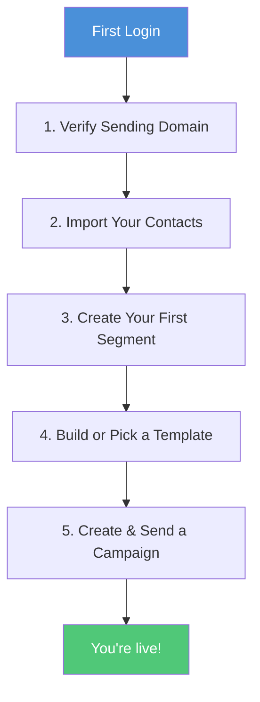
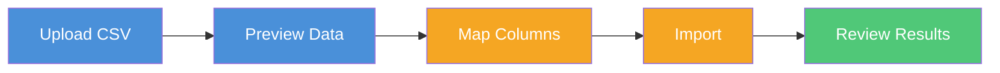
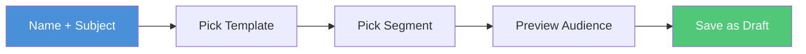
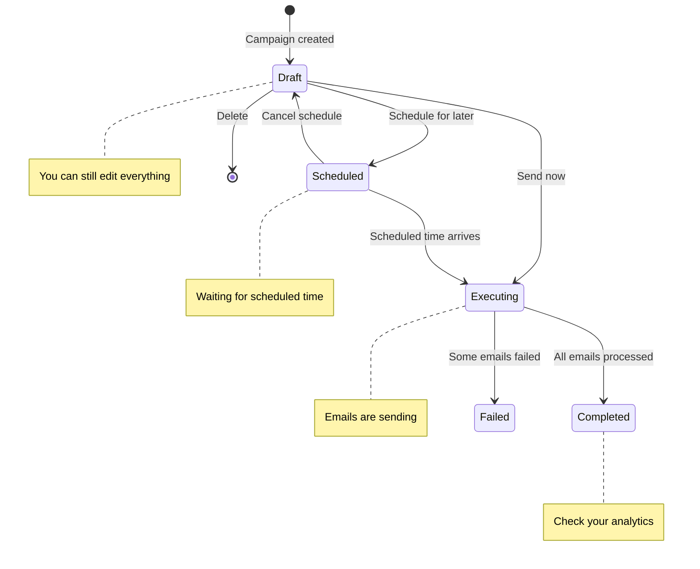
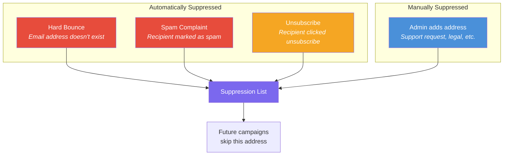
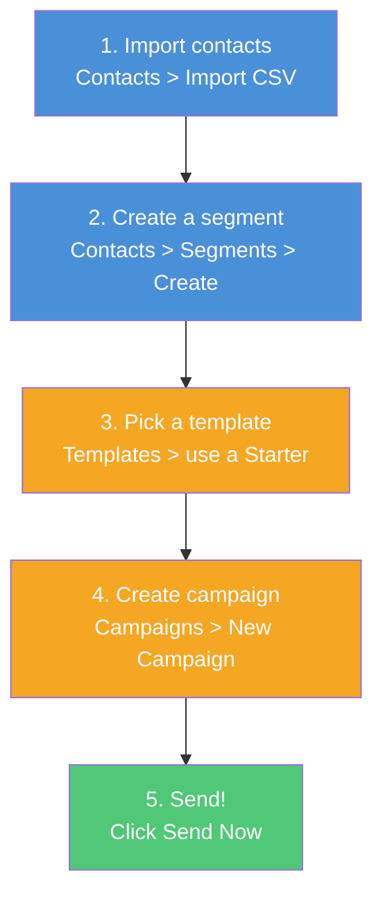

# Volley — End User Guide

> Everything your team needs to know to manage contacts, build emails, run campaigns, and track results — from first login to advanced features.

---

## Table of Contents

- [Getting Started](#getting-started)
  - [Logging In](#logging-in)
  - [Accepting an Invitation](#accepting-an-invitation)
  - [Your Dashboard](#your-dashboard)
  - [Navigating the Platform](#navigating-the-platform)
- [First-Time Setup Checklist](#first-time-setup-checklist)
- [Team Roles & Permissions](#team-roles--permissions)
- [Managing Your Contacts](#managing-your-contacts)
  - [Adding Contacts One by One](#adding-contacts-one-by-one)
  - [Bulk Adding Contacts](#bulk-adding-contacts)
  - [Importing from CSV](#importing-from-csv)
  - [Exporting Contacts](#exporting-contacts)
  - [Editing & Deleting Contacts](#editing--deleting-contacts)
  - [Contact Statuses](#contact-statuses)
- [Organizing Contacts with Segments](#organizing-contacts-with-segments)
  - [What Are Segments?](#what-are-segments)
  - [Creating a Segment](#creating-a-segment)
  - [Segment Rule Examples](#segment-rule-examples)
  - [Editing & Deleting Segments](#editing--deleting-segments)
- [Building Email Templates](#building-email-templates)
  - [Visual Builder vs Code Editor](#visual-builder-vs-code-editor)
  - [Creating a Template](#creating-a-template)
  - [Personalizing with Variables](#personalizing-with-variables)
  - [Previewing Your Template](#previewing-your-template)
  - [Version History & Rollback](#version-history--rollback)
  - [Duplicating Templates](#duplicating-templates)
- [Running Campaigns](#running-campaigns)
  - [Creating a Campaign](#creating-a-campaign)
  - [Previewing Your Audience](#previewing-your-audience)
  - [Sending Immediately](#sending-immediately)
  - [Scheduling for Later](#scheduling-for-later)
  - [Canceling a Scheduled Campaign](#canceling-a-scheduled-campaign)
  - [Campaign Lifecycle](#campaign-lifecycle)
  - [What Happens When You Hit Send](#what-happens-when-you-hit-send)
- [Tracking Results](#tracking-results)
  - [Campaign Analytics](#campaign-analytics)
  - [Global Analytics Dashboard](#global-analytics-dashboard)
  - [Understanding Your Metrics](#understanding-your-metrics)
  - [Healthy Benchmarks](#healthy-benchmarks)
- [Suppression List](#suppression-list)
  - [How It Works](#how-it-works)
  - [Managing Suppressions Manually](#managing-suppressions-manually)
- [Using the AI Assistant](#using-the-ai-assistant)
  - [Generating Email Content](#generating-email-content)
  - [Improving Existing Content](#improving-existing-content)
  - [Chat Assistant](#chat-assistant)
- [Admin Settings](#admin-settings)
  - [Managing Your Team](#managing-your-team)
  - [Domain & Sending Reputation](#domain--sending-reputation)
  - [CRM Integrations](#crm-integrations)
- [Common Workflows](#common-workflows)
  - [Send Your First Campaign in 5 Steps](#send-your-first-campaign-in-5-steps)
  - [Re-engage Inactive Contacts](#re-engage-inactive-contacts)
  - [A/B Test Subject Lines](#ab-test-subject-lines)
- [Troubleshooting & FAQ](#troubleshooting--faq)

---

## Getting Started

### Logging In

Open the platform URL provided by your administrator. You'll see the login screen — a dark, split-panel layout with your company branding on the left and the sign-in form on the right.

```
┌────────────────────────────┬────────────────────────────┐
│                            │                            │
│   ■ ■ ■ ■ ■ ■ ■ ■ ■ ■    │                            │
│                            │     Welcome back           │
│   Your Company             │     Sign in to your        │
│                            │     account                │
│   "Your own email          │                            │
│    marketing platform"     │     Email                  │
│                            │     ┌──────────────────┐   │
│   ● ● ●                   │     │ you@company.com  │   │
│                            │     └──────────────────┘   │
│                            │                            │
│      ~ purple gradient ~   │     Password               │
│      ~ glow effects ~      │     ┌──────────────────┐   │
│                            │     │ ••••••••         │   │
│                            │     └──────────────────┘   │
│                            │                            │
│                            │     [ Sign In ]            │
│                            │                            │
│                            │     Forgot your password?  │
│                            │                            │
└────────────────────────────┴────────────────────────────┘
```

The left panel features a dark background with ambient purple gradient glows — this is the signature Volley visual style. Enter your email and password on the right, then click **Sign In**. If you've forgotten your password, click **Forgot your password?** to receive a reset link by email.

### Accepting an Invitation

If an admin has invited you to the platform:

1. Check your email for the invitation
2. Click the link in the email — it takes you to a page where you set your password
3. Choose a strong password and click **Set Password**
4. You'll be redirected to the login page — sign in with your email and new password

### Your Dashboard

After logging in, you land on the **Dashboard** — your home base. It greets you by name and shows everything you need at a glance.

```
┌─────────────────────────────────────────────────────────────────────────┐
│  Welcome back, Jane!                                                     │
│  Here's how your email marketing is performing.                          │
│                                                                          │
│  STATS                                                                   │
│  ┌──────────────┐  ┌──────────────┐  ┌──────────────┐  ┌──────────────┐│
│  │ Campaigns    │  │ Emails       │  │ Avg Open     │  │ Avg Delivery ││
│  │              │  │ Sent         │  │ Rate         │  │ Rate         ││
│  │      23      │  │   12,450     │  │   34.2%      │  │   98.7%      ││
│  └──────────────┘  └──────────────┘  └──────────────┘  └──────────────┘│
│                                                                          │
│  QUICK ACTIONS                                                           │
│  ┌──────────────────┐  ┌──────────────────┐  ┌──────────────────┐      │
│  │  📧 New Campaign  │  │  📥 Import        │  │  🎨 Create       │      │
│  │                   │  │     Contacts      │  │     Template     │      │
│  └──────────────────┘  └──────────────────┘  └──────────────────┘      │
│                                                                          │
│  RECENT CAMPAIGNS                                                        │
│  ┌───────────────────────────────────────────────────────────────────┐  │
│  │  Name               Status       Sent     Open Rate              │  │
│  │  March Newsletter    Completed    2,847    34.2%                  │  │
│  │  Spring Sale         Scheduled    —        —                      │  │
│  │  Welcome Series      Completed    342      52.1%                  │  │
│  └───────────────────────────────────────────────────────────────────┘  │
│                                                                          │
└─────────────────────────────────────────────────────────────────────────┘
```

| Section | What It Shows |
|---------|---------------|
| **Stats cards** | Campaigns sent, total emails delivered, average open rate, average delivery rate |
| **Quick actions** | One-click shortcuts to create a campaign, import contacts, or build a template |
| **Recent campaigns** | Your latest campaigns with their status, send count, and open rate |

### Navigating the Platform

The platform uses a **dark theme with purple accents** — a sleek, modern interface with subtle gradient glows. The left sidebar is your main navigation, with an active indicator bar and dot showing which section you're in.

```
┌──────────────────────┐
│  🏢 Your Company     │
│  ─── gradient line ──│
│                      │
│  ┃ ▸ Dashboard     • │  ← active indicator
│    ▸ Campaigns       │
│    ▸ Contacts        │
│    ▸ Templates       │
│    ▸ Analytics       │
│    ▸ Suppression     │
│    ▸ Settings        │
│                      │
│  ───────────────     │
│  👤 Jane Smith       │
│     jane@company.com │
│     Admin            │
│                      │
│  [ Log out ]         │
└──────────────────────┘
```

| Section | What You'll Find |
|---------|------------------|
| **Dashboard** | Welcome greeting, stats cards, quick actions, recent campaigns |
| **Campaigns** | Create, schedule, send, and monitor email campaigns |
| **Contacts** | Your recipient database — add, import, search, and organize |
| **Templates** | Email designs you can reuse across campaigns |
| **Analytics** | Delivery and engagement metrics across all campaigns |
| **Suppression** | Email addresses that won't receive future campaigns |
| **Settings** | Team management, domain setup, and CRM connections *(Admin only)* |

Your name and role badge appear at the bottom of the sidebar. Role badges are color-coded — purple for Admin, blue for Editor, gray for Viewer. The company logo and name at the top are customized for your organization.

The top navigation bar includes **breadcrumb navigation** showing your current location (e.g., "Campaigns > March Newsletter") and a **theme toggle** to switch between light, dark, and system modes.

---

## First-Time Setup Checklist

If you're the first admin setting up the platform, complete these steps before sending your first campaign:



| Step | Where | What to Do |
|------|-------|------------|
| **1. Verify your domain** | Settings > Domains | Confirm your sending domain shows "Verified." If pending, add the DNS records shown on screen. |
| **2. Import contacts** | Contacts > Import CSV | Upload your existing mailing list from a CSV file. |
| **3. Create a segment** | Contacts > Segments | Create at least one segment (e.g., "All Active Contacts") to target with campaigns. |
| **4. Pick a template** | Templates | Use a pre-built starter template or create your own. |
| **5. Send a test campaign** | Campaigns > New | Create a campaign targeting a small test segment to verify everything works. |

---

## Team Roles & Permissions

Your platform has three roles. Each person on your team is assigned one role by an admin.

```
┌─────────────────────────────────────────────────────────────────┐
│                                                                  │
│  ADMIN ──────────────────────────────────────────────────────── │
│  │  Everything below, plus:                                     │
│  │  • Invite and manage team members                            │
│  │  • Configure domain settings                                 │
│  │  • Connect CRM integrations (HubSpot, Zoho)                 │
│  │  • Disable user accounts                                     │
│  │                                                              │
│  EDITOR ─────────────────────────────────────────────────────── │
│  │  Everything below, plus:                                     │
│  │  • Create and edit campaigns, templates, contacts            │
│  │  • Send and schedule campaigns                               │
│  │  • Import and export contacts                                │
│  │  • Create and manage segments                                │
│  │  • Use AI content features                                   │
│  │  • Manage the suppression list                               │
│  │                                                              │
│  VIEWER ─────────────────────────────────────────────────────── │
│     • View all data (contacts, campaigns, templates, analytics) │
│     • Export contacts                                            │
│     • Preview templates                                          │
│     • Cannot create, edit, or delete anything                   │
│                                                                  │
└─────────────────────────────────────────────────────────────────┘
```

**Typical team setup:**

| Person | Recommended Role | Why |
|--------|-----------------|-----|
| Marketing Manager | Admin | Full control, manages the team |
| Email Marketer | Editor | Creates and sends campaigns day-to-day |
| Campaign Analyst | Viewer | Monitors performance without making changes |
| Executive Stakeholder | Viewer | Checks dashboards occasionally |

---

## Managing Your Contacts

Contacts are the people who receive your emails. Every contact has an email address (required), a name, optional tags for organizing, and custom fields for any extra data you need.

### Adding Contacts One by One

1. Go to **Contacts**
2. Click **Add Contact** (top right)
3. Fill in the form:

```
┌─────────────────────────────────────────┐
│  Add Contact                            │
│                                         │
│  Email *        ┌───────────────────┐   │
│                 │ jane@example.com  │   │
│                 └───────────────────┘   │
│                                         │
│  First Name *   ┌───────────────────┐   │
│                 │ Jane              │   │
│                 └───────────────────┘   │
│                                         │
│  Last Name *    ┌───────────────────┐   │
│                 │ Doe               │   │
│                 └───────────────────┘   │
│                                         │
│  Tags           ┌───────────────────┐   │
│                 │ vip, newsletter   │   │
│                 └───────────────────┘   │
│  Separate tags with commas              │
│                                         │
│  Custom Fields                          │
│  ┌──────────┐  ┌──────────┐  [✕]       │
│  │ company  │  │ Acme Inc │            │
│  └──────────┘  └──────────┘            │
│  [ + Add Field ]                        │
│                                         │
│       [ Cancel ]  [ Create Contact ]    │
└─────────────────────────────────────────┘
```

4. Click **Create Contact**

Email addresses must be unique — you can't add the same email twice.

### Bulk Adding Contacts

For adding several contacts quickly without a CSV file:

1. Go to **Contacts**
2. Click **Bulk Add**
3. Paste or type contact data in the provided format
4. Click **Add Contacts**

Duplicates are automatically skipped.

### Importing from CSV

For large lists, CSV import is the fastest way to add contacts.



**Step 1 — Upload:** Go to **Contacts**, click **Import CSV**, then drag and drop your file or click to browse. Your CSV must have a header row.

**Step 2 — Preview:** The system shows the first few rows so you can verify the data looks right. Click **Continue to Column Mapping**.

**Step 3 — Map columns:** Tell the platform which CSV column maps to which contact field. You must map at least one column to **Email**.

```
┌─────────────────────────────────────────────────────────────┐
│  Map Columns                                                 │
│                                                              │
│  CSV Column          Sample Value       Maps To              │
│  ─────────────────────────────────────────────────────────── │
│  Email Address       jane@example.com   → [Email ▾]          │
│  First              Jane               → [First Name ▾]     │
│  Last               Doe                → [Last Name ▾]      │
│  Category           VIP                → [Tags ▾]           │
│  Phone              +1234567890        → [Custom Field ▾]   │
│  Notes              Prefers weekly     → [Skip ▾]           │
│                                                              │
│              [ Start Over ]  [ Start Import ]                │
└─────────────────────────────────────────────────────────────┘
```

**Step 4 — Import:** Click **Start Import**. A progress bar shows how many contacts have been processed. Don't close the page during import.

**Step 5 — Results:** When complete, you'll see a summary:

```
┌─────────────────────────────────────────┐
│          ✓ Import Complete              │
│                                         │
│  ┌─────────┐  ┌─────────┐  ┌─────────┐ │
│  │ Created │  │ Skipped │  │ Errors  │ │
│  │  1,847  │  │   612   │  │    3    │ │
│  │  (new)  │  │ (dupes) │  │         │ │
│  └─────────┘  └─────────┘  └─────────┘ │
│                                         │
│    [ View Contacts ] [ Import Another ] │
└─────────────────────────────────────────┘
```

**Tips:**
- Use UTF-8 encoding for your CSV
- Keep files under 10MB for best results
- Contacts are processed in batches of 100
- Duplicates (matching email) are skipped, not overwritten

### Exporting Contacts

Click **Export CSV** on the Contacts page. A CSV file downloads with all contacts including their email, name, tags, custom fields, and status.

### Editing & Deleting Contacts

- **Edit:** Click any contact in the list to open their detail page. Update any field (except email) and click **Save Changes**.
- **Delete:** On the contact detail page, click **Delete** and confirm. This is permanent.

### Contact Statuses

Every contact has one of three statuses:

| Status | Meaning | Can Receive Emails? |
|--------|---------|-------------------|
| **Active** | Normal, healthy contact | Yes |
| **Unsubscribed** | Clicked the unsubscribe link or was manually suppressed | No |
| **Bounced** | Their email address permanently failed delivery | No |

You can filter the contacts list by status using the dropdown at the top of the page.

---

## Organizing Contacts with Segments

### What Are Segments?

Segments are saved filters that group your contacts by specific criteria. Instead of manually picking who gets each campaign, you define rules like "all active contacts tagged VIP" and the platform finds matching contacts automatically — every time you use the segment.

```
┌─────────────────────────────────────────────────────────────────┐
│                                                                  │
│  SEGMENT: "Premium Newsletter Subscribers"                       │
│                                                                  │
│  Rules:                                                          │
│  ├── Status  equals  "active"                                    │
│  │              AND                                              │
│  ├── Tags  contains  "newsletter"                                │
│  │              AND                                              │
│  └── Tags  contains  "premium"                                   │
│                                                                  │
│  Result: 342 contacts match right now                            │
│                                                                  │
│  When you send a campaign to this segment next Tuesday,          │
│  the platform will re-evaluate the rules at send time.           │
│  If 10 new "premium newsletter" contacts are added by then,      │
│  they'll be included automatically.                              │
│                                                                  │
└─────────────────────────────────────────────────────────────────┘
```

**Segments are dynamic** — they don't contain a fixed list of contacts. They contain *rules*, and the matching contacts are determined at the moment the campaign sends.

### Creating a Segment

1. Go to **Contacts** > **Segments**
2. Click **Create Segment**
3. Give it a name (e.g., "Active Subscribers")
4. Optionally add a description
5. Add filter rules using the segment builder:

```
┌─────────────────────────────────────────────────────────────┐
│  Create Segment                                              │
│                                                              │
│  Name:  ┌──────────────────────────────┐                     │
│         │ VIP Customers                │                     │
│         └──────────────────────────────┘                     │
│                                                              │
│  Logic: ( AND ▾ )  — all rules must match                    │
│                                                              │
│  Rule 1:  [ status ▾ ] [ equals ▾ ]      [ active    ]  [✕] │
│                           AND                                │
│  Rule 2:  [ tags   ▾ ] [ contains ▾ ]    [ vip       ]  [✕] │
│                                                              │
│  [ + Add Rule ]                                              │
│                                                              │
│  Matching contacts: 89                                       │
│                                                              │
│                  [ Cancel ]  [ Create Segment ]              │
└─────────────────────────────────────────────────────────────┘
```

6. The member count updates as you add rules
7. Click **Create Segment**

### Segment Rule Examples

| What You Want | Field | Operator | Value | Logic |
|---------------|-------|----------|-------|-------|
| All active contacts | `status` | equals | `active` | — |
| VIP contacts only | `tags` | contains | `vip` | — |
| Contacts from Acme | `customFields.company` | equals | `Acme Inc` | — |
| Active VIPs | `status` equals `active` AND `tags` contains `vip` | | | AND |
| Newsletter OR blog subscribers | `tags` contains `newsletter` OR `tags` contains `blog` | | | OR |
| Contacts with a phone number | `customFields.phone` | exists | — | — |
| Contacts without a company | `customFields.company` | not_exists | — | — |

**Available operators:** equals, not_equals, contains, not_contains, starts_with, exists, not_exists, greater_than, less_than

### Editing & Deleting Segments

- **Edit:** Click a segment name to open it. Change the name, description, or rules, then click **Save Changes**.
- **Delete:** Click **Delete** on the segment detail page and confirm. Deleting a segment does **not** delete the contacts in it — only the filter definition is removed.

---

## Building Email Templates

Templates define what your emails look like. Build them once, reuse them across many campaigns.

### Visual Builder vs Code Editor

When creating a template, you choose one of two editors:

```
┌────────────────────────────┐    ┌────────────────────────────┐
│     📐 Visual Builder       │    │     💻 Code Editor          │
│                             │    │                             │
│  Drag-and-drop interface    │    │  Write MJML markup          │
│  No coding required         │    │  with syntax highlighting   │
│                             │    │                             │
│  Best for:                  │    │  Best for:                  │
│  • Quick campaign emails    │    │  • Complex custom layouts   │
│  • Non-technical users      │    │  • Pixel-perfect designs    │
│  • Simple layouts           │    │  • Developers               │
│                             │    │                             │
│  Drag content blocks:       │    │  MJML compiles to           │
│  text, images, buttons,     │    │  responsive HTML that       │
│  dividers, columns          │    │  works across all email     │
│                             │    │  clients automatically      │
└────────────────────────────┘    └────────────────────────────┘
```

Both editors produce the same result — a responsive HTML email. Choose whichever fits your team's skills.

### Creating a Template

1. Go to **Templates**
2. Click **New Template**
3. Choose **Code Editor** or **Visual Builder**
4. Enter a template name (e.g., "Monthly Newsletter") and optional description
5. Click **Create Template**
6. You're taken to the editor to start building

**Starting from a starter template:** If pre-built templates are available, they appear at the top of the Templates page under "Starter Templates." Click the menu on any starter template and select **Use Template** to create a copy you can customize.

### Personalizing with Variables

Make each email feel personal by inserting variables. Variables are placeholders that get replaced with each recipient's actual data when the email sends.

| Variable | What Gets Inserted | Example Output |
|----------|-------------------|----------------|
| `{{firstName}}` | Recipient's first name | "Jane" |
| `{{lastName}}` | Recipient's last name | "Doe" |
| `{{email}}` | Recipient's email | "jane@example.com" |
| `{{customFields.company}}` | Any custom field | "Acme Inc" |
| `{{unsubscribeUrl}}` | Unsubscribe link (auto-generated) | A clickable URL |

**How to use them:** Type the variable name with double curly braces directly into your template content.

```
Hello {{firstName}},

Thank you for being a valued customer at {{customFields.company}}.

We have some exciting updates to share with you this month.

Best regards,
The Team

Don't want these emails? {{unsubscribeUrl}}
```

**Important:** Always include `{{unsubscribeUrl}}` in your templates. This generates a one-click unsubscribe link for each recipient, which is required for email compliance.

### Previewing Your Template

1. Open your template
2. Click **Preview**
3. Enter sample values for each variable (e.g., firstName = "Jane")
4. Click **Render Preview** to see how the email will look with real data

This lets you verify that variables render correctly and the layout looks right before sending.

### Version History & Rollback

Every time you save a template, a new version is created. Previous versions are never lost.

```
┌─────────────────────────────────────────────────────────────┐
│  Version History — Monthly Newsletter                        │
│                                                              │
│  v3  (current)  Apr 1, 2026 10:30 AM   Updated header image │
│  v2             Mar 28, 2026 3:15 PM    Changed CTA button   │
│  v1             Mar 25, 2026 9:00 AM    Initial version      │
│                                                              │
│  Click [Revert] on any version to restore it.               │
│  Reverting creates a NEW version — nothing is deleted.       │
└─────────────────────────────────────────────────────────────┘
```

To restore an older version:
1. Open the template
2. Click **History**
3. Click **Revert** on the version you want

Reverting doesn't delete newer versions — it creates a new version with the old content. You can always go back.

### Duplicating Templates

To make a copy of any template:
1. Click the menu (three dots) on the template card
2. Select **Duplicate**
3. A new template is created with "(Copy)" in the name

Useful when you want to create a variation of an existing design without modifying the original.

---

## Running Campaigns

A campaign is a single email send to a group of contacts. It combines a **template** (the email content) with a **segment** (the audience).

### Creating a Campaign



1. Go to **Campaigns** > **New Campaign**
2. Fill in the details:

| Field | What to Enter | Example |
|-------|--------------|---------|
| **Campaign Name** | Internal name (your team sees this, recipients don't) | "March Newsletter" |
| **Email Subject** | The subject line recipients see in their inbox | "Your March Update is Here 📬" |
| **Template** | Select from your saved templates | "Monthly Newsletter v3" |
| **Audience** | Select a segment | "Active Subscribers (2,847 members)" |

3. Click **Create Campaign** — it's saved as a **Draft**

The subject line supports variables too — for example, `Hey {{firstName}}, your March update` personalizes the subject for each recipient.

### Previewing Your Audience

When you select a segment, the campaign page shows:
- **Member count** — how many contacts will receive the email
- **Sample contacts** — a preview of matching contacts

This helps you verify you're targeting the right group before sending.

### Sending Immediately

1. Open a draft campaign
2. Review the template, subject, and audience count
3. Click **Send Now**
4. Confirm in the dialog: *"Are you sure you want to send [Campaign Name] immediately?"*
5. The status changes to **Executing** and emails begin sending in the background

You can leave the page — sending continues in the background. Come back anytime to check progress.

### Scheduling for Later

1. Open a draft campaign
2. Click **Schedule**
3. Pick a date and time (in UTC)
4. Click **Confirm Schedule**
5. The status changes to **Scheduled**

At the scheduled time, the platform automatically starts sending. No one needs to be logged in.

### Canceling a Scheduled Campaign

1. Open the scheduled campaign
2. Click **Cancel Schedule**
3. Confirm the cancellation

The campaign returns to **Draft** status. You can edit it and reschedule or send immediately.

### Campaign Lifecycle

Every campaign moves through a clear set of stages:



| Status | What It Means | What You Can Do |
|--------|--------------|----------------|
| **Draft** | Created but not sent — fully editable | Edit, schedule, send now, or delete |
| **Scheduled** | Waiting for the scheduled date/time | Cancel back to draft |
| **Executing** | Actively sending emails to recipients | Watch progress, wait for completion |
| **Completed** | All emails have been processed | View analytics and results |
| **Failed** | Some or all emails encountered errors | Review error details, retry |

### What Happens When You Hit Send

Here's what the platform does behind the scenes — no action needed from you:

```
┌─────────────────────────────────────────────────────────────┐
│  YOU CLICK "SEND NOW"                                        │
│                                                              │
│  1. The platform evaluates your segment rules                │
│     → Finds 2,847 active, non-suppressed contacts            │
│                                                              │
│  2. Creates a personalized email job for each contact        │
│     → 2,847 jobs queued                                      │
│                                                              │
│  3. Each email is rendered individually                      │
│     → {{firstName}} becomes "Jane" for Jane,                 │
│       "Marcus" for Marcus, etc.                              │
│                                                              │
│  4. Before each send, checks the suppression list            │
│     → Skips anyone who bounced, complained, or unsubscribed  │
│                                                              │
│  5. Sends each email with tracking enabled                   │
│     → Opens, clicks, bounces, and complaints tracked         │
│                                                              │
│  6. When all emails are processed                            │
│     → Campaign marked "Completed" or "Failed"                │
│     → Analytics available immediately                        │
│                                                              │
└─────────────────────────────────────────────────────────────┘
```

---

## Tracking Results

### Campaign Analytics

Open any completed campaign to see its performance:

```
┌─────────────────────────────────────────────────────────────────┐
│  March Newsletter — Completed                                    │
│  Sent: 2,847 emails                                              │
│                                                                  │
│  ┌──────────┐  ┌──────────┐  ┌──────────┐  ┌──────────┐  ┌────────┐
│  │Delivered │  │ Opened   │  │ Clicked  │  │ Bounced  │  │Complained│
│  │  2,831   │  │  968     │  │  247     │  │   16     │  │   2     │
│  │  99.4%   │  │  34.2%   │  │  8.7%    │  │  0.6%    │  │  0.07%  │
│  └──────────┘  └──────────┘  └──────────┘  └──────────┘  └────────┘
│                                                                  │
│  ┌───────────────────────────────────────────────────────────┐   │
│  │  Delivery Chart                                            │   │
│  │  ████████████████████████████████████████ Delivered        │   │
│  │  █████████████                            Opened           │   │
│  │  ███                                      Clicked          │   │
│  │  ▪                                        Bounced          │   │
│  └───────────────────────────────────────────────────────────┘   │
│                                                                  │
└─────────────────────────────────────────────────────────────────┘
```

### Global Analytics Dashboard

Go to **Analytics** to see performance across all campaigns. Use the pill-style filter buttons at the top to switch time periods:

```
  [ 7d ]  [ 30d ]  [ 90d ]  [ All time ]
```

| Filter | What It Shows |
|--------|--------------|
| **7d** | Last 7 days — recent campaign performance |
| **30d** | Last 30 days — monthly trend |
| **90d** | Last 90 days — quarterly overview |
| **All time** | Complete history |

The dashboard shows five stats cards with colored left borders, plus a bar chart comparing campaign performance:
- **Total Sent** — total emails across all campaigns
- **Total Delivered** — with delivery rate percentage
- **Total Opened** — with open rate percentage
- **Total Clicked** — with click rate percentage
- **Total Bounced** — with bounce rate percentage

### Understanding Your Metrics

| Metric | What It Measures | How It's Calculated |
|--------|-----------------|---------------------|
| **Delivery Rate** | Emails that actually reached the recipient's inbox | Delivered / Sent |
| **Open Rate** | Recipients who opened the email | Unique Opens / Delivered |
| **Click Rate** | Recipients who clicked a link in the email | Unique Clicks / Delivered |
| **Bounce Rate** | Emails that failed to deliver | Bounced / Sent |
| **Complaint Rate** | Recipients who marked the email as spam | Complaints / Delivered |

### Healthy Benchmarks

Keep your metrics in these ranges to maintain good sending reputation:

| Metric | Healthy | Warning | Critical |
|--------|---------|---------|----------|
| **Delivery Rate** | > 95% | 90-95% | < 90% |
| **Open Rate** | > 20% | 10-20% | < 10% |
| **Click Rate** | > 2% | 1-2% | < 1% |
| **Bounce Rate** | < 2% | 2-5% | > 5% |
| **Complaint Rate** | < 0.1% | 0.1-0.3% | > 0.3% |

**If your bounce rate exceeds 5% or complaint rate exceeds 0.3%,** your email sending may be throttled or suspended by the email provider. Clean your contact list and ensure you're only emailing people who opted in.

---

## Suppression List

### How It Works

The suppression list protects your sending reputation by permanently preventing emails to addresses that should not receive them.



**You don't need to manage this manually in most cases.** The platform automatically adds addresses when bounces, complaints, or unsubscribes happen. Suppressed addresses are automatically skipped in every future campaign.

### Managing Suppressions Manually

Go to the **Suppression** page to:

- **View** all suppressed addresses with the reason they were added
- **Add** an address manually (e.g., someone called to opt out)
- **Remove** an address (e.g., someone re-subscribed and you have confirmation)

**Be cautious when removing addresses.** Only remove a suppression if you're certain the person wants to receive emails again. Re-emailing someone who bounced or complained can damage your sending reputation.

---

## Using the AI Assistant

The platform includes AI-powered features to help you write better email content faster.

### Generating Email Content

When creating a campaign, click the **sparkles icon** (✨) next to the subject line field to open the AI Email Generator.

```
┌─────────────────────────────────────────────────────────────┐
│  ✨ AI Email Generator                                       │
│                                                              │
│  Describe the email you want:                                │
│  ┌───────────────────────────────────────────────────────┐   │
│  │ Write a promotional email for our spring sale,        │   │
│  │ 20% off all plans, ending Friday.                     │   │
│  └───────────────────────────────────────────────────────┘   │
│                                                              │
│  Tone:  [ Professional ▾ ]                                   │
│                                                              │
│  Options: Professional, Casual, Urgent, Friendly             │
│                                                              │
│                              [ Generate ]                    │
│                                                              │
│  ─── Generated Result ───                                    │
│                                                              │
│  Subject: Spring Into Savings — 20% Off All Plans            │
│  Preview: Your exclusive discount expires Friday             │
│  Body:    [Generated HTML content]                           │
│                                                              │
│                    [ Regenerate ]  [ Apply ]                  │
└─────────────────────────────────────────────────────────────┘
```

1. Describe what the email should be about
2. Pick a tone (Professional, Casual, Urgent, or Friendly)
3. Click **Generate**
4. Review the suggested subject line, preview text, and body
5. Click **Apply** to use it, or **Regenerate** for a different version

### Improving Existing Content

When editing a template, open the **AI Content Improver** panel to get suggestions for your existing email:

```
┌──────────────────────────────────────┐
│  AI Content Improver                  │
│                                       │
│  Goal: ┌────────────────────────┐     │
│        │ increase click rate    │     │
│        └────────────────────────┘     │
│                            [Analyze]  │
│                                       │
│  Overall Score:  7.2 / 10             │
│                                       │
│  Suggestions:                         │
│                                       │
│  [subject] ─────────────────────      │
│  Original:  "March Newsletter"        │
│  Improved:  "3 Things You Need to     │
│              Know This March"         │
│  Why: Numbered lists in subjects      │
│       increase open rates by 15%      │
│                       [ Apply ]       │
│                                       │
│  [CTA] ─────────────────────────      │
│  Original:  "Learn More"              │
│  Improved:  "Get Your Free Report"    │
│  Why: Specific, value-driven CTAs     │
│       outperform generic ones         │
│                       [ Apply ]       │
│                                       │
└──────────────────────────────────────┘
```

Each suggestion shows what to change, the improved version, and why. Click **Apply** on individual suggestions to use them.

### Chat Assistant

Click the **AI Assistant** button when creating campaigns to open an interactive chat panel. You can ask questions like:

- *"Write a subject line for a product launch email"*
- *"How should I structure a re-engagement campaign?"*
- *"Suggest 3 different CTAs for this promotion"*

The assistant has context about your platform and can help with campaign strategy, content ideas, and best practices.

---

## Admin Settings

These settings are only available to users with the **Admin** role.

### Managing Your Team

Go to **Settings** > **User Management** to manage who has access.

**Inviting a new team member:**
1. Click **Invite User**
2. Enter their email and select a role (Viewer, Editor, or Admin)
3. Click **Send Invitation**
4. They receive an email with a link to set their password

**Creating a user directly:**
1. Click **Create User**
2. Enter their email, name, and role
3. Click **Create User**

**Disabling a user:**
1. Find the user in the list
2. Click the **Disable** action
3. Confirm — they immediately lose access and all active sessions are terminated

Disabled accounts are preserved (not deleted) and can be referenced in audit history.

### Domain & Sending Reputation

Go to **Settings** > **Domains** to manage your email sending domain.

**Domain verification** confirms you own the domain you're sending from. This is required before you can send any campaigns. The page shows:

- **Verification status** — Verified, Pending, or Failed
- **DKIM CNAME records** — DNS records you need to add to your domain
- **SPF TXT record** — Another DNS record for authentication

If your status is "Pending," copy the DNS records shown on screen and add them to your domain's DNS settings. Click **Verify Domain** to check again.

**Account reputation** shows your sending health:

| Metric | What It Means |
|--------|--------------|
| **Enforcement Status** | Whether your sending is normal or restricted |
| **Production Access** | Whether you can send to any address (vs. only verified ones) |
| **Sending Enabled** | Whether sending is currently active |
| **Send Quota** | Maximum emails you can send per 24 hours |
| **Max Send Rate** | Maximum emails per second |

**SES Sandbox warning:** If you see a yellow "SES Sandbox Mode" banner, your account can only send to verified email addresses. Contact your platform provider to request production access.

### CRM Integrations

Go to **Settings** > **Integrations** to connect your CRM and sync contacts.

**HubSpot:**
1. Click **Connect** on the HubSpot card
2. Enter your HubSpot Private App access token
3. Click **Connect**
4. Once connected, click **Sync Now** to pull contacts from HubSpot

**Zoho CRM:**
1. Click **Connect** on the Zoho card
2. Enter your Zoho refresh token
3. Select your datacenter region (US, EU, IN, AU, CN, or JP)
4. Click **Connect**
5. Once connected, click **Sync Now** to pull contacts

**How sync works:**
- Contacts are imported from CRM → platform
- Duplicate emails are merged, not duplicated
- Synced contacts keep a reference to their CRM ID
- Your existing contacts and customizations are preserved
- Click **Sync Now** anytime to pull the latest

**Disconnecting:** Click the disconnect icon on the integration card. Previously synced contacts remain in your database.

---

## Common Workflows

### Send Your First Campaign in 5 Steps



### Re-engage Inactive Contacts

1. **Create a segment** with rules: `status equals active` AND `tags not_contains recently_engaged`
2. **Create a template** with a compelling "we miss you" message and a strong CTA
3. **Create a campaign** targeting the inactive segment
4. **Send** and monitor your open/click rates
5. After a few days, **check analytics** — contacts who opened or clicked can be tagged as re-engaged

### A/B Test Subject Lines

The platform doesn't have built-in A/B testing, but you can do it manually:

1. **Create two segments** — split your audience roughly in half using different tag criteria
2. **Create two campaigns** with the same template but different subject lines
3. **Send both** at the same time
4. **Compare analytics** — whichever subject line has a higher open rate wins
5. Use the winning subject line for future campaigns

---

## Troubleshooting & FAQ

| Problem | Cause | Solution |
|---------|-------|----------|
| "I can't see the Settings page" | You have Viewer or Editor role | Ask an Admin to upgrade your role |
| "My campaign is stuck on Executing" | Large campaigns take time | Wait — check back in a few minutes. Each email is processed individually. |
| "Emails aren't being delivered" | Domain not verified, or SES sandbox mode | Go to Settings > Domains and verify. Check for the sandbox banner. |
| "Open rates seem low" | Recipients may have image loading disabled | This is normal — not all opens can be tracked. Focus on click rate. |
| "A contact says they didn't unsubscribe but they're suppressed" | They may have hard-bounced | Check the suppression list for the reason. If bounced, their email address may have been invalid. |
| "CSV import skipped a lot of contacts" | Duplicate emails already exist | This is expected — duplicates are skipped to prevent double-entries. |
| "I see 0% open rate immediately after sending" | Tracking data takes time | Events are processed as they happen. Check again after recipients have had time to open. |
| "Forgot my password" | — | Click "Forgot your password?" on the login page to reset via email. |
| "Campaign shows 'Failed'" | Some emails encountered errors | Open the campaign to see error details. Common causes: suppressed recipients, SES limits reached. |
| "AI features aren't responding" | AI service may be temporarily unavailable | Wait a moment and try again. AI features require a backend service connection. |

---

*Need more help? Contact your platform administrator.*
*Last updated: 2026-04-02*
