# Welcome to Volley

> Email marketing that delivers results. Build, send, and track email campaigns with a platform designed for speed and simplicity.

**Key capabilities:**

- **Contact Management** — Import, organize, tag, and segment your audience
- **Email Templates** — Visual drag-and-drop builder or MJML code editor
- **Campaign Engine** — Send immediately or schedule for later
- **Real-Time Analytics** — Track opens, clicks, bounces, and complaints
- **AI Assistant** — Generate and improve email content with built-in AI
- **Team Collaboration** — Role-based access for admins, editors, and viewers
- **CRM Integrations** — Sync contacts from HubSpot and Zoho
- **White-Label** — Your logo, your colors, your domain — zero third-party branding

---

# Volley — Product Overview

> Your own email marketing platform — branded as yours, with unlimited contacts and complete data ownership. Import contacts, design beautiful emails, send campaigns, and track every open and click.

---

## Table of Contents

- [What Is Volley?](#what-is-edm)
- [What Your Team Gets](#what-your-team-gets)
- [Feature Walkthrough](#feature-walkthrough)
  - [Dashboard — Your Command Center](#dashboard--your-command-center)
  - [Contacts — Your Audience Database](#contacts--your-audience-database)
  - [Segments — Target the Right People](#segments--target-the-right-people)
  - [Templates — Design Emails Your Way](#templates--design-emails-your-way)
  - [Campaigns — Send With Confidence](#campaigns--send-with-confidence)
  - [Analytics — Know What's Working](#analytics--know-whats-working)
  - [AI Assistant — Write Better, Faster](#ai-assistant--write-better-faster)
  - [Suppression — Automatic List Hygiene](#suppression--automatic-list-hygiene)
  - [Team Management — Collaborate Securely](#team-management--collaborate-securely)
  - [Domain Settings — Professional Sending](#domain-settings--professional-sending)
  - [CRM Integrations — Connect Your Tools](#crm-integrations--connect-your-tools)
  - [White-Label Branding — Make It Yours](#white-label-branding--make-it-yours)
- [How a Campaign Works — End to End](#how-a-campaign-works--end-to-end)
- [Why Volley?](#why-volley)
- [Who Is Volley For?](#who-is-volley-for)
- [Security & Compliance](#security--compliance)
- [Under the Hood](#under-the-hood)
- [Full Feature Checklist](#full-feature-checklist)

---

## What Is Volley?

**Email marketing that delivers results.**

Volley is a complete email marketing platform that you own and control. Build, send, and track email campaigns with a platform designed for speed and simplicity — just like Mailchimp or SendGrid, but running entirely on your own infrastructure with your own branding.

No vendor lock-in. No contact limits. Full data ownership.

You deploy it once, brand it with your company name and colors, and your team has a professional email marketing tool that looks and feels like your own product.

```
┌─────────────────────────────────────────────────────────────────────────┐
│                                                                          │
│                        YOUR COMPANY NAME                                 │
│                        your logo here                                    │
│                                                                          │
│   ┌───────────────────────────────────────────────────────────────────┐  │
│   │                                                                   │  │
│   │   Dashboard  │  Campaigns  │  Contacts  │  Templates  │  Analytics│  │
│   │                                                                   │  │
│   │   Import contacts, build emails, send campaigns, track results    │  │
│   │   — all from one clean interface branded as your own.             │  │
│   │                                                                   │  │
│   └───────────────────────────────────────────────────────────────────┘  │
│                                                                          │
│   Your team never sees "Volley" anywhere. It's your platform.              │
│                                                                          │
└─────────────────────────────────────────────────────────────────────────┘
```

---

## What Your Team Gets

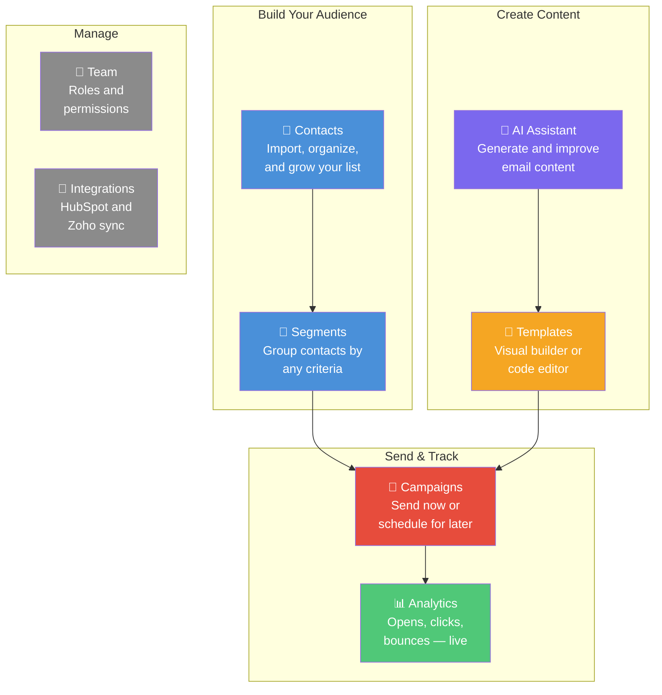

---

## Feature Walkthrough

### Dashboard — Your Command Center

The first thing your team sees after logging in. A personalized welcome, key stats, quick actions, and recent campaign activity — all on one page.

```
┌─────────────────────────────────────────────────────────────────────────┐
│  Welcome back, Jane!                                                     │
│  Here's how your email marketing is performing.                          │
│                                                                          │
│  ┌──────────────┐  ┌──────────────┐  ┌──────────────┐  ┌──────────────┐│
│  │ Campaigns    │  │ Emails       │  │ Avg Open     │  │ Avg Delivery ││
│  │              │  │ Sent         │  │ Rate         │  │ Rate         ││
│  │      23      │  │   12,450     │  │   34.2%      │  │   98.7%      ││
│  └──────────────┘  └──────────────┘  └──────────────┘  └──────────────┘│
│                                                                          │
│  QUICK ACTIONS                                                           │
│  ┌──────────────────┐  ┌──────────────────┐  ┌──────────────────┐      │
│  │  📧 New Campaign  │  │  📥 Import        │  │  🎨 Create       │      │
│  │                   │  │     Contacts      │  │     Template     │      │
│  └──────────────────┘  └──────────────────┘  └──────────────────┘      │
│                                                                          │
│  RECENT CAMPAIGNS                                                        │
│  ┌───────────────────────────────────────────────────────────────────┐  │
│  │  Name               Status       Sent     Open Rate              │  │
│  │  March Newsletter    Completed    2,847    34.2%                  │  │
│  │  Spring Sale         Scheduled    —        —                      │  │
│  │  Welcome Series      Completed    342      52.1%                  │  │
│  └───────────────────────────────────────────────────────────────────┘  │
│                                                                          │
└─────────────────────────────────────────────────────────────────────────┘
```

**Three sections:**
- **Stats cards** — Campaigns sent, total emails delivered, average open rate, average delivery rate
- **Quick actions** — One-click shortcuts to the most common tasks
- **Recent campaigns** — Your latest campaigns with status, send count, and open rate

---

### Contacts — Your Audience Database

Every person who might receive your emails lives here. Add them one at a time, paste a batch, or import thousands from a CSV.

```
┌─────────────────────────────────────────────────────────────────────────┐
│  👥 Contacts                                                             │
│  Manage your contact list for email campaigns.                           │
│                                                                          │
│  [ Segments ]  [ Export CSV ]  [ Import CSV ]  [ Bulk Add ]  [+ Add ]   │
│                                                                          │
│  Search: ┌──────────────────────┐   Status: [ All statuses ▾ ]          │
│          │ Search contacts...   │                                        │
│          └──────────────────────┘                                        │
│                                                                          │
│  ┌───────────────────────────────────────────────────────────────────┐  │
│  │  Email                  First     Last      Tags          Status  │  │
│  │  ─────────────────────────────────────────────────────────────── │  │
│  │  jane@example.com       Jane      Doe       vip, news     Active │  │
│  │  marcus@acme.com        Marcus    Chen      enterprise    Active │  │
│  │  lisa@startup.io        Lisa      Park      trial         Active │  │
│  │  tom@bigcorp.com        Tom       Wilson    vip           Unsub  │  │
│  │  sarah@agency.co        Sarah     Miller    news          Active │  │
│  └───────────────────────────────────────────────────────────────────┘  │
│                                                                          │
│                          [ ← Previous ]  [ Next → ]                     │
│                                                                          │
└─────────────────────────────────────────────────────────────────────────┘
```

**Key capabilities:**

| Action | How It Works |
|--------|-------------|
| **Add one contact** | Click "Add" → fill in email, name, tags, and any custom fields |
| **Bulk add** | Click "Bulk Add" → paste multiple contacts at once |
| **CSV import** | Click "Import CSV" → upload a file → map columns → done |
| **CSV export** | Click "Export CSV" → downloads your full list instantly |
| **Search** | Type a name or email to find anyone fast |
| **Filter by status** | Show only Active, Unsubscribed, or Bounced contacts |
| **Custom fields** | Store any extra data per contact (company, plan, region — anything) |
| **Tags** | Label contacts flexibly for segmentation (e.g., "vip", "newsletter", "trial") |

**CSV Import — step by step:**

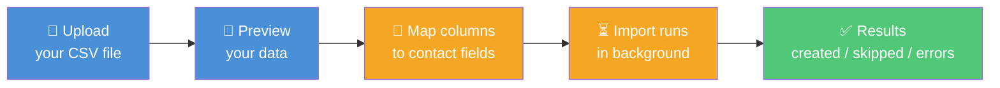

Upload your CSV, preview the data, tell the platform which column is the email / first name / etc., and click import. Duplicates are automatically skipped. You see a clear summary when it's done.

**Contact statuses:**

| Status | What It Means |
|--------|--------------|
| **Active** | This person will receive your campaigns |
| **Unsubscribed** | They clicked the unsubscribe link — automatically protected from future sends |
| **Bounced** | Their email address doesn't exist — automatically removed from future sends |

---

### Segments — Target the Right People

Segments let you send to the right audience instead of blasting your entire list. Define rules like "active contacts tagged VIP" and the platform finds matching contacts automatically — even as your list grows.

```
┌─────────────────────────────────────────────────────────────────────────┐
│  🎯 Segments                                                             │
│  Group contacts by criteria for targeted campaigns.                      │
│                                                                          │
│                                                       [ + Create Segment]│
│                                                                          │
│  ┌───────────────────────────────────────────────────────────────────┐  │
│  │  Name                    Rules        Members    Created          │  │
│  │  ─────────────────────────────────────────────────────────────── │  │
│  │  VIP Customers           3 rules      89         Mar 15          │  │
│  │  Newsletter Subscribers  2 rules      1,204      Mar 10          │  │
│  │  Trial Users             1 rule       342        Mar 8           │  │
│  │  Enterprise Clients      2 rules      56         Mar 1           │  │
│  └───────────────────────────────────────────────────────────────────┘  │
│                                                                          │
└─────────────────────────────────────────────────────────────────────────┘
```

**How the segment builder works:**

```
┌─────────────────────────────────────────────────────────────────┐
│  Create Segment                                                  │
│                                                                  │
│  Name: ┌────────────────────────────────┐                        │
│        │ VIP Customers                  │                        │
│        └────────────────────────────────┘                        │
│                                                                  │
│  Match: ( ALL of these rules ▾ )                                 │
│                                                                  │
│  ┌──────────────────────────────────────────────────────┐       │
│  │  [ status ▾ ]     [ equals ▾ ]      [ active    ]  ✕│       │
│  │                        AND                           │       │
│  │  [ tags   ▾ ]     [ contains ▾ ]    [ vip       ]  ✕│       │
│  │                        AND                           │       │
│  │  [ tags   ▾ ]     [ contains ▾ ]    [ newsletter]  ✕│       │
│  └──────────────────────────────────────────────────────┘       │
│                                                                  │
│  [ + Add another rule ]                                          │
│                                                                  │
│  ┌─────────────────────────┐                                    │
│  │  👥 89 contacts match    │                                    │
│  └─────────────────────────┘                                    │
│                                                                  │
│                    [ Cancel ]  [ Create Segment ]                │
└─────────────────────────────────────────────────────────────────┘
```

**Segments are live, not frozen.** When you add new contacts that match the rules, they're automatically included next time you send to that segment. No manual updating needed.

**Example segments you might create:**

| Segment Name | Rules | Use Case |
|-------------|-------|----------|
| All Active Subscribers | status = active | General newsletters |
| VIP Customers | status = active AND tags contains "vip" | Exclusive offers |
| Enterprise Accounts | customFields.plan = "enterprise" | Product updates |
| New This Month | created after 2026-03-01 | Welcome series |
| Inactive Users | tags not contains "recently_engaged" | Re-engagement |

---

### Templates — Design Emails Your Way

Templates are reusable email designs. Build them once, use them across many campaigns. Every template is responsive — it looks great on desktop, tablet, and mobile.

**Two ways to build:**

```
┌───────────────────────────────────┐     ┌───────────────────────────────────┐
│                                   │     │                                   │
│      ┌─────────────────────┐     │     │     1  <mjml>                     │
│      │      HEADER         │     │     │     2    <mj-body>                │
│      └─────────────────────┘     │     │     3      <mj-section>          │
│                                   │     │     4        <mj-column>        │
│   ┌──────────┐  ┌──────────┐     │     │     5          <mj-text>        │
│   │  IMAGE   │  │  IMAGE   │     │     │     6            Hello           │
│   └──────────┘  └──────────┘     │     │     7            {{firstName}}   │
│                                   │     │     8          </mj-text>       │
│   ┌──────────────────────────┐   │     │     9        </mj-column>       │
│   │   Your text goes here    │   │     │    10      </mj-section>        │
│   └──────────────────────────┘   │     │    11    </mj-body>              │
│                                   │     │    12  </mjml>                   │
│   ┌──────────────────────────┐   │     │                                   │
│   │    [ Call to Action → ]  │   │     │                                   │
│   └──────────────────────────┘   │     │                                   │
│                                   │     │                                   │
│   🎨 VISUAL BUILDER              │     │   💻 CODE EDITOR                  │
│   Drag and drop blocks —         │     │   Write MJML markup for           │
│   no coding required.            │     │   full control over layout.       │
│   Perfect for marketers.         │     │   Perfect for developers.         │
│                                   │     │                                   │
└───────────────────────────────────┘     └───────────────────────────────────┘
```

| Feature | What It Does |
|---------|-------------|
| **Visual builder** | Drag text, images, buttons, and columns into your email — like designing a document |
| **Code editor** | Write MJML (a simple email markup language) with syntax highlighting |
| **Personalization** | Insert `{{firstName}}`, `{{lastName}}`, or any custom field — each recipient sees their own data |
| **Preview** | See how the email looks with sample data before sending |
| **Version history** | Every save is a version. Revert to any previous version with one click. Nothing is ever lost. |
| **Starter templates** | Pre-built designs to get started fast — customize them or build from scratch |
| **Duplicate** | Copy any template to create a variation without changing the original |

**Personalization example:**

```
What you write:                    What Jane sees:          What Marcus sees:
─────────────────                  ──────────────           ────────────────
Hello {{firstName}},        →      Hello Jane,              Hello Marcus,
Thanks for choosing                Thanks for choosing      Thanks for choosing
{{customFields.plan}}.             Premium.                 Enterprise.
```

---

### Campaigns — Send With Confidence

A campaign is one email send to one audience. Pick a template, pick a segment, write a subject line, and send — now or later.

```
┌─────────────────────────────────────────────────────────────────────────┐
│  📧 Campaigns                                                            │
│  Create and manage email campaigns.                                      │
│                                                                          │
│                                                      [ + New Campaign ] │
│                                                                          │
│  ┌───────────────────────────────────────────────────────────────────┐  │
│  │  Name              Status       Segment          Sent     Created │  │
│  │  ───────────────────────────────────────────────────────────────  │  │
│  │  April Newsletter   Draft       All Subscribers   —       Apr 1  │  │
│  │  Spring Sale        Scheduled   VIP Customers     —       Mar 28 │  │
│  │  March Newsletter   Completed   All Subscribers   2.8K    Mar 15 │  │
│  │  Welcome Series     Completed   New This Month    342     Mar 10 │  │
│  │  Product Update     Failed      Enterprise        41/56   Mar 5  │  │
│  └───────────────────────────────────────────────────────────────────┘  │
│                                                                          │
└─────────────────────────────────────────────────────────────────────────┘
```

**Creating a new campaign:**

```
┌─────────────────────────────────────────────────────────────────┐
│  New Campaign                                         [✨ AI ]   │
│  Configure your campaign and select an audience.                 │
│                                                                  │
│  Campaign Name *                                                 │
│  ┌─────────────────────────────────────────────┐                │
│  │ April Newsletter                            │                │
│  └─────────────────────────────────────────────┘                │
│                                                                  │
│  Email Subject *                                       [✨]      │
│  ┌─────────────────────────────────────────────┐                │
│  │ Your April update is here, {{firstName}}    │                │
│  └─────────────────────────────────────────────┘                │
│  Tip: Click ✨ to generate a subject line with AI               │
│                                                                  │
│  Template *                                                      │
│  ┌─────────────────────────────────────────────┐                │
│  │ Monthly Newsletter (v3)                  ▾  │                │
│  └─────────────────────────────────────────────┘                │
│                                                                  │
│  Audience *                                                      │
│  ┌─────────────────────────────────────────────┐                │
│  │ All Active Subscribers (2,847 members)   ▾  │                │
│  └─────────────────────────────────────────────┘                │
│                                                                  │
│  Audience Preview:                                               │
│  jane@example.com, marcus@acme.com, lisa@startup.io...          │
│                                                                  │
│                 [ Cancel ]  [ Create Campaign ]                  │
└─────────────────────────────────────────────────────────────────┘
```

**After creating, you choose when to send:**

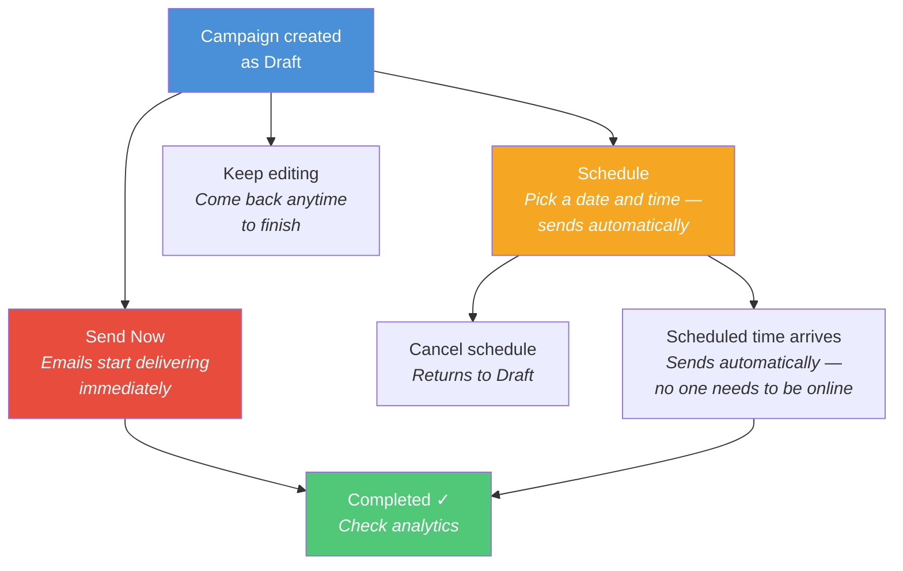

**Campaign statuses at a glance:**

| Status | What It Means |
|--------|--------------|
| **Draft** | Saved but not sent — you can still edit everything |
| **Scheduled** | Waiting for the scheduled date and time to arrive |
| **Executing** | Emails are being sent right now |
| **Completed** | All emails processed — check your analytics |
| **Failed** | Something went wrong — click in to see details |

---

### Analytics — Know What's Working

Every campaign tracks delivery, opens, clicks, bounces, and complaints in real time. Results start appearing as soon as recipients interact with your email.

**Per-campaign view:**

```
┌─────────────────────────────────────────────────────────────────────────┐
│  March Newsletter — Completed                                            │
│  Sent to 2,847 contacts                                                 │
│                                                                          │
│  ┌───────────┐  ┌───────────┐  ┌───────────┐  ┌───────────┐  ┌───────┐│
│  │ Delivered │  │  Opened   │  │  Clicked  │  │  Bounced  │  │Compl. ││
│  │   2,831   │  │    968    │  │    247    │  │    16     │  │   2   ││
│  │   99.4%   │  │   34.2%   │  │   8.7%    │  │   0.6%    │  │ 0.07% ││
│  └───────────┘  └───────────┘  └───────────┘  └───────────┘  └───────┘│
│                                                                          │
│  ████████████████████████████████████████████ Delivered  2,831          │
│  ████████████████                             Opened      968          │
│  ████                                         Clicked     247          │
│  ▪                                            Bounced      16          │
│                                                                          │
└─────────────────────────────────────────────────────────────────────────┘
```

**Global analytics dashboard:**

Aggregated metrics across all your campaigns, with time-range filters:

```
┌─────────────────────────────────────────────────────────────────────────┐
│  📈 Analytics                                                            │
│  Track email delivery and engagement across all campaigns.               │
│                                                                          │
│  [ 7d ]  [ 30d ]  [ 90d ]  [ All time ]                                 │
│                                                                          │
│  ┌───────────┐  ┌───────────┐  ┌───────────┐  ┌───────────┐  ┌───────┐│
│  │ Total     │  │ Total     │  │ Total     │  │ Total     │  │ Total ││
│  │ Sent      │  │ Delivered │  │ Opened    │  │ Clicked   │  │Bounced││
│  │  12,450   │  │  12,283   │  │   4,106   │  │   1,038   │  │  167  ││
│  │           │  │   98.7%   │  │   33.4%   │  │   8.4%    │  │  1.3% ││
│  └───────────┘  └───────────┘  └───────────┘  └───────────┘  └───────┘│
│                                                                          │
│  Campaign Comparison                                                     │
│  ┌───────────────────────────────────────────────────────────────────┐  │
│  │  March Newsletter    ████████████████████  ████████  ███          │  │
│  │  Spring Sale         ████████████████      █████████████          │  │
│  │  Welcome Series      ████████████████████████  ████████████       │  │
│  │  Product Update      ████████████          ███                    │  │
│  │                                                                   │  │
│  │  Legend: ■ Delivered  ■ Opened  ■ Clicked                        │  │
│  └───────────────────────────────────────────────────────────────────┘  │
│                                                                          │
└─────────────────────────────────────────────────────────────────────────┘
```

**What each metric tells you:**

| Metric | What It Means | Healthy Range |
|--------|--------------|---------------|
| **Delivery Rate** | How many emails actually reached the inbox | > 95% |
| **Open Rate** | How many people opened your email | > 20% |
| **Click Rate** | How many people clicked a link | > 2% |
| **Bounce Rate** | How many emails failed to deliver | < 2% |
| **Complaint Rate** | How many people marked it as spam | < 0.1% |

---

### AI Assistant — Write Better, Faster

Built-in AI helps your team create email content without being a copywriter. Three tools, all accessible from within the campaign and template editors.

**Generate — Create content from a description:**

```
┌─────────────────────────────────────────────────────────────┐
│  ✨ AI Email Generator                                       │
│                                                              │
│  What should this email be about?                            │
│  ┌───────────────────────────────────────────────────────┐   │
│  │ Announce our spring sale — 20% off all plans,         │   │
│  │ running for one week starting Monday.                 │   │
│  └───────────────────────────────────────────────────────┘   │
│                                                              │
│  Tone:  [ Professional ▾ ]                                   │
│         Professional · Casual · Urgent · Friendly            │
│                                                              │
│                                        [ ✨ Generate ]       │
│                                                              │
│  ─── Result ─────────────────────────────────────────────    │
│                                                              │
│  Subject:  Spring Into Savings — 20% Off All Plans           │
│  Preview:  Your exclusive discount starts Monday             │
│  Body:     [Full email copy ready to use]                    │
│                                                              │
│                        [ Regenerate ]  [ Apply ]             │
└─────────────────────────────────────────────────────────────┘
```

**Improve — Get suggestions for existing content:**

```
┌──────────────────────────────────────────┐
│  📝 AI Content Improver                   │
│                                           │
│  Goal: ┌────────────────────────────┐     │
│        │ increase click rate        │     │
│        └────────────────────────────┘     │
│                              [ Analyze ]  │
│                                           │
│  Overall Score:  7.2 / 10                 │
│                                           │
│  Suggestion 1 — Subject Line              │
│  ┌───────────────────────────────────┐    │
│  │  Before: "March Newsletter"       │    │
│  │  After:  "3 Things You Need to    │    │
│  │           Know This March"        │    │
│  │  Why: Numbers in subject lines    │    │
│  │       increase open rates by 15%  │    │
│  │                      [ Apply ]    │    │
│  └───────────────────────────────────┘    │
│                                           │
│  Suggestion 2 — Call to Action            │
│  ┌───────────────────────────────────┐    │
│  │  Before: "Learn More"             │    │
│  │  After:  "Get Your Free Report"   │    │
│  │  Why: Specific CTAs outperform    │    │
│  │       generic ones by 2-3x       │    │
│  │                      [ Apply ]    │    │
│  └───────────────────────────────────┘    │
│                                           │
└──────────────────────────────────────────┘
```

**Chat — Ask anything about your campaigns:**

```
┌──────────────────────────────────────────┐
│  🤖 AI Assistant                          │
│                                           │
│  ┌───────────────────────────────────┐    │
│  │ 🤖 I can help you with campaigns, │    │
│  │ content, segments, and strategy.  │    │
│  │ What would you like to do?        │    │
│  └───────────────────────────────────┘    │
│                                           │
│         ┌───────────────────────────┐     │
│         │ Write me 3 subject line   │     │
│         │ options for a product     │     │
│         │ launch email.         👤  │     │
│         └───────────────────────────┘     │
│                                           │
│  ┌───────────────────────────────────┐    │
│  │ 🤖 Here are 3 options:            │    │
│  │                                   │    │
│  │ 1. "It's Here — Introducing       │    │
│  │     [Product Name]"               │    │
│  │ 2. "You Asked, We Built It"       │    │
│  │ 3. "First Look: [Product] Is      │    │
│  │     Now Live"                     │    │
│  │                                   │    │
│  │ Option 1 works best for brand     │    │
│  │ announcements. Option 2 creates   │    │
│  │ curiosity. Option 3 appeals to    │    │
│  │ early adopters.                   │    │
│  └───────────────────────────────────┘    │
│                                           │
│  ┌──────────────────────────┐ [ Send ]   │
│  │ Ask anything...          │             │
│  └──────────────────────────┘             │
└──────────────────────────────────────────┘
```

---

### Suppression — Automatic List Hygiene

The suppression list keeps your sending reputation healthy by automatically preventing emails to addresses that shouldn't receive them.

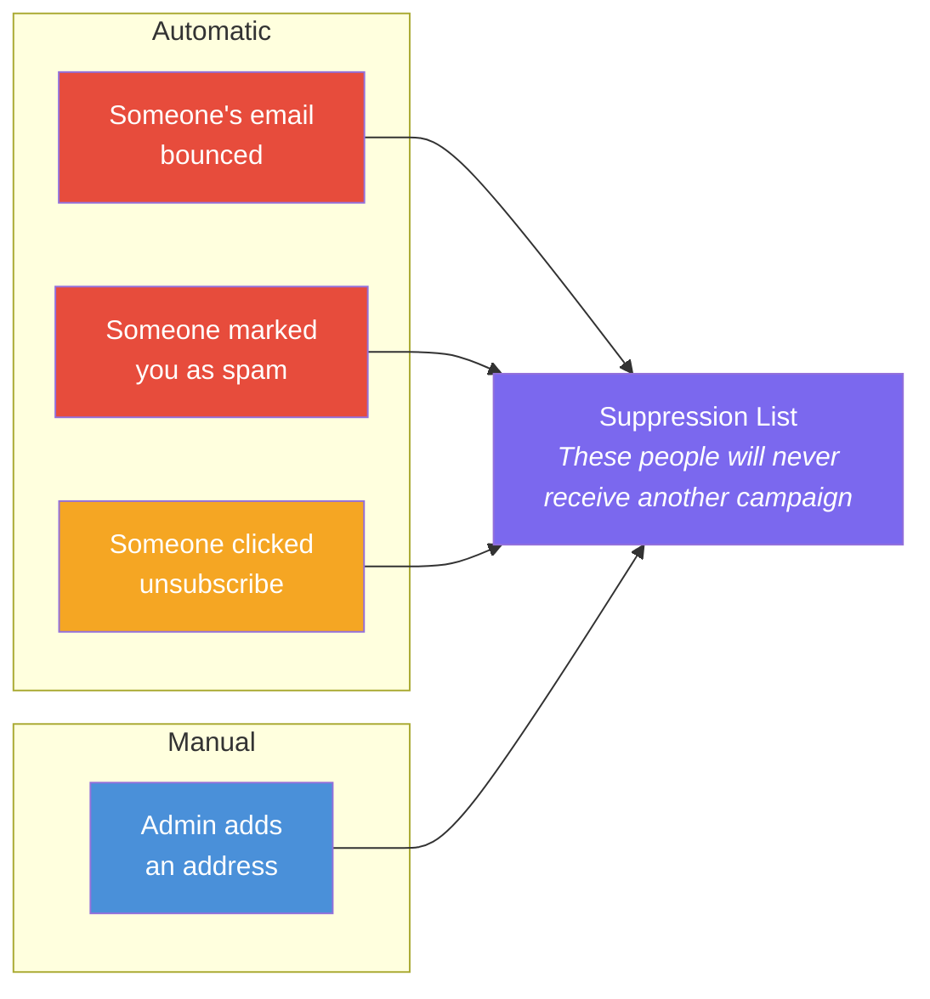

**Your team doesn't need to manage this.** The platform handles it automatically. Every campaign checks the suppression list before sending — suppressed contacts are silently skipped.

You can also manually add or remove addresses through the Suppression page (for things like phone opt-out requests or re-subscriptions).

---

### Team Management — Collaborate Securely

Invite your team and control who can do what.

```
┌─────────────────────────────────────────────────────────────────┐
│  ⚙️ User Management                                              │
│  Manage platform users and their roles.                          │
│                                                                  │
│  [ Invite User ]  [ + Create User ]                             │
│                                                                  │
│  Search: ┌────────────────┐  Role: [All▾]  Status: [All▾]       │
│          │                │                                      │
│          └────────────────┘                                      │
│                                                                  │
│  ┌───────────────────────────────────────────────────────────┐  │
│  │  Name           Email                 Role     Status     │  │
│  │  ─────────────────────────────────────────────────────── │  │
│  │  Jane Smith     jane@company.com      Admin    Active     │  │
│  │  Marcus Chen    marcus@company.com    Editor   Active     │  │
│  │  Lisa Park      lisa@company.com      Viewer   Active     │  │
│  │  Tom Wilson     tom@company.com       Editor   Disabled   │  │
│  └───────────────────────────────────────────────────────────┘  │
│                                                                  │
└─────────────────────────────────────────────────────────────────┘
```

**Three roles — give each person exactly the access they need:**

| | Admin | Editor | Viewer |
|---|:---:|:---:|:---:|
| View contacts, campaigns, templates, analytics | ✅ | ✅ | ✅ |
| Export contacts | ✅ | ✅ | ✅ |
| Create and edit campaigns, templates, contacts | ✅ | ✅ | — |
| Send and schedule campaigns | ✅ | ✅ | — |
| Use AI features | ✅ | ✅ | — |
| Manage team members | ✅ | — | — |
| Configure domains and integrations | ✅ | — | — |

**Invite by email** — new team members receive a link, set their password, and they're in. **Disable instantly** — one click removes access and terminates all active sessions.

---

### Domain Settings — Professional Sending

Emails are sent from your own domain (e.g., `campaigns@yourdomain.com`), not from a generic address. The Domains settings page shows your verification status and sending health.

```
┌─────────────────────────────────────────────────────────────────┐
│  🌐 Domain Settings                                              │
│                                                                  │
│  Domain: yourdomain.com                                          │
│  Verification: ✅ Verified                                       │
│  DKIM: ✅ Configured                                             │
│                                                                  │
│  Account Health                                                  │
│  ┌──────────────┐  ┌──────────────┐  ┌──────────────┐          │
│  │ Enforcement  │  │ Production   │  │ Sending      │          │
│  │   Normal     │  │   Yes ✅     │  │   Enabled ✅ │          │
│  └──────────────┘  └──────────────┘  └──────────────┘          │
│                                                                  │
│  Send Quota (24 hours)                                           │
│  ████████████░░░░░░░░░  2,100 / 50,000                          │
│                                                                  │
└─────────────────────────────────────────────────────────────────┘
```

The platform handles email authentication (SPF, DKIM, DMARC) — your team just needs to add the DNS records shown on the page to your domain settings. This ensures your emails land in inboxes, not spam folders.

---

### CRM Integrations — Connect Your Tools

Pull contacts from HubSpot or Zoho CRM with one click. No manual CSV exports needed.

```
┌─────────────────────────────────────────────────────────────────┐
│  🔗 CRM Integrations                                             │
│                                                                  │
│  ┌──────────────────────────────┐  ┌──────────────────────────┐ │
│  │  HubSpot        ✅ Connected  │  │  Zoho CRM    ✅ Connected │ │
│  │                              │  │                          │ │
│  │  Last synced: 2 hours ago    │  │  Last synced: 1 day ago  │ │
│  │                              │  │  Region: US              │ │
│  │  [ Sync Now ]  [ Disconnect ]│  │  [ Sync Now ] [Disconn.] │ │
│  └──────────────────────────────┘  └──────────────────────────┘ │
│                                                                  │
└─────────────────────────────────────────────────────────────────┘
```

| | HubSpot | Zoho CRM |
|---|---|---|
| **How to connect** | Paste your Private App token | Enter refresh token + pick region |
| **What syncs** | Contacts from HubSpot → your platform | Contacts from Zoho → your platform |
| **Duplicates** | Automatically merged by email | Automatically merged by email |
| **Your existing contacts** | Preserved — sync adds, doesn't replace | Preserved — sync adds, doesn't replace |

Click **Sync Now** anytime to pull the latest contacts from your CRM.

---

### White-Label Branding — Make It Yours

The entire platform is branded as your own. Your team sees your company name, your logo, and your colors — no trace of "Volley" anywhere. The UI features a **modern dark aesthetic with purple gradient accents** — ambient glow effects on the login screen and sidebar create a premium, polished feel.

```
┌──────────────────────────┐     ┌──────────────────────────┐
│  ▓▓▓▓▓▓▓▓▓▓▓▓▓▓▓▓▓▓▓▓▓▓│     │  ▓▓▓▓▓▓▓▓▓▓▓▓▓▓▓▓▓▓▓▓▓▓│
│  🏢 ACME CORP            │     │  🌊 BLUE OCEAN AGENCY    │
│  ── gradient accent ──   │     │  ── gradient accent ──   │
│                          │     │                          │
│  ┃ ▸ Dashboard         • │     │  ┃ ▸ Dashboard         • │
│    ▸ Campaigns           │     │    ▸ Campaigns           │
│    ▸ Contacts            │     │    ▸ Contacts            │
│                          │     │                          │
│  Primary: 🟠 #FF6B35     │     │  Primary: 🔵 #2563EB     │
│  ~ purple/orange glow ~  │     │  ~ purple/blue glow ~    │
│                          │     │                          │
│  Emails from:            │     │  Emails from:            │
│  hi@acmecorp.com         │     │  news@blueocean.agency   │
│  ▓▓▓▓▓▓▓▓▓▓▓▓▓▓▓▓▓▓▓▓▓▓│     │  ▓▓▓▓▓▓▓▓▓▓▓▓▓▓▓▓▓▓▓▓▓▓│
└──────────────────────────┘     └──────────────────────────┘

Same platform, completely different brands.
```

**Visual design:**

The platform features a premium dark-to-light aesthetic with purple accent gradients:

- **Login screen** — split-panel: dark branding panel (left) with tagline, feature bullets, and "Powered by" branding; light panel (right) with sign-in card and purple gradient button
- **Sidebar** — dark background with subtle purple gradient glows, active item bar + dot indicator, gradient accent line under logo
- **Color-coded role badges** — purple for Admin, blue for Editor, gray for Viewer
- **Stats cards** — colored left borders (purple, blue, emerald, amber)
- **Theme toggle** — light, dark, or system-matching mode
- **Breadcrumb navigation** — shows current page location in the header
- **Purple gradient buttons** — primary actions use a vibrant purple gradient

**What you can customize:**

| Element | Where It Appears |
|---------|-----------------|
| **Company name** | Login tagline, sidebar header, browser tab, transactional emails |
| **Logo** | Login panel (top-left), sidebar header |
| **Brand color** | Buttons, links, active states, gradient accents throughout the UI |
| **Login copy** | Tagline, description, and feature bullets on the login panel |
| **Sending domain** | The "from" address on all campaign emails |
| **Theme** | Light, dark, or system-matching mode (user-selectable) |
| **Transactional branding** | Password reset, invite, and verification emails match your brand too |

The login page shows "Powered by Webpuppies" in the bottom-left corner. All other screens display your brand only — no third-party branding.

---

## How a Campaign Works — End to End

From idea to delivered email, here's the complete flow:

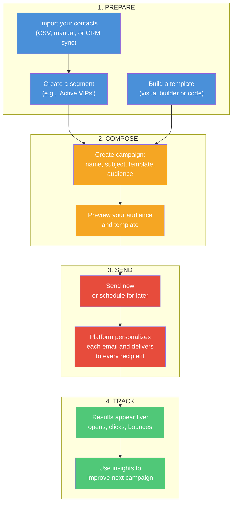

**What the platform handles automatically after you hit send:**

```
┌─────────────────────────────────────────────────────────────────┐
│                                                                  │
│  You click "Send Now"                                            │
│       │                                                          │
│       ▼                                                          │
│  Platform finds all contacts matching your segment               │
│       │                                                          │
│       ▼                                                          │
│  Checks each contact against the suppression list                │
│  (bounced, unsubscribed, or complained = skipped)                │
│       │                                                          │
│       ▼                                                          │
│  Renders a personalized email for each recipient                 │
│  ({{firstName}} → "Jane", {{company}} → "Acme Inc")             │
│       │                                                          │
│       ▼                                                          │
│  Delivers each email with tracking enabled                       │
│       │                                                          │
│       ▼                                                          │
│  As recipients open and click, your analytics update live        │
│       │                                                          │
│       ▼                                                          │
│  If someone bounces or complains, they're automatically          │
│  suppressed from all future campaigns                            │
│                                                                  │
│  ✓  You don't need to monitor any of this — it's all automatic  │
│                                                                  │
└─────────────────────────────────────────────────────────────────┘
```

---

## Why Volley?

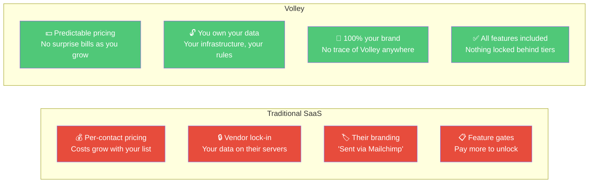

| | Traditional SaaS | Volley |
|---|---|---|
| **Contact limits** | Capped by plan tier — pay more as you grow | Unlimited |
| **Features** | Advanced features locked behind higher tiers | Everything included from day one |
| **White-labeling** | Enterprise plans only (if available at all) | Built-in, standard |
| **Data ownership** | Vendor stores your data on their servers | Your data stays on your infrastructure |
| **Vendor lock-in** | High — migrating away is painful | None — you control everything |
| **Branding** | "Sent via [vendor]" footers | Zero third-party branding |
| **Scalability** | Plan upgrades required | Scales automatically with usage |

*Contact us for pricing details and deployment options.*

---

## Who Is Volley For?

```
┌─────────────────────────────────────────────────────────────────┐
│                                                                  │
│  🏢  AGENCIES                                                    │
│  Deploy a branded instance for each client. Offer email          │
│  marketing as a white-label managed service.                     │
│                                                                  │
│  🚀  STARTUPS                                                    │
│  Full-featured email marketing from day one. Scale from          │
│  100 contacts to 100,000 without hitting plan limits.            │
│                                                                  │
│  🏛️  ENTERPRISES WITH DATA REQUIREMENTS                          │
│  Everything runs on your own infrastructure, in your chosen      │
│  region. No data leaves your environment. Full audit trail.      │
│                                                                  │
│  📈  GROWING TEAMS                                               │
│  Unlimited contacts, all features included, no surprise          │
│  bills as your audience grows.                                   │
│                                                                  │
│  🛠️  TECHNICAL TEAMS                                             │
│  Extensible codebase, serverless architecture, easy to           │
│  customize with your own features and integrations.                │
│                                                                  │
└─────────────────────────────────────────────────────────────────┘
```

---

## Security & Compliance

Everything your team and your recipients expect from a professional email platform:

| Area | What's Built In |
|------|----------------|
| **Data ownership** | All data stays in your cloud account — no third parties |
| **Encryption** | All data encrypted in transit (HTTPS) and at rest |
| **Authentication** | Secure login with short-lived tokens and encrypted passwords |
| **Team access control** | Three roles (Admin, Editor, Viewer) enforced on every action |
| **Email authentication** | SPF + DKIM + DMARC — your emails are verified as coming from you |
| **One-click unsubscribe** | Every email includes a tamper-proof unsubscribe link (RFC 8058) |
| **Automatic suppression** | Bounces, complaints, and unsubscribes are instantly protected |
| **No re-emailing** | Suppressed contacts can never accidentally receive another campaign |
| **Domain reputation monitoring** | Live dashboard showing your sending health and limits |

---

## Under the Hood

For technical stakeholders who want to know what powers the platform:

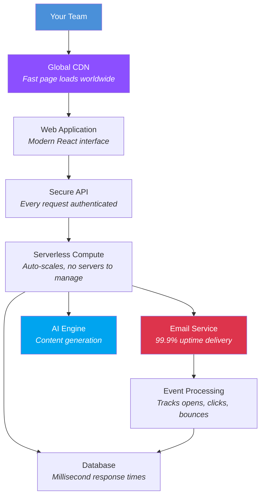

| Characteristic | Detail |
|----------------|--------|
| **Servers to manage** | Zero — fully serverless, auto-scaling |
| **Uptime** | Built on AWS infrastructure (99.9%+ SLA) |
| **Scaling** | Handles 100 or 1,000,000 emails — no configuration needed |
| **Deployment** | Single command deploys the entire platform |
| **Regions** | Deploy in any AWS region worldwide |
| **AI** | Powered by Claude AI for content generation |

*For the full technical architecture, see [Platform Overview](./VOLLEY-PLATFORM-OVERVIEW.md).*

---

## Full Feature Checklist

| Category | Feature | |
|----------|---------|---|
| **Contacts** | Unlimited contacts | ✅ |
| | CSV import with column mapping wizard | ✅ |
| | CSV export | ✅ |
| | Custom fields (store any data) | ✅ |
| | Tags for organizing | ✅ |
| | Search and filter | ✅ |
| | Automatic deduplication | ✅ |
| | CRM sync (HubSpot, Zoho) | ✅ |
| **Segments** | Dynamic rule-based segments | ✅ |
| | AND / OR logic | ✅ |
| | 9 filter operators | ✅ |
| | Live member count | ✅ |
| **Templates** | Visual drag-and-drop builder | ✅ |
| | Code editor (MJML) | ✅ |
| | Personalization variables | ✅ |
| | Version history with rollback | ✅ |
| | Starter templates | ✅ |
| | Live preview | ✅ |
| | Template duplication | ✅ |
| **Campaigns** | Send now | ✅ |
| | Schedule for later | ✅ |
| | Cancel scheduled sends | ✅ |
| | Per-recipient personalization | ✅ |
| | Audience preview | ✅ |
| | Live send progress | ✅ |
| **Analytics** | Delivery tracking | ✅ |
| | Open tracking | ✅ |
| | Click tracking | ✅ |
| | Bounce tracking | ✅ |
| | Complaint tracking | ✅ |
| | Per-campaign detail view | ✅ |
| | Global dashboard with charts | ✅ |
| | Time-range filters | ✅ |
| **AI** | Email content generation | ✅ |
| | Content improvement suggestions | ✅ |
| | Interactive chat assistant | ✅ |
| | Tone selection (4 tones) | ✅ |
| **Compliance** | One-click unsubscribe | ✅ |
| | Automatic bounce suppression | ✅ |
| | Automatic complaint suppression | ✅ |
| | Email authentication (SPF/DKIM/DMARC) | ✅ |
| **Team** | Role-based access (3 roles) | ✅ |
| | Email invitations | ✅ |
| | Instant account disable | ✅ |
| **White-Label** | Custom company name | ✅ |
| | Custom logo | ✅ |
| | Custom brand color | ✅ |
| | Custom sending domain | ✅ |
| | Zero third-party branding | ✅ |
| **Platform** | Fully serverless (no maintenance) | ✅ |
| | Auto-scaling | ✅ |
| | Single-command deployment | ✅ |
| | Multi-region support | ✅ |

---

*Ready to see it in action? Contact us for a demo.*
*For setup instructions, see the [Setup Guide](./setup-guide.md).*
*Last updated: 2026-04-02*


---


# Volley — End User Guide

> Everything your team needs to know to manage contacts, build emails, run campaigns, and track results — from first login to advanced features.

---

## Table of Contents

- [Getting Started](#getting-started)
  - [Logging In](#logging-in)
  - [Accepting an Invitation](#accepting-an-invitation)
  - [Your Dashboard](#your-dashboard)
  - [Navigating the Platform](#navigating-the-platform)
- [First-Time Setup Checklist](#first-time-setup-checklist)
- [Team Roles & Permissions](#team-roles--permissions)
- [Managing Your Contacts](#managing-your-contacts)
  - [Adding Contacts One by One](#adding-contacts-one-by-one)
  - [Bulk Adding Contacts](#bulk-adding-contacts)
  - [Importing from CSV](#importing-from-csv)
  - [Exporting Contacts](#exporting-contacts)
  - [Editing & Deleting Contacts](#editing--deleting-contacts)
  - [Contact Statuses](#contact-statuses)
- [Organizing Contacts with Segments](#organizing-contacts-with-segments)
  - [What Are Segments?](#what-are-segments)
  - [Creating a Segment](#creating-a-segment)
  - [Segment Rule Examples](#segment-rule-examples)
  - [Editing & Deleting Segments](#editing--deleting-segments)
- [Building Email Templates](#building-email-templates)
  - [Visual Builder vs Code Editor](#visual-builder-vs-code-editor)
  - [Creating a Template](#creating-a-template)
  - [Personalizing with Variables](#personalizing-with-variables)
  - [Previewing Your Template](#previewing-your-template)
  - [Version History & Rollback](#version-history--rollback)
  - [Duplicating Templates](#duplicating-templates)
- [Running Campaigns](#running-campaigns)
  - [Creating a Campaign](#creating-a-campaign)
  - [Previewing Your Audience](#previewing-your-audience)
  - [Sending Immediately](#sending-immediately)
  - [Scheduling for Later](#scheduling-for-later)
  - [Canceling a Scheduled Campaign](#canceling-a-scheduled-campaign)
  - [Campaign Lifecycle](#campaign-lifecycle)
  - [What Happens When You Hit Send](#what-happens-when-you-hit-send)
- [Tracking Results](#tracking-results)
  - [Campaign Analytics](#campaign-analytics)
  - [Global Analytics Dashboard](#global-analytics-dashboard)
  - [Understanding Your Metrics](#understanding-your-metrics)
  - [Healthy Benchmarks](#healthy-benchmarks)
- [Suppression List](#suppression-list)
  - [How It Works](#how-it-works)
  - [Managing Suppressions Manually](#managing-suppressions-manually)
- [Using the AI Assistant](#using-the-ai-assistant)
  - [Generating Email Content](#generating-email-content)
  - [Improving Existing Content](#improving-existing-content)
  - [Chat Assistant](#chat-assistant)
- [Admin Settings](#admin-settings)
  - [Managing Your Team](#managing-your-team)
  - [Domain & Sending Reputation](#domain--sending-reputation)
  - [CRM Integrations](#crm-integrations)
- [Common Workflows](#common-workflows)
  - [Send Your First Campaign in 5 Steps](#send-your-first-campaign-in-5-steps)
  - [Re-engage Inactive Contacts](#re-engage-inactive-contacts)
  - [A/B Test Subject Lines](#ab-test-subject-lines)
- [Troubleshooting & FAQ](#troubleshooting--faq)

---

## Getting Started

### Logging In

Open the platform URL provided by your administrator. You'll see the login screen — a split-panel design with a dark branding panel on the left and the sign-in form on the right.

```
┌─────────────────────────────────┬─────────────────────────────────┐
│  ▓▓▓▓▓▓▓▓▓▓▓▓▓▓▓▓▓▓▓▓▓▓▓▓▓▓▓  │                                 │
│                                 │                                 │
│  🟣 Volley                      │                                 │
│                                 │                                 │
│                                 │     ┌───────────────────────┐   │
│                                 │     │     Sign In           │   │
│  Email marketing                │     │                       │   │
│  that delivers results.         │     │  Enter your           │   │
│                                 │     │  credentials to       │   │
│  Build, send, and track email   │     │  access the platform  │   │
│  campaigns with a platform      │     │                       │   │
│  designed for speed and         │     │  Email                │   │
│  simplicity.                    │     │  ┌─────────────────┐  │   │
│                                 │     │  │ you@example.com │  │   │
│  📧 Powerful campaign builder   │     │  └─────────────────┘  │   │
│  👥 Smart audience segmentation │     │                       │   │
│  📊 Real-time delivery analytics│     │  Password             │   │
│  ⚡ Automated email workflows   │     │  ┌─────────────────┐  │   │
│                                 │     │  │ ••••••••        │  │   │
│                                 │     │  └─────────────────┘  │   │
│                                 │     │                       │   │
│                                 │     │  [███ Sign In ███]    │   │
│                                 │     │   purple gradient     │   │
│                                 │     │                       │   │
│                                 │     │  Forgot     Create    │   │
│                                 │     │  password?  account   │   │
│  Powered by ── webpuppies       │     └───────────────────────┘   │
│  ▓▓▓▓▓▓▓▓▓▓▓▓▓▓▓▓▓▓▓▓▓▓▓▓▓▓▓  │                                 │
└─────────────────────────────────┴─────────────────────────────────┘
```

**Left panel:** Dark background (near-black) with subtle purple gradient glow effects. Shows the Volley logo, tagline, platform description, and four feature highlights. "Powered by Webpuppies" appears at the bottom.

**Right panel:** Light background with a white sign-in card. The **Sign In** button uses a vibrant purple gradient. Links to "Forgot password?" and "Create account" appear below.

Enter your email and password, then click **Sign In**. If you've forgotten your password, click **Forgot password?** to receive a reset link by email.

### Accepting an Invitation

If an admin has invited you to the platform:

1. Check your email for the invitation
2. Click the link in the email — it takes you to a page where you set your password
3. Choose a strong password and click **Set Password**
4. You'll be redirected to the login page — sign in with your email and new password

### Your Dashboard

After logging in, you land on the **Dashboard** — your home base. It greets you by name and shows everything you need at a glance.

```
┌─────────────────────────────────────────────────────────────────────────┐
│  Welcome back, Jane!                                                     │
│  Here's how your email marketing is performing.                          │
│                                                                          │
│  STATS                                                                   │
│  ┌──────────────┐  ┌──────────────┐  ┌──────────────┐  ┌──────────────┐│
│  │ Campaigns    │  │ Emails       │  │ Avg Open     │  │ Avg Delivery ││
│  │              │  │ Sent         │  │ Rate         │  │ Rate         ││
│  │      23      │  │   12,450     │  │   34.2%      │  │   98.7%      ││
│  └──────────────┘  └──────────────┘  └──────────────┘  └──────────────┘│
│                                                                          │
│  QUICK ACTIONS                                                           │
│  ┌──────────────────┐  ┌──────────────────┐  ┌──────────────────┐      │
│  │  📧 New Campaign  │  │  📥 Import        │  │  🎨 Create       │      │
│  │                   │  │     Contacts      │  │     Template     │      │
│  └──────────────────┘  └──────────────────┘  └──────────────────┘      │
│                                                                          │
│  RECENT CAMPAIGNS                                                        │
│  ┌───────────────────────────────────────────────────────────────────┐  │
│  │  Name               Status       Sent     Open Rate              │  │
│  │  March Newsletter    Completed    2,847    34.2%                  │  │
│  │  Spring Sale         Scheduled    —        —                      │  │
│  │  Welcome Series      Completed    342      52.1%                  │  │
│  └───────────────────────────────────────────────────────────────────┘  │
│                                                                          │
└─────────────────────────────────────────────────────────────────────────┘
```

| Section | What It Shows |
|---------|---------------|
| **Stats cards** | Campaigns sent, total emails delivered, average open rate, average delivery rate |
| **Quick actions** | One-click shortcuts to create a campaign, import contacts, or build a template |
| **Recent campaigns** | Your latest campaigns with their status, send count, and open rate |

### Navigating the Platform

The platform uses a **dark theme with purple accents** — a sleek, modern interface with subtle gradient glows. The left sidebar is your main navigation, with an active indicator bar and dot showing which section you're in.

```
┌──────────────────────┐
│  🏢 Your Company     │
│  ─── gradient line ──│
│                      │
│  ┃ ▸ Dashboard     • │  ← active indicator
│    ▸ Campaigns       │
│    ▸ Contacts        │
│    ▸ Templates       │
│    ▸ Analytics       │
│    ▸ Suppression     │
│    ▸ Settings        │
│                      │
│  ───────────────     │
│  👤 Jane Smith       │
│     jane@company.com │
│     Admin            │
│                      │
│  [ Log out ]         │
└──────────────────────┘
```

| Section | What You'll Find |
|---------|------------------|
| **Dashboard** | Welcome greeting, stats cards, quick actions, recent campaigns |
| **Campaigns** | Create, schedule, send, and monitor email campaigns |
| **Contacts** | Your recipient database — add, import, search, and organize |
| **Templates** | Email designs you can reuse across campaigns |
| **Analytics** | Delivery and engagement metrics across all campaigns |
| **Suppression** | Email addresses that won't receive future campaigns |
| **Settings** | Team management, domain setup, and CRM connections *(Admin only)* |

Your name and role badge appear at the bottom of the sidebar. Role badges are color-coded — purple for Admin, blue for Editor, gray for Viewer. The company logo and name at the top are customized for your organization.

The top navigation bar includes **breadcrumb navigation** showing your current location (e.g., "Campaigns > March Newsletter") and a **theme toggle** to switch between light, dark, and system modes.

---

## First-Time Setup Checklist

If you're the first admin setting up the platform, complete these steps before sending your first campaign:

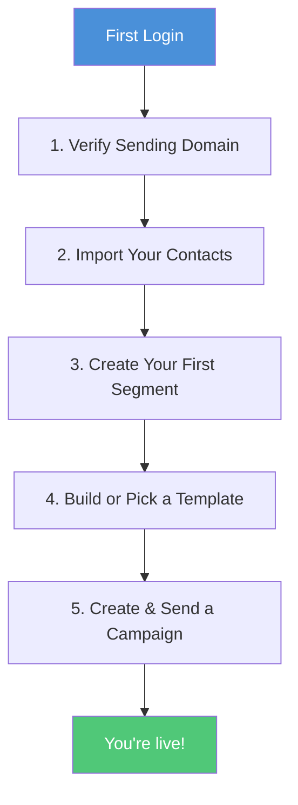

| Step | Where | What to Do |
|------|-------|------------|
| **1. Verify your domain** | Settings > Domains | Confirm your sending domain shows "Verified." If pending, add the DNS records shown on screen. |
| **2. Import contacts** | Contacts > Import CSV | Upload your existing mailing list from a CSV file. |
| **3. Create a segment** | Contacts > Segments | Create at least one segment (e.g., "All Active Contacts") to target with campaigns. |
| **4. Pick a template** | Templates | Use a pre-built starter template or create your own. |
| **5. Send a test campaign** | Campaigns > New | Create a campaign targeting a small test segment to verify everything works. |

---

## Team Roles & Permissions

Your platform has three roles. Each person on your team is assigned one role by an admin.

```
┌─────────────────────────────────────────────────────────────────┐
│                                                                  │
│  ADMIN ──────────────────────────────────────────────────────── │
│  │  Everything below, plus:                                     │
│  │  • Invite and manage team members                            │
│  │  • Configure domain settings                                 │
│  │  • Connect CRM integrations (HubSpot, Zoho)                 │
│  │  • Disable user accounts                                     │
│  │                                                              │
│  EDITOR ─────────────────────────────────────────────────────── │
│  │  Everything below, plus:                                     │
│  │  • Create and edit campaigns, templates, contacts            │
│  │  • Send and schedule campaigns                               │
│  │  • Import and export contacts                                │
│  │  • Create and manage segments                                │
│  │  • Use AI content features                                   │
│  │  • Manage the suppression list                               │
│  │                                                              │
│  VIEWER ─────────────────────────────────────────────────────── │
│     • View all data (contacts, campaigns, templates, analytics) │
│     • Export contacts                                            │
│     • Preview templates                                          │
│     • Cannot create, edit, or delete anything                   │
│                                                                  │
└─────────────────────────────────────────────────────────────────┘
```

**Typical team setup:**

| Person | Recommended Role | Why |
|--------|-----------------|-----|
| Marketing Manager | Admin | Full control, manages the team |
| Email Marketer | Editor | Creates and sends campaigns day-to-day |
| Campaign Analyst | Viewer | Monitors performance without making changes |
| Executive Stakeholder | Viewer | Checks dashboards occasionally |

---

## Managing Your Contacts

Contacts are the people who receive your emails. Every contact has an email address (required), a name, optional tags for organizing, and custom fields for any extra data you need.

### Adding Contacts One by One

1. Go to **Contacts**
2. Click **Add Contact** (top right)
3. Fill in the form:

```
┌─────────────────────────────────────────┐
│  Add Contact                            │
│                                         │
│  Email *        ┌───────────────────┐   │
│                 │ jane@example.com  │   │
│                 └───────────────────┘   │
│                                         │
│  First Name *   ┌───────────────────┐   │
│                 │ Jane              │   │
│                 └───────────────────┘   │
│                                         │
│  Last Name *    ┌───────────────────┐   │
│                 │ Doe               │   │
│                 └───────────────────┘   │
│                                         │
│  Tags           ┌───────────────────┐   │
│                 │ vip, newsletter   │   │
│                 └───────────────────┘   │
│  Separate tags with commas              │
│                                         │
│  Custom Fields                          │
│  ┌──────────┐  ┌──────────┐  [✕]       │
│  │ company  │  │ Acme Inc │            │
│  └──────────┘  └──────────┘            │
│  [ + Add Field ]                        │
│                                         │
│       [ Cancel ]  [ Create Contact ]    │
└─────────────────────────────────────────┘
```

4. Click **Create Contact**

Email addresses must be unique — you can't add the same email twice.

### Bulk Adding Contacts

For adding several contacts quickly without a CSV file:

1. Go to **Contacts**
2. Click **Bulk Add**
3. Paste or type contact data in the provided format
4. Click **Add Contacts**

Duplicates are automatically skipped.

### Importing from CSV

For large lists, CSV import is the fastest way to add contacts.

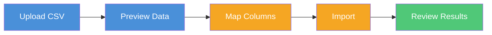

**Step 1 — Upload:** Go to **Contacts**, click **Import CSV**, then drag and drop your file or click to browse. Your CSV must have a header row.

**Step 2 — Preview:** The system shows the first few rows so you can verify the data looks right. Click **Continue to Column Mapping**.

**Step 3 — Map columns:** Tell the platform which CSV column maps to which contact field. You must map at least one column to **Email**.

```
┌─────────────────────────────────────────────────────────────┐
│  Map Columns                                                 │
│                                                              │
│  CSV Column          Sample Value       Maps To              │
│  ─────────────────────────────────────────────────────────── │
│  Email Address       jane@example.com   → [Email ▾]          │
│  First              Jane               → [First Name ▾]     │
│  Last               Doe                → [Last Name ▾]      │
│  Category           VIP                → [Tags ▾]           │
│  Phone              +1234567890        → [Custom Field ▾]   │
│  Notes              Prefers weekly     → [Skip ▾]           │
│                                                              │
│              [ Start Over ]  [ Start Import ]                │
└─────────────────────────────────────────────────────────────┘
```

**Step 4 — Import:** Click **Start Import**. A progress bar shows how many contacts have been processed. Don't close the page during import.

**Step 5 — Results:** When complete, you'll see a summary:

```
┌─────────────────────────────────────────┐
│          ✓ Import Complete              │
│                                         │
│  ┌─────────┐  ┌─────────┐  ┌─────────┐ │
│  │ Created │  │ Skipped │  │ Errors  │ │
│  │  1,847  │  │   612   │  │    3    │ │
│  │  (new)  │  │ (dupes) │  │         │ │
│  └─────────┘  └─────────┘  └─────────┘ │
│                                         │
│    [ View Contacts ] [ Import Another ] │
└─────────────────────────────────────────┘
```

**Tips:**
- Use UTF-8 encoding for your CSV
- Keep files under 10MB for best results
- Contacts are processed in batches of 100
- Duplicates (matching email) are skipped, not overwritten

### Exporting Contacts

Click **Export CSV** on the Contacts page. A CSV file downloads with all contacts including their email, name, tags, custom fields, and status.

### Editing & Deleting Contacts

- **Edit:** Click any contact in the list to open their detail page. Update any field (except email) and click **Save Changes**.
- **Delete:** On the contact detail page, click **Delete** and confirm. This is permanent.

### Contact Statuses

Every contact has one of three statuses:

| Status | Meaning | Can Receive Emails? |
|--------|---------|-------------------|
| **Active** | Normal, healthy contact | Yes |
| **Unsubscribed** | Clicked the unsubscribe link or was manually suppressed | No |
| **Bounced** | Their email address permanently failed delivery | No |

You can filter the contacts list by status using the dropdown at the top of the page.

---

## Organizing Contacts with Segments

### What Are Segments?

Segments are saved filters that group your contacts by specific criteria. Instead of manually picking who gets each campaign, you define rules like "all active contacts tagged VIP" and the platform finds matching contacts automatically — every time you use the segment.

```
┌─────────────────────────────────────────────────────────────────┐
│                                                                  │
│  SEGMENT: "Premium Newsletter Subscribers"                       │
│                                                                  │
│  Rules:                                                          │
│  ├── Status  equals  "active"                                    │
│  │              AND                                              │
│  ├── Tags  contains  "newsletter"                                │
│  │              AND                                              │
│  └── Tags  contains  "premium"                                   │
│                                                                  │
│  Result: 342 contacts match right now                            │
│                                                                  │
│  When you send a campaign to this segment next Tuesday,          │
│  the platform will re-evaluate the rules at send time.           │
│  If 10 new "premium newsletter" contacts are added by then,      │
│  they'll be included automatically.                              │
│                                                                  │
└─────────────────────────────────────────────────────────────────┘
```

**Segments are dynamic** — they don't contain a fixed list of contacts. They contain *rules*, and the matching contacts are determined at the moment the campaign sends.

### Creating a Segment

1. Go to **Contacts** > **Segments**
2. Click **Create Segment**
3. Give it a name (e.g., "Active Subscribers")
4. Optionally add a description
5. Add filter rules using the segment builder:

```
┌─────────────────────────────────────────────────────────────┐
│  Create Segment                                              │
│                                                              │
│  Name:  ┌──────────────────────────────┐                     │
│         │ VIP Customers                │                     │
│         └──────────────────────────────┘                     │
│                                                              │
│  Logic: ( AND ▾ )  — all rules must match                    │
│                                                              │
│  Rule 1:  [ status ▾ ] [ equals ▾ ]      [ active    ]  [✕] │
│                           AND                                │
│  Rule 2:  [ tags   ▾ ] [ contains ▾ ]    [ vip       ]  [✕] │
│                                                              │
│  [ + Add Rule ]                                              │
│                                                              │
│  Matching contacts: 89                                       │
│                                                              │
│                  [ Cancel ]  [ Create Segment ]              │
└─────────────────────────────────────────────────────────────┘
```

6. The member count updates as you add rules
7. Click **Create Segment**

### Segment Rule Examples

| What You Want | Field | Operator | Value | Logic |
|---------------|-------|----------|-------|-------|
| All active contacts | `status` | equals | `active` | — |
| VIP contacts only | `tags` | contains | `vip` | — |
| Contacts from Acme | `customFields.company` | equals | `Acme Inc` | — |
| Active VIPs | `status` equals `active` AND `tags` contains `vip` | | | AND |
| Newsletter OR blog subscribers | `tags` contains `newsletter` OR `tags` contains `blog` | | | OR |
| Contacts with a phone number | `customFields.phone` | exists | — | — |
| Contacts without a company | `customFields.company` | not_exists | — | — |

**Available operators:** equals, not_equals, contains, not_contains, starts_with, exists, not_exists, greater_than, less_than

### Editing & Deleting Segments

- **Edit:** Click a segment name to open it. Change the name, description, or rules, then click **Save Changes**.
- **Delete:** Click **Delete** on the segment detail page and confirm. Deleting a segment does **not** delete the contacts in it — only the filter definition is removed.

---

## Building Email Templates

Templates define what your emails look like. Build them once, reuse them across many campaigns.

### Visual Builder vs Code Editor

When creating a template, you choose one of two editors:

```
┌────────────────────────────┐    ┌────────────────────────────┐
│     📐 Visual Builder       │    │     💻 Code Editor          │
│                             │    │                             │
│  Drag-and-drop interface    │    │  Write MJML markup          │
│  No coding required         │    │  with syntax highlighting   │
│                             │    │                             │
│  Best for:                  │    │  Best for:                  │
│  • Quick campaign emails    │    │  • Complex custom layouts   │
│  • Non-technical users      │    │  • Pixel-perfect designs    │
│  • Simple layouts           │    │  • Developers               │
│                             │    │                             │
│  Drag content blocks:       │    │  MJML compiles to           │
│  text, images, buttons,     │    │  responsive HTML that       │
│  dividers, columns          │    │  works across all email     │
│                             │    │  clients automatically      │
└────────────────────────────┘    └────────────────────────────┘
```

Both editors produce the same result — a responsive HTML email. Choose whichever fits your team's skills.

### Creating a Template

1. Go to **Templates**
2. Click **New Template**
3. Choose **Code Editor** or **Visual Builder**
4. Enter a template name (e.g., "Monthly Newsletter") and optional description
5. Click **Create Template**
6. You're taken to the editor to start building

**Starting from a starter template:** If pre-built templates are available, they appear at the top of the Templates page under "Starter Templates." Click the menu on any starter template and select **Use Template** to create a copy you can customize.

### Personalizing with Variables

Make each email feel personal by inserting variables. Variables are placeholders that get replaced with each recipient's actual data when the email sends.

| Variable | What Gets Inserted | Example Output |
|----------|-------------------|----------------|
| `{{firstName}}` | Recipient's first name | "Jane" |
| `{{lastName}}` | Recipient's last name | "Doe" |
| `{{email}}` | Recipient's email | "jane@example.com" |
| `{{customFields.company}}` | Any custom field | "Acme Inc" |
| `{{unsubscribeUrl}}` | Unsubscribe link (auto-generated) | A clickable URL |

**How to use them:** Type the variable name with double curly braces directly into your template content.

```
Hello {{firstName}},

Thank you for being a valued customer at {{customFields.company}}.

We have some exciting updates to share with you this month.

Best regards,
The Team

Don't want these emails? {{unsubscribeUrl}}
```

**Important:** Always include `{{unsubscribeUrl}}` in your templates. This generates a one-click unsubscribe link for each recipient, which is required for email compliance.

### Previewing Your Template

1. Open your template
2. Click **Preview**
3. Enter sample values for each variable (e.g., firstName = "Jane")
4. Click **Render Preview** to see how the email will look with real data

This lets you verify that variables render correctly and the layout looks right before sending.

### Version History & Rollback

Every time you save a template, a new version is created. Previous versions are never lost.

```
┌─────────────────────────────────────────────────────────────┐
│  Version History — Monthly Newsletter                        │
│                                                              │
│  v3  (current)  Apr 1, 2026 10:30 AM   Updated header image │
│  v2             Mar 28, 2026 3:15 PM    Changed CTA button   │
│  v1             Mar 25, 2026 9:00 AM    Initial version      │
│                                                              │
│  Click [Revert] on any version to restore it.               │
│  Reverting creates a NEW version — nothing is deleted.       │
└─────────────────────────────────────────────────────────────┘
```

To restore an older version:
1. Open the template
2. Click **History**
3. Click **Revert** on the version you want

Reverting doesn't delete newer versions — it creates a new version with the old content. You can always go back.

### Duplicating Templates

To make a copy of any template:
1. Click the menu (three dots) on the template card
2. Select **Duplicate**
3. A new template is created with "(Copy)" in the name

Useful when you want to create a variation of an existing design without modifying the original.

---

## Running Campaigns

A campaign is a single email send to a group of contacts. It combines a **template** (the email content) with a **segment** (the audience).

### Creating a Campaign

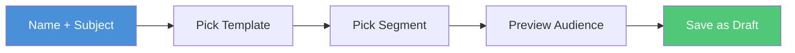

1. Go to **Campaigns** > **New Campaign**
2. Fill in the details:

| Field | What to Enter | Example |
|-------|--------------|---------|
| **Campaign Name** | Internal name (your team sees this, recipients don't) | "March Newsletter" |
| **Email Subject** | The subject line recipients see in their inbox | "Your March Update is Here 📬" |
| **Template** | Select from your saved templates | "Monthly Newsletter v3" |
| **Audience** | Select a segment | "Active Subscribers (2,847 members)" |

3. Click **Create Campaign** — it's saved as a **Draft**

The subject line supports variables too — for example, `Hey {{firstName}}, your March update` personalizes the subject for each recipient.

### Previewing Your Audience

When you select a segment, the campaign page shows:
- **Member count** — how many contacts will receive the email
- **Sample contacts** — a preview of matching contacts

This helps you verify you're targeting the right group before sending.

### Sending Immediately

1. Open a draft campaign
2. Review the template, subject, and audience count
3. Click **Send Now**
4. Confirm in the dialog: *"Are you sure you want to send [Campaign Name] immediately?"*
5. The status changes to **Executing** and emails begin sending in the background

You can leave the page — sending continues in the background. Come back anytime to check progress.

### Scheduling for Later

1. Open a draft campaign
2. Click **Schedule**
3. Pick a date and time (in UTC)
4. Click **Confirm Schedule**
5. The status changes to **Scheduled**

At the scheduled time, the platform automatically starts sending. No one needs to be logged in.

### Canceling a Scheduled Campaign

1. Open the scheduled campaign
2. Click **Cancel Schedule**
3. Confirm the cancellation

The campaign returns to **Draft** status. You can edit it and reschedule or send immediately.

### Campaign Lifecycle

Every campaign moves through a clear set of stages:

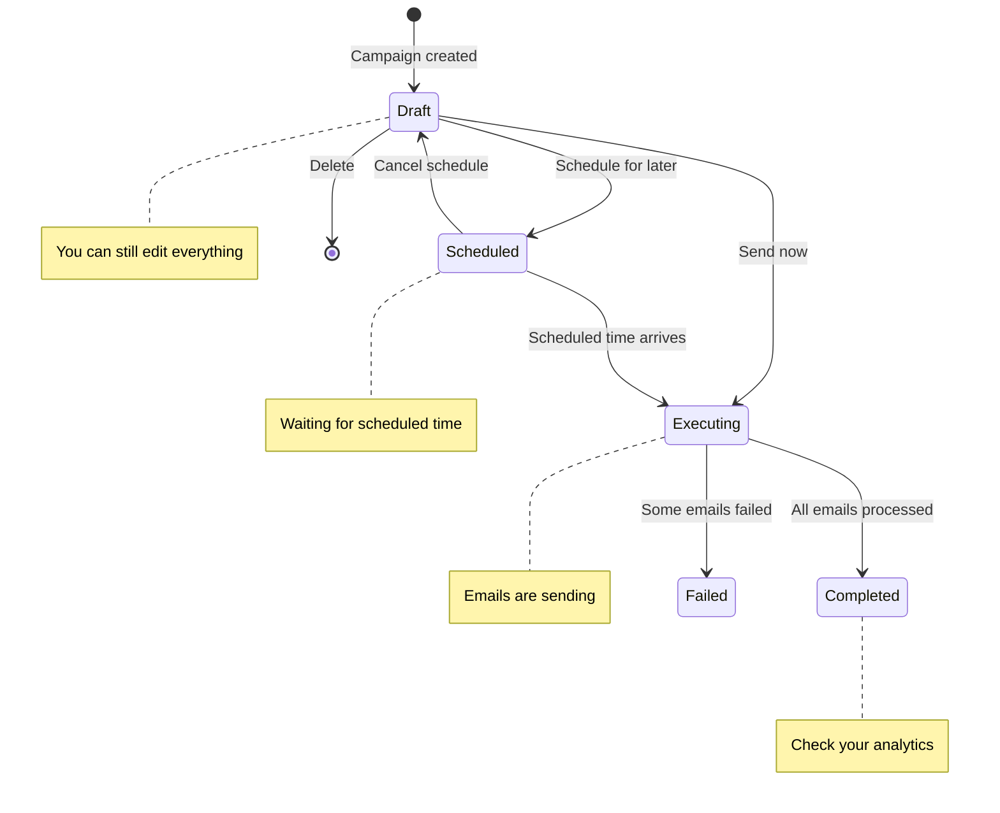

| Status | What It Means | What You Can Do |
|--------|--------------|----------------|
| **Draft** | Created but not sent — fully editable | Edit, schedule, send now, or delete |
| **Scheduled** | Waiting for the scheduled date/time | Cancel back to draft |
| **Executing** | Actively sending emails to recipients | Watch progress, wait for completion |
| **Completed** | All emails have been processed | View analytics and results |
| **Failed** | Some or all emails encountered errors | Review error details, retry |

### What Happens When You Hit Send

Here's what the platform does behind the scenes — no action needed from you:

```
┌─────────────────────────────────────────────────────────────┐
│  YOU CLICK "SEND NOW"                                        │
│                                                              │
│  1. The platform evaluates your segment rules                │
│     → Finds 2,847 active, non-suppressed contacts            │
│                                                              │
│  2. Creates a personalized email job for each contact        │
│     → 2,847 jobs queued                                      │
│                                                              │
│  3. Each email is rendered individually                      │
│     → {{firstName}} becomes "Jane" for Jane,                 │
│       "Marcus" for Marcus, etc.                              │
│                                                              │
│  4. Before each send, checks the suppression list            │
│     → Skips anyone who bounced, complained, or unsubscribed  │
│                                                              │
│  5. Sends each email with tracking enabled                   │
│     → Opens, clicks, bounces, and complaints tracked         │
│                                                              │
│  6. When all emails are processed                            │
│     → Campaign marked "Completed" or "Failed"                │
│     → Analytics available immediately                        │
│                                                              │
└─────────────────────────────────────────────────────────────┘
```

---

## Tracking Results

### Campaign Analytics

Open any completed campaign to see its performance:

```
┌─────────────────────────────────────────────────────────────────┐
│  March Newsletter — Completed                                    │
│  Sent: 2,847 emails                                              │
│                                                                  │
│  ┌──────────┐  ┌──────────┐  ┌──────────┐  ┌──────────┐  ┌────────┐
│  │Delivered │  │ Opened   │  │ Clicked  │  │ Bounced  │  │Complained│
│  │  2,831   │  │  968     │  │  247     │  │   16     │  │   2     │
│  │  99.4%   │  │  34.2%   │  │  8.7%    │  │  0.6%    │  │  0.07%  │
│  └──────────┘  └──────────┘  └──────────┘  └──────────┘  └────────┘
│                                                                  │
│  ┌───────────────────────────────────────────────────────────┐   │
│  │  Delivery Chart                                            │   │
│  │  ████████████████████████████████████████ Delivered        │   │
│  │  █████████████                            Opened           │   │
│  │  ███                                      Clicked          │   │
│  │  ▪                                        Bounced          │   │
│  └───────────────────────────────────────────────────────────┘   │
│                                                                  │
└─────────────────────────────────────────────────────────────────┘
```

### Global Analytics Dashboard

Go to **Analytics** to see performance across all campaigns. Use the pill-style filter buttons at the top to switch time periods:

```
  [ 7d ]  [ 30d ]  [ 90d ]  [ All time ]
```

| Filter | What It Shows |
|--------|--------------|
| **7d** | Last 7 days — recent campaign performance |
| **30d** | Last 30 days — monthly trend |
| **90d** | Last 90 days — quarterly overview |
| **All time** | Complete history |

The dashboard shows five stats cards with colored left borders, plus a bar chart comparing campaign performance:
- **Total Sent** — total emails across all campaigns
- **Total Delivered** — with delivery rate percentage
- **Total Opened** — with open rate percentage
- **Total Clicked** — with click rate percentage
- **Total Bounced** — with bounce rate percentage

### Understanding Your Metrics

| Metric | What It Measures | How It's Calculated |
|--------|-----------------|---------------------|
| **Delivery Rate** | Emails that actually reached the recipient's inbox | Delivered / Sent |
| **Open Rate** | Recipients who opened the email | Unique Opens / Delivered |
| **Click Rate** | Recipients who clicked a link in the email | Unique Clicks / Delivered |
| **Bounce Rate** | Emails that failed to deliver | Bounced / Sent |
| **Complaint Rate** | Recipients who marked the email as spam | Complaints / Delivered |

### Healthy Benchmarks

Keep your metrics in these ranges to maintain good sending reputation:

| Metric | Healthy | Warning | Critical |
|--------|---------|---------|----------|
| **Delivery Rate** | > 95% | 90-95% | < 90% |
| **Open Rate** | > 20% | 10-20% | < 10% |
| **Click Rate** | > 2% | 1-2% | < 1% |
| **Bounce Rate** | < 2% | 2-5% | > 5% |
| **Complaint Rate** | < 0.1% | 0.1-0.3% | > 0.3% |

**If your bounce rate exceeds 5% or complaint rate exceeds 0.3%,** your email sending may be throttled or suspended by the email provider. Clean your contact list and ensure you're only emailing people who opted in.

---

## Suppression List

### How It Works

The suppression list protects your sending reputation by permanently preventing emails to addresses that should not receive them.

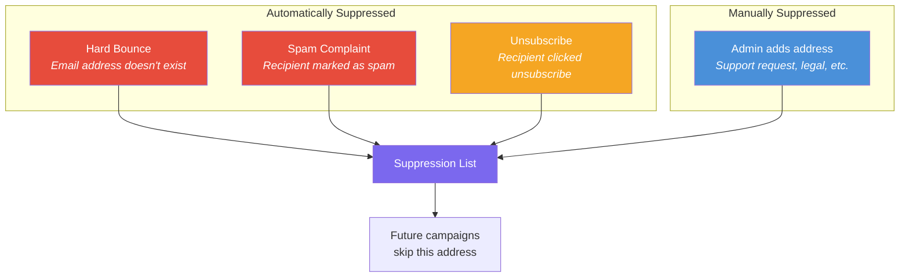

**You don't need to manage this manually in most cases.** The platform automatically adds addresses when bounces, complaints, or unsubscribes happen. Suppressed addresses are automatically skipped in every future campaign.

### Managing Suppressions Manually

Go to the **Suppression** page to:

- **View** all suppressed addresses with the reason they were added
- **Add** an address manually (e.g., someone called to opt out)
- **Remove** an address (e.g., someone re-subscribed and you have confirmation)

**Be cautious when removing addresses.** Only remove a suppression if you're certain the person wants to receive emails again. Re-emailing someone who bounced or complained can damage your sending reputation.

---

## Using the AI Assistant

The platform includes AI-powered features to help you write better email content faster.

### Generating Email Content

When creating a campaign, click the **sparkles icon** (✨) next to the subject line field to open the AI Email Generator.

```
┌─────────────────────────────────────────────────────────────┐
│  ✨ AI Email Generator                                       │
│                                                              │
│  Describe the email you want:                                │
│  ┌───────────────────────────────────────────────────────┐   │
│  │ Write a promotional email for our spring sale,        │   │
│  │ 20% off all plans, ending Friday.                     │   │
│  └───────────────────────────────────────────────────────┘   │
│                                                              │
│  Tone:  [ Professional ▾ ]                                   │
│                                                              │
│  Options: Professional, Casual, Urgent, Friendly             │
│                                                              │
│                              [ Generate ]                    │
│                                                              │
│  ─── Generated Result ───                                    │
│                                                              │
│  Subject: Spring Into Savings — 20% Off All Plans            │
│  Preview: Your exclusive discount expires Friday             │
│  Body:    [Generated HTML content]                           │
│                                                              │
│                    [ Regenerate ]  [ Apply ]                  │
└─────────────────────────────────────────────────────────────┘
```

1. Describe what the email should be about
2. Pick a tone (Professional, Casual, Urgent, or Friendly)
3. Click **Generate**
4. Review the suggested subject line, preview text, and body
5. Click **Apply** to use it, or **Regenerate** for a different version

### Improving Existing Content

When editing a template, open the **AI Content Improver** panel to get suggestions for your existing email:

```
┌──────────────────────────────────────┐
│  AI Content Improver                  │
│                                       │
│  Goal: ┌────────────────────────┐     │
│        │ increase click rate    │     │
│        └────────────────────────┘     │
│                            [Analyze]  │
│                                       │
│  Overall Score:  7.2 / 10             │
│                                       │
│  Suggestions:                         │
│                                       │
│  [subject] ─────────────────────      │
│  Original:  "March Newsletter"        │
│  Improved:  "3 Things You Need to     │
│              Know This March"         │
│  Why: Numbered lists in subjects      │
│       increase open rates by 15%      │
│                       [ Apply ]       │
│                                       │
│  [CTA] ─────────────────────────      │
│  Original:  "Learn More"              │
│  Improved:  "Get Your Free Report"    │
│  Why: Specific, value-driven CTAs     │
│       outperform generic ones         │
│                       [ Apply ]       │
│                                       │
└──────────────────────────────────────┘
```

Each suggestion shows what to change, the improved version, and why. Click **Apply** on individual suggestions to use them.

### Chat Assistant

Click the **AI Assistant** button when creating campaigns to open an interactive chat panel. You can ask questions like:

- *"Write a subject line for a product launch email"*
- *"How should I structure a re-engagement campaign?"*
- *"Suggest 3 different CTAs for this promotion"*

The assistant has context about your platform and can help with campaign strategy, content ideas, and best practices.

---

## Admin Settings

These settings are only available to users with the **Admin** role.

### Managing Your Team

Go to **Settings** > **User Management** to manage who has access.

**Inviting a new team member:**
1. Click **Invite User**
2. Enter their email and select a role (Viewer, Editor, or Admin)
3. Click **Send Invitation**
4. They receive an email with a link to set their password

**Creating a user directly:**
1. Click **Create User**
2. Enter their email, name, and role
3. Click **Create User**

**Disabling a user:**
1. Find the user in the list
2. Click the **Disable** action
3. Confirm — they immediately lose access and all active sessions are terminated

Disabled accounts are preserved (not deleted) and can be referenced in audit history.

### Domain & Sending Reputation

Go to **Settings** > **Domains** to manage your email sending domain.

**Domain verification** confirms you own the domain you're sending from. This is required before you can send any campaigns. The page shows:

- **Verification status** — Verified, Pending, or Failed
- **DKIM CNAME records** — DNS records you need to add to your domain
- **SPF TXT record** — Another DNS record for authentication

If your status is "Pending," copy the DNS records shown on screen and add them to your domain's DNS settings. Click **Verify Domain** to check again.

**Account reputation** shows your sending health:

| Metric | What It Means |
|--------|--------------|
| **Enforcement Status** | Whether your sending is normal or restricted |
| **Production Access** | Whether you can send to any address (vs. only verified ones) |
| **Sending Enabled** | Whether sending is currently active |
| **Send Quota** | Maximum emails you can send per 24 hours |
| **Max Send Rate** | Maximum emails per second |

**SES Sandbox warning:** If you see a yellow "SES Sandbox Mode" banner, your account can only send to verified email addresses. Contact your platform provider to request production access.

### CRM Integrations

Go to **Settings** > **Integrations** to connect your CRM and sync contacts.

**HubSpot:**
1. Click **Connect** on the HubSpot card
2. Enter your HubSpot Private App access token
3. Click **Connect**
4. Once connected, click **Sync Now** to pull contacts from HubSpot

**Zoho CRM:**
1. Click **Connect** on the Zoho card
2. Enter your Zoho refresh token
3. Select your datacenter region (US, EU, IN, AU, CN, or JP)
4. Click **Connect**
5. Once connected, click **Sync Now** to pull contacts

**How sync works:**
- Contacts are imported from CRM → platform
- Duplicate emails are merged, not duplicated
- Synced contacts keep a reference to their CRM ID
- Your existing contacts and customizations are preserved
- Click **Sync Now** anytime to pull the latest

**Disconnecting:** Click the disconnect icon on the integration card. Previously synced contacts remain in your database.

---

## Common Workflows

### Send Your First Campaign in 5 Steps

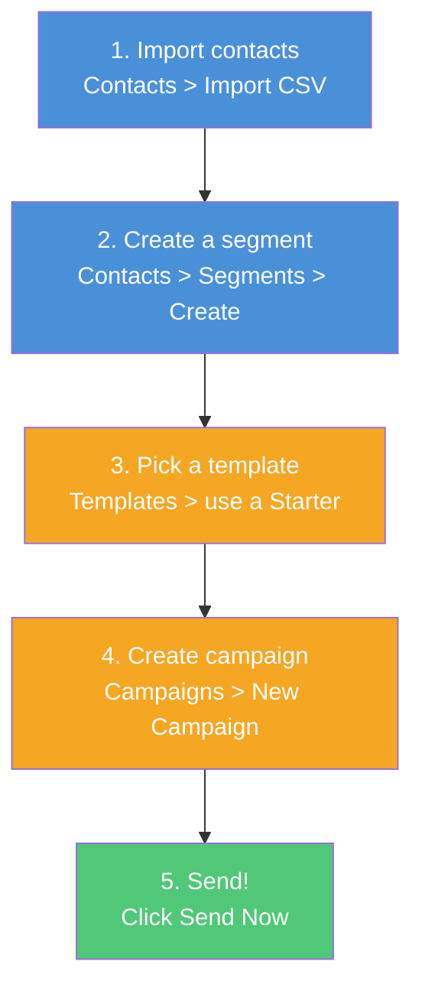

### Re-engage Inactive Contacts

1. **Create a segment** with rules: `status equals active` AND `tags not_contains recently_engaged`
2. **Create a template** with a compelling "we miss you" message and a strong CTA
3. **Create a campaign** targeting the inactive segment
4. **Send** and monitor your open/click rates
5. After a few days, **check analytics** — contacts who opened or clicked can be tagged as re-engaged

### A/B Test Subject Lines

The platform doesn't have built-in A/B testing, but you can do it manually:

1. **Create two segments** — split your audience roughly in half using different tag criteria
2. **Create two campaigns** with the same template but different subject lines
3. **Send both** at the same time
4. **Compare analytics** — whichever subject line has a higher open rate wins
5. Use the winning subject line for future campaigns

---

## Troubleshooting & FAQ

| Problem | Cause | Solution |
|---------|-------|----------|
| "I can't see the Settings page" | You have Viewer or Editor role | Ask an Admin to upgrade your role |
| "My campaign is stuck on Executing" | Large campaigns take time | Wait — check back in a few minutes. Each email is processed individually. |
| "Emails aren't being delivered" | Domain not verified, or SES sandbox mode | Go to Settings > Domains and verify. Check for the sandbox banner. |
| "Open rates seem low" | Recipients may have image loading disabled | This is normal — not all opens can be tracked. Focus on click rate. |
| "A contact says they didn't unsubscribe but they're suppressed" | They may have hard-bounced | Check the suppression list for the reason. If bounced, their email address may have been invalid. |
| "CSV import skipped a lot of contacts" | Duplicate emails already exist | This is expected — duplicates are skipped to prevent double-entries. |
| "I see 0% open rate immediately after sending" | Tracking data takes time | Events are processed as they happen. Check again after recipients have had time to open. |
| "Forgot my password" | — | Click "Forgot your password?" on the login page to reset via email. |
| "Campaign shows 'Failed'" | Some emails encountered errors | Open the campaign to see error details. Common causes: suppressed recipients, SES limits reached. |
| "AI features aren't responding" | AI service may be temporarily unavailable | Wait a moment and try again. AI features require a backend service connection. |

---

*Need more help? Contact your platform administrator.*
*Last updated: 2026-04-02*


---


# Volley User Manual

## Getting Started

### Logging In

Open the dashboard URL provided by your administrator. Enter your email address and password on the login page, then click "Sign In."

If this is your first time logging in via an invitation, use the link in your invitation email to set your password before signing in.

### Navigating the Dashboard

The dashboard has a sidebar on the left with links to all major sections:

- **Dashboard** -- Overview and quick stats
- **Contacts** -- Manage your email recipients
- **Campaigns** -- Create and send email campaigns
- **Templates** -- Design email templates
- **Analytics** -- View delivery and engagement metrics
- **Suppression** -- Manage suppressed email addresses
- **Settings** -- User management, domain configuration, and integrations

Click any item in the sidebar to navigate to that section.

### First-Time Setup

After your first login as an administrator, complete these steps:

1. **Verify your sending domain** -- Go to Settings > Domains and confirm that your domain verification is complete. If DNS records are still pending, add the displayed DKIM and SPF records to your domain.
2. **Review starter templates** -- Go to Templates to see the pre-built starter templates. You can use these as-is or customize them.
3. **Import your contacts** -- Go to Contacts and use the Import feature to upload your existing contact list from a CSV file.

---

## Contacts

The Contacts section is where you manage all email recipients.

### Viewing Contacts

The contacts page displays a searchable, paginated list of all your contacts. Each row shows the contact's email, name, tags, and creation date. Use the search bar at the top to filter contacts by name or email.

### Adding a Single Contact

1. Click the "Add Contact" button.
2. Fill in the contact details: email (required), first name, last name, tags, and any custom fields.
3. Click "Save" to create the contact.

Email addresses must be unique. If you try to add an email that already exists, you will receive an error.

### Editing a Contact

1. Click on a contact in the list to open their detail page.
2. Edit any field (name, tags, custom fields).
3. Click "Save" to apply changes.

### Deleting a Contact

1. Open the contact's detail page.
2. Click the "Delete" button.
3. Confirm the deletion when prompted.

Deleting a contact is permanent and cannot be undone.

### CSV Import

To import contacts in bulk from a CSV file:

1. Click the "Import" button on the contacts page.
2. Select your CSV file. The file should have headers in the first row.
3. The import wizard displays a column mapping screen. Map each CSV column to the corresponding contact field (email, first name, last name, tags, custom fields).
4. Review the preview showing the first few rows with your mapping applied.
5. Click "Import" to begin the import.

The system processes contacts in batches of 100. Duplicate emails are automatically skipped. After import completes, you will see a summary showing how many contacts were imported and how many were skipped.

**Supported CSV format:** UTF-8 encoded, comma-separated, with a header row. Maximum recommended file size is 10MB.

### CSV Export

To export all contacts to a CSV file:

1. Click the "Export" button on the contacts page.
2. A CSV file will download containing all contacts with their email, name, tags, custom fields, and creation date.

---

## Segments

Segments are dynamic groups of contacts defined by filter rules. When you use a segment as a campaign audience, the platform evaluates the rules at send time to determine which contacts match.

### Creating a Segment

1. Navigate to Contacts > Segments.
2. Click "New Segment."
3. Enter a segment name.
4. Add one or more filter rules. Each rule consists of:
   - **Field** -- The contact field to filter on (e.g., tags, custom fields, engagement data).
   - **Operator** -- The comparison type (e.g., "contains," "equals," "greater than").
   - **Value** -- The value to compare against.
5. The member count updates as you add rules, showing how many contacts currently match.
6. Click "Save" to create the segment.

### Rule Examples

- **Tags contain "newsletter"** -- Matches contacts who have the "newsletter" tag.
- **Custom field "company" equals "Acme"** -- Matches contacts whose company field is "Acme."
- **Created after 2026-01-01** -- Matches contacts added after a specific date.

### Editing a Segment

1. Click on a segment in the list.
2. Modify the name or rules.
3. Click "Save." The member count will be recalculated.

### Deleting a Segment

1. Open the segment detail page.
2. Click "Delete" and confirm.

Deleting a segment does not delete the contacts in it. It only removes the segment definition.

---

## Templates

Templates define the content and layout of your emails. The platform supports two editing modes: a code editor for MJML markup and a visual drag-and-drop builder.

### Creating a Template

1. Navigate to Templates.
2. Click "New Template."
3. Choose your starting point:
   - **Blank template** -- Start from scratch.
   - **Starter template** -- Choose from pre-built templates and customize.
4. Enter a template name.
5. Choose your editor:
   - **Code Editor** -- Write MJML markup directly with syntax highlighting.
   - **Visual Builder** -- Use the drag-and-drop Unlayer editor.

### Using the Code Editor

The code editor provides a Monaco-based editing experience with syntax highlighting for MJML. MJML is a markup language that compiles to responsive HTML email.

Write your template using MJML tags. The editor supports real-time preview.

### Using the Visual Builder

The visual builder provides a drag-and-drop interface powered by Unlayer. Drag content blocks (text, images, buttons, dividers) from the sidebar into your email layout. Click any block to edit its content and styling.

### Handlebars Variables

Use Handlebars variables to personalize emails with contact data. Variables are enclosed in double curly braces:

| Variable | Description |
|----------|-------------|
| `{{firstName}}` | Contact's first name |
| `{{lastName}}` | Contact's last name |
| `{{email}}` | Contact's email address |
| `{{tags}}` | Contact's tags |
| `{{customFields.fieldName}}` | Any custom field value |

Example: "Hello {{firstName}}, thank you for subscribing!"

### Previewing a Template

1. Open a template.
2. Click "Preview."
3. The preview renders the template with sample contact data so you can see how variables are replaced.

### Version History

Every time you save a template, a new version is created. To view or restore previous versions:

1. Open the template.
2. Click "History" to see all saved versions with timestamps.
3. Click "Revert" on any version to restore it. This creates a new version with the content from the selected version (non-destructive).

### Duplicating a Template

1. Open the template you want to copy.
2. Click "Duplicate."
3. A new template is created with the same content and a "(Copy)" suffix in the name.

---

## Campaigns

Campaigns are the core of email delivery. A campaign combines a template with an audience (segment) and delivers personalized emails to all matching contacts.

### Creating a Campaign

1. Navigate to Campaigns.
2. Click "New Campaign."
3. Fill in the campaign details:
   - **Name** -- Internal name for this campaign.
   - **Subject** -- Email subject line (supports Handlebars variables).
   - **Template** -- Select the email template to use.
   - **Audience** -- Select a segment to define who receives the email.
4. The audience preview shows how many contacts will receive the email.
5. Click "Save" to create the campaign as a draft.

### Previewing Audience

When creating or editing a campaign, the audience count shows how many contacts match the selected segment. This count is calculated in real time based on current contact data.

### Sending Immediately

1. Open a draft campaign.
2. Review the details (template, audience, subject line).
3. Click "Send Now."
4. Confirm when prompted.

The campaign status changes to "Executing." Emails are queued and sent in the background. You can monitor progress on the campaign detail page.

### Scheduling for Future Delivery

1. Open a draft campaign.
2. Click "Schedule."
3. Select the date and time for delivery (in UTC).
4. Click "Confirm Schedule."

The campaign status changes to "Scheduled." At the scheduled time, the platform automatically begins sending.

### Canceling a Scheduled Campaign

1. Open a scheduled campaign.
2. Click "Cancel Schedule."
3. Confirm the cancellation.

The campaign returns to "Draft" status. You can edit it and reschedule.

### Campaign Statuses

| Status | Description |
|--------|-------------|
| Draft | Campaign created but not yet sent or scheduled |
| Scheduled | Campaign scheduled for future delivery |
| Executing | Campaign is actively sending emails |
| Sent | All emails have been processed |
| Cancelled | Scheduled campaign was cancelled |

---

## Analytics

The Analytics section provides insights into your email campaign performance.

### Per-Campaign Analytics

Open any sent campaign to see its detailed analytics:

- **Delivery Rate** -- Percentage of emails successfully delivered.
- **Open Rate** -- Percentage of delivered emails that were opened. Shows both unique opens and total opens.
- **Click Rate** -- Percentage of delivered emails where a link was clicked. Shows both unique clicks and total clicks.
- **Bounce Rate** -- Percentage of emails that bounced (hard or soft bounce).
- **Complaint Rate** -- Percentage of recipients who reported the email as spam.

### Global Analytics Dashboard

Navigate to Analytics to see aggregated metrics across all campaigns:

- Total campaigns sent
- Total emails delivered
- Overall open rate, click rate, bounce rate, and complaint rate
- Trends over time

Use the date range filter to narrow results to a specific period. Filter by campaign status to see only sent, scheduled, or draft campaigns.

---

## Suppression List

The suppression list contains email addresses that should not receive any future campaigns. Addresses are automatically added when:

- A recipient reports your email as spam (complaint)
- An email hard bounces (invalid address)
- A recipient clicks the unsubscribe link in an email

### Viewing the Suppression List

Navigate to the Suppression page to see all suppressed email addresses with the reason and date they were added.

### Manually Adding an Address

1. Click "Add to Suppression List."
2. Enter the email address.
3. Click "Add."

Use this for contacts who have requested removal through channels outside the email (phone, support ticket, etc.).

### Removing an Address

1. Find the address in the suppression list.
2. Click "Remove."
3. Confirm the removal.

After removal, the address will be eligible to receive campaigns again. Use this only when you are certain the person wants to receive emails (e.g., they re-subscribed).

---

## Settings

### User Management (Admin Only)

Administrators can manage team members who have access to the dashboard.

**Creating a user:**

1. Go to Settings > Users.
2. Click "Add User."
3. Enter the user's email, name, and assign a role (viewer, editor, or admin).
4. Click "Create."

**Inviting a user:**

1. Go to Settings > Users.
2. Click "Invite User."
3. Enter the email address and select a role.
4. Click "Send Invitation."

The user receives an email with a link to set their password and activate their account.

**Roles:**

| Role | Can View | Can Create/Edit | Can Manage Settings |
|------|----------|-----------------|-------------------|
| Viewer | Contacts, templates, campaigns, analytics | No | No |
| Editor | Everything | Contacts, templates, campaigns | No |
| Admin | Everything | Everything | Users, domains, integrations |

**Disabling a user:**

1. Open the user's row in the user list.
2. Click "Disable."
3. The user can no longer log in but their account data is preserved.

### Domain Settings (Admin Only)

The Domain settings page shows your sending domain's verification status.

**Verification status:**
- **Verified** -- Your domain is ready to send emails.
- **Pending** -- DNS records have been submitted but not yet verified. Ensure your DKIM CNAME records and SPF TXT record are correctly configured.
- **Failed** -- Verification failed. Check your DNS records and try again.

The page displays the exact DNS records you need to add. Copy them directly into your domain's DNS management panel.

**Sending reputation:**
The domain page also shows your SES sending reputation score, bounce rate, and complaint rate. Keep your bounce rate below 5% and complaint rate below 0.1% to maintain good deliverability.

### Integrations (Admin Only)

The Integrations settings page allows you to connect external CRM systems for contact synchronization.

**Connecting HubSpot:**

1. Go to Settings > Integrations.
2. In the HubSpot section, click "Connect."
3. Enter your HubSpot Private App token. To create one:
   - Log in to HubSpot.
   - Go to Settings > Integrations > Private Apps.
   - Create a new app with "Contacts" read/write scope.
   - Copy the access token.
4. Click "Save." The platform verifies the token before saving.

**Connecting Zoho CRM:**

1. Go to Settings > Integrations.
2. In the Zoho CRM section, click "Connect."
3. Enter your Zoho refresh token and select your data center region:
   - **US** -- zohoapis.com / accounts.zoho.com
   - **EU** -- zohoapis.eu / accounts.zoho.eu
   - **IN** -- zohoapis.in / accounts.zoho.in
   - **AU** -- zohoapis.com.au / accounts.zoho.com.au
   - **CN** -- zohoapis.com.cn / accounts.zoho.com.cn
   - **JP** -- zohoapis.jp / accounts.zoho.jp
4. Click "Save."

**Syncing contacts:**

After connecting a CRM:

1. Click "Sync" on the integration card.
2. The sync pulls new contacts from the CRM into the platform and pushes platform contacts to the CRM.
3. A summary shows how many contacts were pulled, pushed, and any errors.

Sync deduplicates by email address. Contacts that exist in both systems are matched and updated rather than duplicated.

**Disconnecting:**

Click "Disconnect" on any integration card to remove the connection. This does not delete any contacts that were previously synced.

---

## Branding

The dashboard appearance can be customized per deployment through environment variables. Branding is configured at deploy time, not through the dashboard UI.

**What can be customized:**

| Setting | Variable | Effect |
|---------|----------|--------|
| Application name | `VITE_APP_NAME` | Displayed in the sidebar header and browser tab title |
| Logo | `VITE_LOGO_URL` | Displayed in the sidebar header. If empty, the app name is shown as text. |
| Primary color | `VITE_PRIMARY_COLOR` | Accent color used for buttons, links, and highlights throughout the UI |

To change branding, update the corresponding variables in your `.env` file and redeploy the frontend:

```bash
bash scripts/deploy-frontend.sh
```

Transactional emails (verification, password reset, invitation) use separate branding variables (`APP_NAME`, `LOGO_URL`, `PRIMARY_COLOR`) that are configured on the backend Lambda functions. These require a full redeployment to update:

```bash
bash scripts/deploy.sh
```


---


# Volley — Full Application Overview

> What Volley is, how it works end-to-end, and how it turns email campaigns into delivered, tracked, and analyzed communications — for stakeholders who want substance without the infrastructure details.

**See also:** [Setup Guide](./setup-guide.md) (deployment) · [API Reference](./api-reference.md) (endpoints) · [User Manual](./user-manual.md) (usage)

---

## Table of Contents

- [What Is Volley?](#what-is-volley)
- [The Big Picture](#the-big-picture)
- [How It Works — The Simple Version](#how-it-works--the-simple-version)
  - [Campaign Creation Flow](#campaign-creation-flow)
  - [Email Delivery Flow](#email-delivery-flow)
  - [Event Tracking Flow](#event-tracking-flow)
- [The Tech Stack](#the-tech-stack)
- [Architecture Deep Dive](#architecture-deep-dive)
  - [Frontend Architecture](#frontend-architecture)
  - [Backend Architecture — Lambda Functions](#backend-architecture--lambda-functions)
  - [Request Lifecycle](#request-lifecycle)
- [Authentication & Authorization](#authentication--authorization)
  - [Token Architecture](#token-architecture)
  - [Role-Based Access Control](#role-based-access-control)
  - [Auth Flow — Step by Step](#auth-flow--step-by-step)
- [Database Schema (DynamoDB)](#database-schema-dynamodb)
  - [Users Table](#users-table)
  - [Data Table](#data-table)
  - [Access Patterns](#access-patterns)
- [The Email Engine](#the-email-engine)
  - [Campaign State Machine](#campaign-state-machine)
  - [Sending Pipeline](#sending-pipeline)
  - [Template Rendering](#template-rendering)
  - [Event Tracking & Analytics](#event-tracking--analytics)
  - [Suppression & Compliance](#suppression--compliance)
- [Contact Management](#contact-management)
  - [Contact Lifecycle](#contact-lifecycle)
  - [Segmentation Engine](#segmentation-engine)
  - [CSV Import Pipeline](#csv-import-pipeline)
- [Template System](#template-system)
  - [Template Types](#template-types)
  - [Version Control](#version-control)
  - [Variable System](#variable-system)
- [CRM Integrations](#crm-integrations)
- [AI Features (AWS Bedrock)](#ai-features-aws-bedrock)
- [AWS Infrastructure](#aws-infrastructure)
  - [Service Map](#service-map)
  - [Deployment Pipeline](#deployment-pipeline)
  - [Naming Conventions](#naming-conventions)
- [Security Architecture](#security-architecture)
- [Data Flow Examples](#data-flow-examples)
  - [Campaign Execution — End to End](#campaign-execution--end-to-end)
  - [Contact Import — End to End](#contact-import--end-to-end)
  - [One-Click Unsubscribe](#one-click-unsubscribe)
- [Quick Stats](#quick-stats)

---

## What Is Volley?

The Volley (Electronic Direct Mail) Platform is a self-hosted, serverless email marketing system built entirely on AWS. It handles the complete lifecycle of email campaigns — from contact management and template creation through audience segmentation, email delivery, and real-time analytics tracking. The platform is a monorepo containing a React frontend, Node.js Lambda backend, and shared TypeScript types, deployed across 12+ AWS services with zero standing servers. Users create campaigns with visual or code-based email templates, target segments of their contact database, schedule or immediately send campaigns, and track opens, clicks, bounces, and complaints in real time. The system supports multi-user access with role-based permissions, CRM integrations (HubSpot, Zoho), and AI-powered email content generation via AWS Bedrock.

---

## The Big Picture

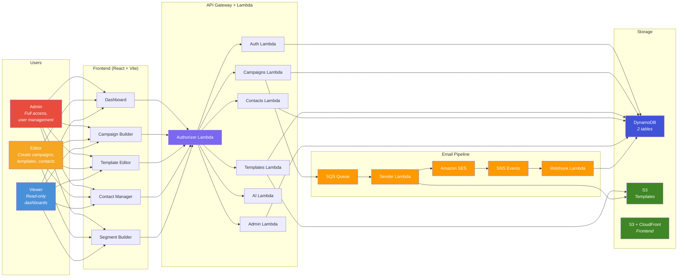

**Everything is serverless.** There are no EC2 instances, no containers, no standing servers. Every compute action runs as a Lambda function invoked by API Gateway (for API requests), SQS (for email sending), or SNS (for delivery event processing). The frontend is a static React SPA served from S3 via CloudFront.

---

## How It Works — The Simple Version

### Campaign Creation Flow

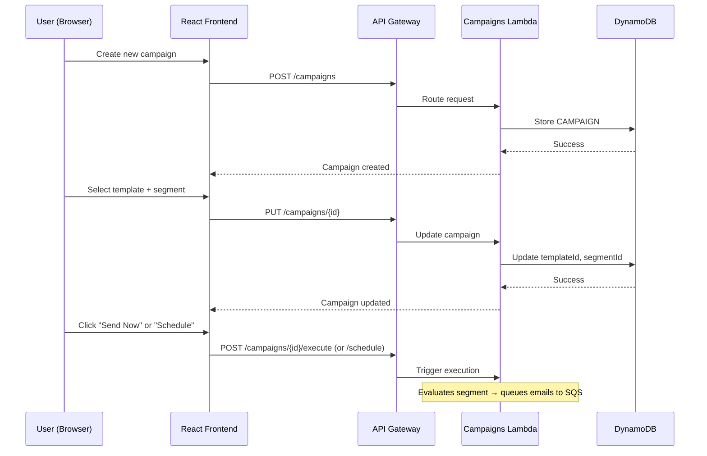

A campaign starts as a **draft** — just a name, subject line, template, and target segment. The user builds it iteratively: pick a template, choose a segment, preview the audience, then execute or schedule. No email leaves the system until the user explicitly triggers it.

### Email Delivery Flow

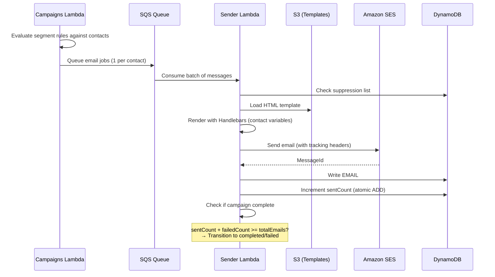

Each contact in the segment becomes a separate SQS message. The Sender Lambda processes these in batches, rendering personalized HTML for each recipient. Sends are idempotent — the same email job processed twice will not send twice.

### Event Tracking Flow

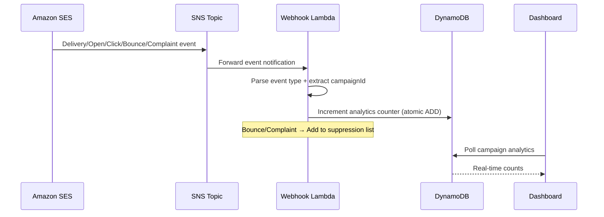

SES publishes delivery events to an SNS topic. The Webhook Lambda parses each event and atomically increments the relevant counter on the campaign record. Bounces and complaints automatically add the recipient to the suppression list, preventing future sends.

---

## The Tech Stack

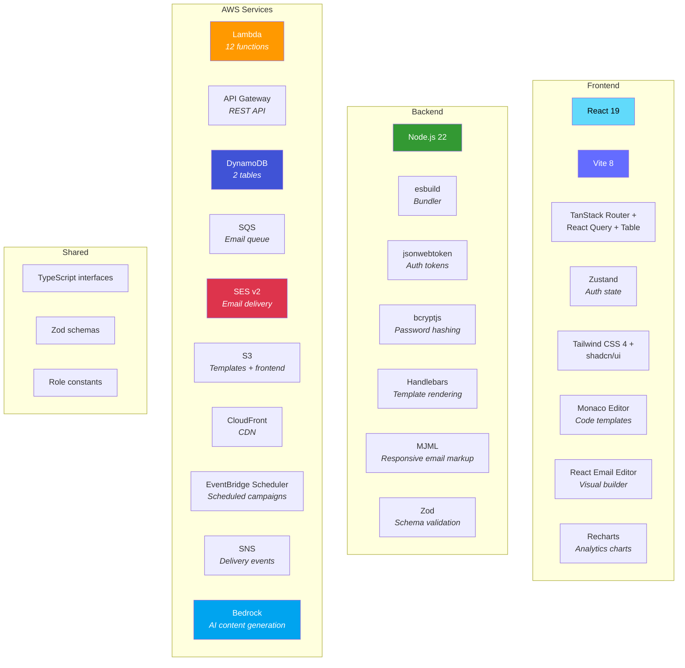

### Monorepo Structure

```
edm-aws/
├── packages/
│   ├── frontend/          React 19 + Vite SPA
│   │   ├── src/
│   │   │   ├── routes/    File-based routing (TanStack Router)
│   │   │   ├── components/ UI components (shadcn/ui)
│   │   │   ├── hooks/     React Query data hooks
│   │   │   ├── stores/    Zustand state (auth, theme)
│   │   │   └── lib/       API client, utilities
│   │   └── vite.config.ts
│   │
│   ├── backend/           Lambda functions
│   │   ├── src/
│   │   │   ├── functions/  10 API + 1 sender + 1 webhook
│   │   │   ├── lib/       Shared utilities (db, jwt, middleware)
│   │   │   └── types/     TypeScript interfaces
│   │   └── scripts/       Build configuration (esbuild)
│   │
│   └── shared/            Cross-package types + validation
│       ├── types/
│       ├── validation/
│       └── constants/
│
├── scripts/               AWS deployment scripts (18+ bash)
│   ├── deploy.sh          Master deployment orchestrator
│   ├── setup-*.sh         Per-service provisioning
│   ├── seed-*.sh          Initial data seeding
│   └── teardown.sh        Full resource cleanup
│
└── docs/                  Documentation
```

---

## Architecture Deep Dive

### Frontend Architecture

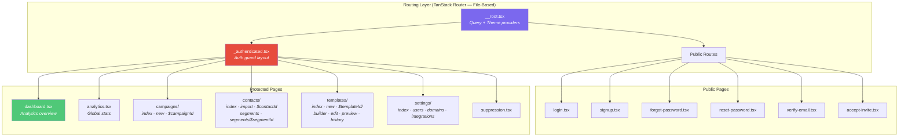

**State management is intentionally layered:**

| Layer | Tool | What It Manages |
|-------|------|----------------|
| **Server state** | React Query (5min staleTime, 1 retry) | All API data — campaigns, contacts, templates, analytics |
| **Auth state** | Zustand (localStorage persistence) | User profile, access token, `isAuthenticated` flag |
| **Theme state** | next-themes | Light/dark mode preference |
| **Component state** | React hooks | Forms, modals, local UI state |

**The API client** is a single generic `apiClient<T>()` function that handles JSON serialization, Bearer token injection, and automatic 401 → refresh → retry with a mutex to prevent duplicate refresh calls across concurrent requests.

### Backend Architecture — Lambda Functions

The backend is 12 Lambda functions. 10 serve API endpoints via API Gateway. 1 processes email sends from SQS. 1 processes delivery events from SNS.

```
┌─────────────────────────────────────────────────────────────────────────┐
│  API GATEWAY (REST)                                                      │
│  ┌──────────────┐                                                        │
│  │  Authorizer   │ ← Validates JWT on every request                      │
│  │  Lambda       │   Returns: userId, email, role as context             │
│  └──────┬───────┘                                                        │
│         │                                                                │
│  ┌──────▼───────────────────────────────────────────────────────────┐    │
│  │                        API Routes                                │    │
│  │                                                                  │    │
│  │  /auth/*          → Auth Lambda          (login, register, etc.) │    │
│  │  /admin/*         → Admin Lambda         (user management)       │    │
│  │  /contacts/*      → Contacts Lambda      (CRUD + import/export)  │    │
│  │  /campaigns/*     → Campaigns Lambda     (CRUD + execute)        │    │
│  │  /templates/*     → Templates Lambda     (CRUD + render)         │    │
│  │  /domain/*        → Domain Lambda        (SES domain status)     │    │
│  │  /integrations/*  → Integrations Lambda  (HubSpot, Zoho)        │    │
│  │  /ai/*            → AI Lambda            (generate, improve)     │    │
│  │                                                                  │    │
│  └──────────────────────────────────────────────────────────────────┘    │
└─────────────────────────────────────────────────────────────────────────┘

┌─────────────────────────────────────────────────────────────────────────┐
│  EVENT-DRIVEN FUNCTIONS                                                  │
│                                                                          │
│  SQS (email-queue)  → Sender Lambda    (render + send via SES)          │
│  SNS (ses-events)   → Webhook Lambda   (track delivery/open/click)      │
│                                                                          │
└─────────────────────────────────────────────────────────────────────────┘
```

### Full API Route Map

| Function | Method | Route | Auth | Description |
|----------|--------|-------|------|-------------|
| **auth** | POST | `/auth/login` | None | Username/password login |
| | POST | `/auth/register` | None | New user registration |
| | POST | `/auth/refresh` | Cookie | Refresh access token |
| | POST | `/auth/logout` | Cookie | Clear session |
| | POST | `/auth/verify-email` | None | Verify email token |
| | POST | `/auth/forgot-password` | None | Request password reset |
| | POST | `/auth/reset-password` | None | Reset with token |
| | POST | `/auth/accept-invite` | None | Accept admin invite |
| **admin** | GET | `/admin/users` | Admin | List all users |
| | POST | `/admin/users` | Admin | Create user |
| | POST | `/admin/users/invite` | Admin | Send invite email |
| | PUT | `/admin/users/{userId}` | Admin | Update user |
| | POST | `/admin/users/{userId}/disable` | Admin | Disable account |
| **contacts** | GET | `/contacts` | Any | List with pagination |
| | POST | `/contacts` | Editor+ | Create contact |
| | GET | `/contacts/{contactId}` | Any | Get contact details |
| | PUT | `/contacts/{contactId}` | Editor+ | Update contact |
| | DELETE | `/contacts/{contactId}` | Editor+ | Delete contact |
| | POST | `/contacts/import` | Editor+ | Bulk CSV import |
| | GET | `/contacts/export` | Any | CSV export |
| | GET | `/contacts/segments` | Any | List segments |
| | POST | `/contacts/segments` | Editor+ | Create segment |
| | GET/PUT/DELETE | `/contacts/segments/{segmentId}` | Editor+ | Segment CRUD |
| **campaigns** | GET | `/campaigns` | Any | List campaigns |
| | POST | `/campaigns` | Editor+ | Create campaign |
| | GET/PUT/DELETE | `/campaigns/{campaignId}` | Editor+ | Campaign CRUD |
| | GET | `/campaigns/{campaignId}/analytics` | Any | Per-campaign stats |
| | GET | `/campaigns/analytics` | Any | Global analytics |
| | GET | `/campaigns/{campaignId}/audience` | Any | Preview segment members |
| | POST | `/campaigns/{campaignId}/schedule` | Editor+ | Schedule send |
| | POST | `/campaigns/{campaignId}/cancel` | Editor+ | Cancel scheduled send |
| | POST | `/campaigns/{campaignId}/execute` | Editor+ | Send immediately |
| | POST/GET | `/campaigns/unsubscribe` | None | One-click unsubscribe |
| | GET/POST/DELETE | `/campaigns/suppressions` | Editor+ | Suppression list |
| **templates** | GET | `/templates` | Any | List templates |
| | POST | `/templates` | Editor+ | Create template |
| | GET/PUT/DELETE | `/templates/{templateId}` | Editor+ | Template CRUD |
| | POST | `/templates/{templateId}/render` | Any | Render with sample data |
| | GET | `/templates/{templateId}/versions` | Any | Version history |
| | POST | `/templates/{templateId}/revert` | Editor+ | Revert to version |
| | POST | `/templates/{templateId}/duplicate` | Editor+ | Clone template |
| **domain** | GET | `/domain/status` | Admin | SES domain verification status |
| | GET | `/domain/reputation` | Admin | Sender reputation metrics |
| | POST | `/domain/verify` | Admin | Trigger domain verification |
| **integrations** | GET | `/integrations` | Admin | List integrations |
| | GET/POST/DELETE | `/integrations/hubspot` | Admin | HubSpot connection |
| | GET/POST/DELETE | `/integrations/zoho` | Admin | Zoho connection |
| | POST | `/integrations/hubspot/sync` | Admin | Sync HubSpot contacts |
| | POST | `/integrations/zoho/sync` | Admin | Sync Zoho contacts |
| **ai** | POST | `/ai/generate` | Editor+ | Generate email content |
| | POST | `/ai/improve` | Editor+ | Suggest improvements |
| | POST | `/ai/agent` | Editor+ | Multi-turn AI chat |

### Request Lifecycle

Every API request follows the same path:

```
┌───────────────────────────────────────────────────────────────────────┐
│  1. BROWSER → API GATEWAY                                             │
│     Headers: Authorization: Bearer {accessToken}                      │
│     Body: JSON payload                                                │
│                                                                       │
│  2. API GATEWAY → AUTHORIZER LAMBDA                                   │
│     Extracts JWT from header                                          │
│     Verifies signature + expiration (HS256)                           │
│     Returns IAM policy + context: { userId, email, role }             │
│                                                                       │
│  3. API GATEWAY → TARGET LAMBDA                                       │
│     event.requestContext.authorizer = { userId, email, role }         │
│     event.pathParameters = { campaignId, contactId, etc. }            │
│     event.body = JSON string                                          │
│                                                                       │
│  4. LAMBDA HANDLER                                                    │
│     ├── Check OPTIONS → Return CORS preflight                        │
│     ├── Parse path + HTTP method                                     │
│     ├── Check role authorization (if write operation)                 │
│     ├── Route to business logic function                             │
│     └── Return { statusCode, headers (CORS), body: JSON }            │
│                                                                       │
│  5. RESPONSE → BROWSER                                                │
│     Success: { success: true, data: {...} }                           │
│     Error:   { success: false, error: "message" }                     │
└───────────────────────────────────────────────────────────────────────┘
```

---

## Authentication & Authorization

### Token Architecture

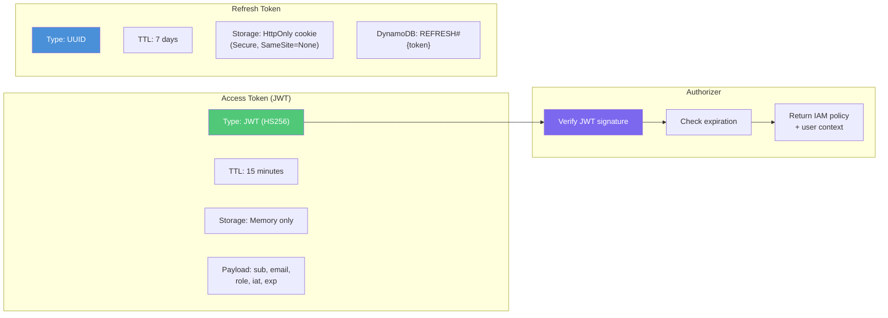

### Role-Based Access Control

```
┌─────────────────────────────────────────────────────────────────┐
│  ROLE HIERARCHY                                                  │
│                                                                  │
│  admin ──────────────────────────────────────────────────────── │
│  │  Full platform access                                        │
│  │  User management (create, invite, disable)                   │
│  │  Domain configuration (SES verification)                     │
│  │  CRM integrations (HubSpot, Zoho)                           │
│  │  All editor + viewer permissions                             │
│  │                                                              │
│  editor ─────────────────────────────────────────────────────── │
│  │  Create/edit campaigns, templates, contacts                  │
│  │  Execute and schedule campaigns                              │
│  │  Import/export contacts                                      │
│  │  Manage segments and suppression lists                       │
│  │  Use AI features                                             │
│  │  All viewer permissions                                      │
│  │                                                              │
│  viewer ─────────────────────────────────────────────────────── │
│     Read-only access to all data                                │
│     View dashboards and analytics                               │
│     Preview templates                                           │
│     Export contacts                                              │
└─────────────────────────────────────────────────────────────────┘
```

### Auth Flow — Step by Step

```mermaid
sequenceDiagram
    participant Browser as Browser
    participant Store as Zustand Auth Store
    participant API as API Client
    participant GW as API Gateway
    participant Auth as Auth Lambda
    participant DB as DynamoDB

    Note over Browser,DB: LOGIN FLOW
    Browser->>API: POST /auth/login {email, password}
    API->>GW: Forward (no auth header)
    GW->>Auth: Route to auth handler
    Auth->>DB: Lookup USER by email (GSI1)
    DB-->>Auth: User record
    Auth->>Auth: bcrypt.compare(password, hash)
    Auth->>Auth: Generate JWT (15min) + UUID refresh token
    Auth->>DB: Store REFRESH#{token}#META (TTL: 7 days)
    Auth-->>Browser: {accessToken, user} + Set-Cookie: refreshToken

    Browser->>Store: Save user + token in memory

    Note over Browser,DB: AUTHENTICATED REQUEST
    Browser->>API: GET /campaigns (Bearer token)
    API->>GW: Authorization: Bearer {jwt}
    GW->>GW: Authorizer Lambda validates JWT
    GW->>Auth: Forward with user context
    Auth-->>Browser: Campaign data

    Note over Browser,DB: TOKEN REFRESH (on 401)
    Browser->>API: Any request → 401 Unauthorized
    API->>API: Mutex lock (prevent duplicate refreshes)
    API->>GW: POST /auth/refresh (cookie sent automatically)
    GW->>Auth: Extract refreshToken from cookie
    Auth->>DB: Lookup REFRESH#{token} → validate
    Auth->>Auth: Generate new JWT
    Auth-->>API: {accessToken}
    API->>Store: Update token
    API->>GW: Retry original request with new token
    GW-->>Browser: Success

    Note over Browser,DB: LOGOUT
    Browser->>API: POST /auth/logout
    API->>Auth: Clear refresh token
    Auth->>DB: Delete REFRESH#{token}
    Browser->>Store: Clear auth state
    Browser->>Browser: Broadcast logout to other tabs
```

---

## Database Schema (DynamoDB)

The platform uses two DynamoDB tables with single-table design patterns. All records use composite keys (PK + SK) for efficient access.

### Users Table

```
┌─────────────────────────────────────────────────────────────────────────┐
│  TABLE: {TENANT_PREFIX}-users                                            │
│  Billing: On-Demand (pay-per-request)                                    │
│  GSI1: email (for login lookup)                                          │
├─────────────────────────────────────────────────────────────────────────┤
│                                                                          │
│  RECORD TYPE           PK                        SK                      │
│  ─────────────────────────────────────────────────────────────────────── │
│  User Profile          USER#{userId}             PROFILE                 │
│  Refresh Token Lookup  REFRESH#{tokenValue}      META                   │
│  User Session          USER#{userId}             SESSION#{sessionId}     │
│  Email Verify Token    VERIFY#{token}            META                   │
│  Password Reset Token  RESET#{token}             META                   │
│                                                                          │
│  USER ATTRIBUTES                                                         │
│  ─────────────────────────────────────────────────────────────────────── │
│  userId         String     UUID                                          │
│  email          String     Unique (GSI1)                                 │
│  passwordHash   String     bcrypt (10 rounds)                            │
│  name           String     Display name                                  │
│  role           String     admin | editor | viewer                       │
│  status         String     active | disabled | pending                   │
│  emailVerified  Boolean    Email verification status                     │
│  lastLoginAt    String     ISO timestamp                                 │
│  createdAt      String     ISO timestamp                                 │
│  updatedAt      String     ISO timestamp                                 │
│                                                                          │
│  TOKEN ATTRIBUTES                                                        │
│  ─────────────────────────────────────────────────────────────────────── │
│  refreshToken   String     UUID value                                    │
│  expiresAt      Number     TTL (epoch seconds) — auto-deleted by DDB     │
│                                                                          │
└─────────────────────────────────────────────────────────────────────────┘
```

### Data Table

```
┌─────────────────────────────────────────────────────────────────────────┐
│  TABLE: {TENANT_PREFIX}-data                                             │
│  Billing: On-Demand (pay-per-request)                                    │
│  GSI1: GSI1PK + GSI1SK (for alternative access patterns)                │
├─────────────────────────────────────────────────────────────────────────┤
│                                                                          │
│  RECORD TYPE           PK                        SK                      │
│  ─────────────────────────────────────────────────────────────────────── │
│  Contact               CONTACT#{contactId}       PROFILE                 │
│  Segment               SEGMENT#{segmentId}       META                   │
│  Template              TEMPLATE#{templateId}     META                   │
│  Template Version      TEMPLATE#{templateId}     VERSION#{versionNum}   │
│  Campaign              CAMPAIGN#{campaignId}     META                   │
│  Email Send Record     CAMPAIGN#{campaignId}     EMAIL#{contactId}      │
│  Campaign Audit Log    CAMPAIGN#{campaignId}     AUDIT#{ts}#{uuid}      │
│  Suppression Entry     SUPPRESSION#{email}       META                   │
│                                                                          │
│  CONTACT ATTRIBUTES                                                      │
│  ─────────────────────────────────────────────────────────────────────── │
│  contactId       String     UUID                                         │
│  email           String     Recipient email                              │
│  firstName       String     First name                                   │
│  lastName        String     Last name                                    │
│  tags            List       String tags for segmentation                 │
│  customFields    Map        Arbitrary key-value metadata                 │
│  status          String     active | unsubscribed | bounced              │
│  syncSource      String     local | hubspot | zoho                       │
│  externalIds     Map        { hubspotId, zohoId }                        │
│                                                                          │
│  CAMPAIGN ATTRIBUTES                                                     │
│  ─────────────────────────────────────────────────────────────────────── │
│  campaignId      String     UUID                                         │
│  name            String     Campaign name                                │
│  subject         String     Email subject line                           │
│  templateId      String     Linked template                              │
│  segmentId       String     Target segment                               │
│  status          String     draft|scheduled|executing|completed|failed   │
│  totalEmails     Number     Total recipients                             │
│  sentCount       Number     Successfully sent                            │
│  failedCount     Number     Failed to send                               │
│  deliveredCount  Number     Confirmed delivered                          │
│  openedCount     Number     Unique opens                                 │
│  clickedCount    Number     Unique clicks                                │
│  bouncedCount    Number     Hard/soft bounces                            │
│  complainedCount Number     Spam complaints                              │
│                                                                          │
│  TEMPLATE ATTRIBUTES                                                     │
│  ─────────────────────────────────────────────────────────────────────── │
│  templateId      String     UUID                                         │
│  name            String     Template name                                │
│  type            String     code | visual                                │
│  currentVersion  Number     Latest version number                        │
│  s3Key           String     Rendered HTML in S3                          │
│  designS3Key     String     Visual builder JSON in S3                    │
│  mjmlS3Key       String     MJML source in S3                            │
│  variables       List       Handlebars variable names                    │
│  isStarter       Boolean    Pre-built starter template flag              │
│                                                                          │
│  SEGMENT ATTRIBUTES                                                      │
│  ─────────────────────────────────────────────────────────────────────── │
│  segmentId       String     UUID                                         │
│  name            String     Segment name                                 │
│  description     String     Optional description                         │
│  rules           List       Array of {field, operator, value} rules      │
│  logic           String     AND | OR (combine rules)                     │
│  memberCount     Number     Cached member count                          │
│                                                                          │
└─────────────────────────────────────────────────────────────────────────┘
```

### Access Patterns

| Pattern | Table | Key Condition | Use Case |
|---------|-------|---------------|----------|
| Get user by ID | users | PK=`USER#{id}`, SK=`PROFILE` | Profile lookup |
| Get user by email | users | GSI1 on `email` | Login |
| Validate refresh token | users | PK=`REFRESH#{token}`, SK=`META` | Token refresh |
| List all contacts | data | PK begins_with `CONTACT#` | Contact list |
| Get campaign analytics | data | PK=`CAMPAIGN#{id}`, SK=`META` | Dashboard |
| List email send records | data | PK=`CAMPAIGN#{id}`, SK begins_with `EMAIL#` | Delivery tracking |
| Check suppression | data | PK=`SUPPRESSION#{email}`, SK=`META` | Pre-send check |
| Get template versions | data | PK=`TEMPLATE#{id}`, SK begins_with `VERSION#` | Version history |

---

## The Email Engine

### Campaign State Machine

```mermaid
stateDiagram-v2
    [*] --> draft: Campaign created

    draft --> scheduled: Schedule (EventBridge cron)
    draft --> executing: Execute now
    draft --> [*]: Delete

    scheduled --> executing: EventBridge triggers at scheduled time
    scheduled --> draft: Cancel schedule

    executing --> completed: All emails sent successfully
    executing --> failed: Some/all emails failed

    completed --> [*]
    failed --> [*]
```

```
┌──────────────────────────────────────────────────────────────────────┐
│  STATE TRANSITIONS — WHAT TRIGGERS EACH                              │
├──────────────────────────────────────────────────────────────────────┤
│                                                                      │
│  draft → scheduled                                                   │
│    Trigger: POST /campaigns/{id}/schedule                            │
│    Action:  Create EventBridge one-time schedule                     │
│    Target:  Campaigns Lambda with { campaignId, action: "execute" }  │
│                                                                      │
│  draft → executing                                                   │
│    Trigger: POST /campaigns/{id}/execute                             │
│    Action:  Evaluate segment, queue emails to SQS                    │
│                                                                      │
│  scheduled → draft                                                   │
│    Trigger: POST /campaigns/{id}/cancel                              │
│    Action:  Delete EventBridge schedule, reset status                │
│                                                                      │
│  scheduled → executing                                               │
│    Trigger: EventBridge fires at scheduled time                      │
│    Action:  Invokes Campaigns Lambda → evaluate + queue              │
│                                                                      │
│  executing → completed                                               │
│    Trigger: Sender Lambda detects sentCount + failedCount >= total   │
│    Action:  Conditional update to "completed"                        │
│                                                                      │
│  executing → failed                                                  │
│    Trigger: Same check, but failedCount > 0                          │
│    Action:  Conditional update to "failed"                           │
│                                                                      │
└──────────────────────────────────────────────────────────────────────┘
```

### Sending Pipeline

```mermaid
graph TD
    EXEC["Campaign Execute"]
    EVAL["Evaluate Segment Rules"]
    FILTER["Filter: active contacts only<br/>+ not in suppression list"]
    QUEUE["Queue to SQS<br/>(1 message per contact)"]
    SENDER["Sender Lambda<br/>(SQS consumer)"]
    SUPP_CHECK["Check suppression list"]
    LOAD["Load template from S3"]
    RENDER["Render with Handlebars<br/>(contact variables)"]
    MIME["Build MIME message<br/>+ List-Unsubscribe headers"]
    SES["Send via SES v2"]
    RECORD["Write idempotent<br/>EMAIL#{contactId} record"]
    COUNT["Atomic increment<br/>sentCount or failedCount"]
    COMPLETE{"sentCount + failedCount<br/>>= totalEmails?"}
    DONE["Transition campaign<br/>to completed/failed"]

    EXEC --> EVAL --> FILTER --> QUEUE
    QUEUE --> SENDER --> SUPP_CHECK
    SUPP_CHECK -->|"Suppressed"| COUNT
    SUPP_CHECK -->|"Not suppressed"| LOAD --> RENDER --> MIME --> SES
    SES --> RECORD --> COUNT
    COUNT --> COMPLETE
    COMPLETE -->|"Yes"| DONE
    COMPLETE -->|"No"| SENDER

    style EXEC fill:#4A90D9,color:#fff
    style SES fill:#DD344C,color:#fff
    style DONE fill:#50C878,color:#fff
    style SUPP_CHECK fill:#F5A623,color:#fff
```

### SQS Email Job Structure

Each contact in the segment becomes one SQS message:

```json
{
  "campaignId": "uuid",
  "contactId": "uuid",
  "email": "recipient@example.com",
  "firstName": "Jane",
  "lastName": "Doe",
  "subject": "Your exclusive offer inside",
  "templateS3Key": "templates/tpl-123/v3.html",
  "customFields": {
    "company": "Acme Corp",
    "plan": "enterprise"
  }
}
```

### Template Rendering

```
┌─────────────────────────────────────────────────────────────────┐
│  RENDERING PIPELINE                                              │
│                                                                  │
│  1. Load HTML from S3 (templateS3Key)                           │
│     └── Pre-compiled from MJML or visual builder JSON           │
│                                                                  │
│  2. Handlebars compilation                                       │
│     └── Template variables: {{firstName}}, {{lastName}},         │
│         {{email}}, {{company}}, any customField key              │
│                                                                  │
│  3. Variable injection                                           │
│     └── Each contact's data fills their template copy            │
│                                                                  │
│  4. Unsubscribe link injection                                   │
│     └── {{unsubscribeUrl}} = /campaigns/unsubscribe              │
│         ?cid={campaignId}&email={email}&token={HMAC}             │
│                                                                  │
│  5. MIME message construction                                    │
│     └── Headers:                                                 │
│         List-Unsubscribe: <{url}>                               │
│         List-Unsubscribe-Post: List-Unsubscribe=One-Click       │
│         X-Campaign-Id: {campaignId}                              │
│         X-Contact-Id: {contactId}                                │
│                                                                  │
└─────────────────────────────────────────────────────────────────┘
```

### Event Tracking & Analytics

SES publishes delivery events via a Configuration Set → SNS → Webhook Lambda pipeline.

| Event | Source | Action | Counter Updated |
|-------|--------|--------|----------------|
| **Send** | SES queues email | Log send record | — |
| **Delivery** | MTA confirms receipt | Increment | `deliveredCount` |
| **Open** | Tracking pixel loaded | Increment | `openedCount` |
| **Click** | Tracked link clicked | Increment | `clickedCount` |
| **Bounce** | Hard or soft bounce | Increment + suppress (hard only) | `bouncedCount` |
| **Complaint** | Recipient marks as spam | Increment + suppress | `complainedCount` |

All counter updates use DynamoDB's atomic `ADD` operation — no read-modify-write races.

### Suppression & Compliance

```
┌─────────────────────────────────────────────────────────────────┐
│  SUPPRESSION LIST                                                │
│                                                                  │
│  Records: SUPPRESSION#{email}#META in data table                 │
│                                                                  │
│  Auto-added on:                                                  │
│  ├── Hard bounce (permanent delivery failure)                    │
│  ├── Spam complaint (recipient reported as spam)                 │
│  └── One-click unsubscribe (RFC 8058 compliant)                 │
│                                                                  │
│  Checked:                                                        │
│  ├── Before every individual email send (Sender Lambda)          │
│  └── Suppressed contacts are skipped, never re-contacted         │
│                                                                  │
│  One-Click Unsubscribe:                                          │
│  ├── URL: GET /campaigns/unsubscribe?cid=X&email=Y&token=Z      │
│  ├── Token: HMAC-SHA256(email + campaignId, UNSUBSCRIBE_SECRET)  │
│  ├── No authentication required (per RFC 8058)                   │
│  └── Adds to suppression list immediately                        │
│                                                                  │
│  Manual management:                                              │
│  ├── GET  /campaigns/suppressions — List all                     │
│  ├── POST /campaigns/suppressions — Add manually                 │
│  └── DELETE /campaigns/suppressions — Remove entry               │
│                                                                  │
└─────────────────────────────────────────────────────────────────┘
```

---

## Contact Management

### Contact Lifecycle

```mermaid
stateDiagram-v2
    [*] --> active: Created (manual or import)

    active --> unsubscribed: One-click unsubscribe
    active --> bounced: Hard bounce detected
    active --> active: Updated / synced

    unsubscribed --> active: Manual reactivation
    bounced --> [*]: Suppressed permanently

    note right of active: Eligible for campaigns
    note right of unsubscribed: In suppression list
    note right of bounced: In suppression list
```

### Segmentation Engine

Segments are dynamic filters defined by rules. Each rule has a **field**, **operator**, and **value**. Rules combine with **AND** or **OR** logic.

```
┌─────────────────────────────────────────────────────────────────┐
│  SEGMENT RULE STRUCTURE                                          │
│                                                                  │
│  {                                                               │
│    "rules": [                                                    │
│      { "field": "status",    "operator": "equals",  "value": "active" },
│      { "field": "tags",      "operator": "contains","value": "premium" },
│      { "field": "firstName", "operator": "exists",  "value": null }
│    ],                                                            │
│    "logic": "AND"                                                │
│  }                                                               │
│                                                                  │
│  SUPPORTED OPERATORS                                             │
│  ─────────────────────────────────────────────────────────────── │
│  equals         Exact match (case-sensitive)                     │
│  not_equals     Inverse of equals                                │
│  contains       Substring or array element match                 │
│  not_contains   Inverse of contains                              │
│  starts_with    String prefix match                              │
│  exists         Field is present and non-null                    │
│  not_exists     Field is absent or null                          │
│  greater_than   Numeric comparison                               │
│  less_than      Numeric comparison                               │
│                                                                  │
│  EVALUATION                                                      │
│  ─────────────────────────────────────────────────────────────── │
│  Segments are evaluated at send time — not pre-computed.         │
│  All contacts are scanned and filtered by rules.                 │
│  memberCount is cached after evaluation for display purposes.    │
│                                                                  │
└─────────────────────────────────────────────────────────────────┘
```

### CSV Import Pipeline

```mermaid
graph TD
    UPLOAD["User uploads CSV file"]
    PARSE["PapaParse: parse CSV<br/>(frontend)"]
    MAP["Column mapping UI<br/>(email, firstName, etc.)"]
    VALIDATE["Validate rows:<br/>email format, required fields"]
    PREVIEW["Preview: show first 10 rows"]
    SEND["POST /contacts/import<br/>(batch payload)"]
    DEDUP["Backend: deduplicate by email"]
    WRITE["Write CONTACT#{id} records<br/>(batch PutItem)"]
    RESULT["Return: created, updated,<br/>skipped counts"]

    UPLOAD --> PARSE --> MAP --> VALIDATE --> PREVIEW --> SEND
    SEND --> DEDUP --> WRITE --> RESULT

    style UPLOAD fill:#4A90D9,color:#fff
    style RESULT fill:#50C878,color:#fff
```

---

## Template System

### Template Types

| Type | Editor | Storage | Best For |
|------|--------|---------|----------|
| **Visual** | React Email Editor (drag & drop) | Design JSON in S3 (`designS3Key`) + compiled HTML (`s3Key`) | Non-technical users, quick campaigns |
| **Code** | Monaco Editor (HTML/MJML) | MJML source in S3 (`mjmlS3Key`) + compiled HTML (`s3Key`) | Developers, complex layouts |

Both types compile to final HTML stored in S3. The Sender Lambda always loads the compiled HTML — it doesn't know or care which editor created it.

### Version Control

```
┌─────────────────────────────────────────────────────────────────┐
│  TEMPLATE VERSIONING                                             │
│                                                                  │
│  Every save creates a new version:                               │
│  ├── TEMPLATE#{id}#VERSION#1  (original)                         │
│  ├── TEMPLATE#{id}#VERSION#2  (first edit)                       │
│  ├── TEMPLATE#{id}#VERSION#3  (current)                          │
│  └── TEMPLATE#{id}#META.currentVersion = 3                       │
│                                                                  │
│  S3 keys include version:                                        │
│  ├── templates/{templateId}/v1.html                              │
│  ├── templates/{templateId}/v2.html                              │
│  └── templates/{templateId}/v3.html                              │
│                                                                  │
│  Operations:                                                     │
│  ├── GET  /templates/{id}/versions → List all versions           │
│  ├── POST /templates/{id}/revert   → Set currentVersion = N      │
│  └── POST /templates/{id}/duplicate → Clone as new template      │
│                                                                  │
│  Reverting does NOT delete newer versions — it repoints the      │
│  currentVersion counter, preserving full history.                │
│                                                                  │
└─────────────────────────────────────────────────────────────────┘
```

### Variable System

Templates use Handlebars syntax for personalization:

| Variable | Source | Example |
|----------|--------|---------|
| `{{firstName}}` | Contact record | "Jane" |
| `{{lastName}}` | Contact record | "Doe" |
| `{{email}}` | Contact record | "jane@example.com" |
| `{{unsubscribeUrl}}` | Auto-generated | HMAC-signed unsubscribe link |
| `{{customFields.company}}` | Contact custom fields | "Acme Corp" |
| `{{customFields.*}}` | Contact custom fields | Any user-defined field |

---

## CRM Integrations

```mermaid
graph LR
    subgraph "HubSpot"
        HS_AUTH["Private App Token"]
        HS_API["HubSpot API"]
        HS_SYNC["Sync contacts"]
    end

    subgraph "Zoho"
        ZO_AUTH["OAuth 2.0<br/>Refresh Token"]
        ZO_API["Zoho CRM API"]
        ZO_SYNC["Sync contacts"]
    end

    subgraph "Volley"
        INT_LAMBDA["Integrations Lambda"]
        DEDUP["Deduplication engine"]
        DB["DynamoDB contacts"]
    end

    HS_AUTH --> HS_API --> HS_SYNC --> INT_LAMBDA
    ZO_AUTH --> ZO_API --> ZO_SYNC --> INT_LAMBDA
    INT_LAMBDA --> DEDUP --> DB

    style HS_AUTH fill:#FF7A59,color:#fff
    style ZO_AUTH fill:#DC2626,color:#fff
    style DB fill:#4053D6,color:#fff
```

| Integration | Auth Method | Sync Direction | Dedup Key | Stored In |
|-------------|-------------|----------------|-----------|-----------|
| **HubSpot** | Private App token | HubSpot → Volley | `externalIds.hubspotId` | DynamoDB (encrypted token) |
| **Zoho** | OAuth 2.0 refresh token | Zoho → Volley | `externalIds.zohoId` | DynamoDB (OAuth credentials) |

**Sync behavior:**
- Imports contacts with email deduplication
- Maps external IDs for future syncs
- Sets `syncSource` to `hubspot` or `zoho`
- Preserves local customizations (tags, custom fields)
- Token refresh handled automatically (Zoho OAuth)

---

## AI Features (AWS Bedrock)

```mermaid
graph TD
    subgraph "AI Lambda (/ai/*)"
        GEN["POST /ai/generate<br/><i>Create email from prompt</i>"]
        IMP["POST /ai/improve<br/><i>Suggest improvements</i>"]
        AGENT["POST /ai/agent<br/><i>Multi-turn chat</i>"]
    end

    subgraph "AWS Bedrock"
        MODEL["Claude Haiku 4.5<br/><i>Temperature: 0.3</i><br/><i>Max tokens: 4096</i>"]
    end

    GEN --> MODEL
    IMP --> MODEL
    AGENT --> MODEL

    style MODEL fill:#00A4EF,color:#fff
    style GEN fill:#50C878,color:#fff
    style IMP fill:#F5A623,color:#fff
    style AGENT fill:#7B68EE,color:#fff
```

### Three AI Capabilities

| Feature | Input | Output | Use Case |
|---------|-------|--------|----------|
| **Generate** | Prompt + tone (professional, casual, urgent, friendly) | Subject line + preview text + body HTML | Create email copy from scratch |
| **Improve** | Current subject + body + optional goal | Array of suggestions: `{type, original, improved, reason}` + effectiveness score | Polish existing content |
| **Agent** | Conversation history + current message | Final text + list of tools used | Interactive AI assistant with tool access |

**Agent mode** supports multi-turn conversation with tool execution (content analysis, email generation, suggestion generation). It runs an agentic loop of up to 5 iterations: model → tools → results → model, preventing infinite loops.

**Configuration:**
- Model: `us.anthropic.claude-haiku-4-5-20251001-v1:0` (configurable via `AI_MODEL_ID`)
- Region: `us-east-1` (separate from main infrastructure region)
- Temperature: 0.3 (deterministic, consistent output)
- IAM: `bedrock:InvokeModel` permission on `arn:aws:bedrock:*::foundation-model/*`

---

## AWS Infrastructure

### Service Map

```mermaid
graph TD
    subgraph "Compute"
        LAMBDA["Lambda<br/>12 functions<br/>Node.js 22"]
        APIGW["API Gateway<br/>REST API + Authorizer"]
    end

    subgraph "Storage"
        DDB["DynamoDB<br/>2 tables (on-demand)"]
        S3T["S3 — Templates<br/>HTML, MJML, design JSON"]
        S3F["S3 — Frontend<br/>Static SPA assets"]
    end

    subgraph "Email"
        SES["SES v2<br/>Domain-verified sender"]
        SQS["SQS<br/>Email job queue"]
        SNS["SNS<br/>Delivery events"]
    end

    subgraph "Scheduling"
        EB["EventBridge Scheduler<br/>Campaign schedules"]
    end

    subgraph "CDN"
        CF["CloudFront<br/>Frontend distribution"]
    end

    subgraph "AI"
        BR["Bedrock<br/>Claude model inference"]
    end

    subgraph "Observability"
        CW["CloudWatch<br/>Lambda logs + metrics"]
    end

    APIGW --> LAMBDA
    LAMBDA --> DDB & S3T & SQS & SES & BR
    SQS --> LAMBDA
    SNS --> LAMBDA
    SES --> SNS
    EB --> LAMBDA
    CF --> S3F

    style LAMBDA fill:#FF9900,color:#fff
    style APIGW fill:#FF9900,color:#fff
    style DDB fill:#4053D6,color:#fff
    style SES fill:#DD344C,color:#fff
    style SQS fill:#FF9900,color:#fff
    style CF fill:#8C4FFF,color:#fff
    style BR fill:#00A4EF,color:#fff
```

### Deployment Pipeline

The master `deploy.sh` script orchestrates full infrastructure provisioning in dependency order:

```
┌─────────────────────────────────────────────────────────────────────────┐
│  DEPLOYMENT ORDER (scripts/deploy.sh)                                    │
├─────────────────────────────────────────────────────────────────────────┤
│                                                                          │
│   Step  Script                    What It Creates                        │
│  ────────────────────────────────────────────────────────────────────── │
│    1    validate-env.sh           Check .env for required variables       │
│    2    build.ts                  esbuild all Lambda functions            │
│    3    setup-dynamodb.sh         Create users + data tables             │
│    4    setup-s3-buckets.sh       Create templates + frontend buckets    │
│    5    setup-ses.sh              Domain identity + verification         │
│    6    setup-sqs.sh              Email queue                            │
│    7    setup-lambdas.sh          Deploy all 12 Lambda functions         │
│    8    setup-sender-lambda.sh    Configure sender with SQS trigger      │
│    9    setup-api-gateway.sh      REST API + routes + authorizer         │
│   10    setup-eventbridge.sh      Campaign scheduler group               │
│   11    setup-ses-tracking.sh     Config set + SNS + webhook trigger     │
│   12    setup-cloudfront.sh       Frontend CDN distribution              │
│   13    seed-data.sh              Admin user + starter templates         │
│                                                                          │
│  TEARDOWN: scripts/teardown.sh removes ALL resources in reverse order   │
│                                                                          │
└─────────────────────────────────────────────────────────────────────────┘
```

### Naming Conventions

All AWS resources use a tenant prefix for multi-tenant isolation:

| Resource | Naming Pattern | Example |
|----------|---------------|---------|
| DynamoDB tables | `{TENANT_PREFIX}-users`, `-data` | `edm-users`, `edm-data` |
| S3 buckets | `{TENANT_PREFIX}-templates-{ACCOUNT_ID}` | `edm-templates-123456789` |
| Lambda functions | `{TENANT_PREFIX}-{function}` | `edm-auth`, `edm-campaigns` |
| API Gateway | `{TENANT_PREFIX}-api` | `edm-api` |
| SQS queue | `{TENANT_PREFIX}-email-queue` | `edm-email-queue` |
| SNS topic | `{TENANT_PREFIX}-ses-events` | `edm-ses-events` |
| EventBridge group | `{TENANT_PREFIX}-campaigns` | `edm-campaigns` |
| IAM roles | `{TENANT_PREFIX}-api-role`, `-scheduler-role` | `edm-api-role` |

---

## Security Architecture

```
┌─────────────────────────────────────────────────────────────────┐
│  SECURITY LAYERS                                                 │
├─────────────────────────────────────────────────────────────────┤
│                                                                  │
│  TRANSPORT                                                       │
│  ├── HTTPS throughout (CloudFront + API Gateway)                │
│  └── TLS termination at edge (CloudFront)                       │
│                                                                  │
│  AUTHENTICATION                                                  │
│  ├── JWT: 15-min TTL, HS256, verified on every request          │
│  ├── Refresh token: 7-day TTL, HttpOnly cookie, rotation        │
│  ├── Password: bcryptjs hashing (10 rounds)                     │
│  └── Email verification required for new accounts               │
│                                                                  │
│  AUTHORIZATION                                                   │
│  ├── Role-based: admin > editor > viewer                        │
│  ├── Every write operation checks role in handler               │
│  └── Authorizer Lambda returns role as request context          │
│                                                                  │
│  API SECURITY                                                    │
│  ├── CORS: Locked to FRONTEND_URL origin (not wildcard)         │
│  ├── OPTIONS preflight: Handled in every Lambda handler         │
│  └── Input validation: Zod schemas on request bodies            │
│                                                                  │
│  EMAIL SECURITY                                                  │
│  ├── SES domain verification: SPF + DKIM + DMARC                │
│  ├── Suppression list: Bounces + complaints auto-suppressed     │
│  ├── Unsubscribe HMAC: SHA256(email + campaignId, secret)       │
│  └── RFC 8058: List-Unsubscribe + List-Unsubscribe-Post         │
│                                                                  │
│  DATA PROTECTION                                                 │
│  ├── DynamoDB: Encryption at rest (AWS managed)                 │
│  ├── S3: Encryption at rest (SSE-S3)                            │
│  ├── Token TTL: Auto-deleted by DynamoDB TTL                    │
│  └── No PII in logs (CloudWatch)                                │
│                                                                  │
│  INFRASTRUCTURE                                                  │
│  ├── IAM: Least-privilege roles per function                    │
│  ├── Lambda: Execution role scoped to specific resources        │
│  └── No standing servers — zero attack surface at rest          │
│                                                                  │
└─────────────────────────────────────────────────────────────────┘
```

---

## Data Flow Examples

### Campaign Execution — End to End

```
STAGE 1: PREPARATION (User → Frontend → API)
┌────────────────────────────────────────────────────────────────┐
│  User creates campaign: name, subject line                      │
│  User selects template: picks from template gallery             │
│  User selects segment: "Active Premium Subscribers"             │
│  User previews audience: sees matching contacts + count         │
│  User clicks "Send Now"                                         │
│  → POST /campaigns/{id}/execute                                 │
└──────────────────────────────┬─────────────────────────────────┘
                               │
                               ▼

STAGE 2: QUEUING (Campaigns Lambda)
┌────────────────────────────────────────────────────────────────┐
│  Evaluate segment rules against all contacts in DynamoDB        │
│  Filter: status=active AND not in suppression list              │
│  Result: 2,500 matching contacts                                │
│  Set campaign: totalEmails=2500, status=executing               │
│  Queue 2,500 SQS messages (1 per contact)                      │
│  Each message: { campaignId, contactId, email, templateS3Key }  │
└──────────────────────────────┬─────────────────────────────────┘
                               │
                               ▼

STAGE 3: SENDING (Sender Lambda — SQS consumer)
┌────────────────────────────────────────────────────────────────┐
│  For each SQS message:                                          │
│  1. Check SUPPRESSION#{email} — skip if exists                  │
│  2. Load HTML from S3: templates/tpl-123/v3.html                │
│  3. Compile with Handlebars: inject firstName, lastName, etc.   │
│  4. Build MIME: add List-Unsubscribe, campaign tracking headers │
│  5. SES SendEmailCommand → get MessageId                        │
│  6. Write CAMPAIGN#{id}#EMAIL#{contactId} (idempotent PutItem)  │
│  7. Atomic ADD sentCount (or failedCount on error)              │
│  8. Check completion: 2500 == sentCount + failedCount?          │
│     → Yes: update status to completed/failed                    │
└──────────────────────────────┬─────────────────────────────────┘
                               │
                               ▼

STAGE 4: TRACKING (SES → SNS → Webhook Lambda)
┌────────────────────────────────────────────────────────────────┐
│  SES Configuration Set fires events:                            │
│  → Delivery: atomic ADD deliveredCount                          │
│  → Open: atomic ADD openedCount                                 │
│  → Click: atomic ADD clickedCount                               │
│  → Bounce: atomic ADD bouncedCount + SUPPRESSION#{email}        │
│  → Complaint: atomic ADD complainedCount + SUPPRESSION#{email}  │
│                                                                  │
│  Frontend polls /campaigns/{id} for real-time dashboard updates │
└────────────────────────────────────────────────────────────────┘
```

### Contact Import — End to End

```
┌────────────────────────────────────────────────────────────────┐
│  1. User uploads contacts.csv (frontend)                        │
│  2. PapaParse parses CSV → array of rows                        │
│  3. Column mapping UI: user maps CSV headers to fields          │
│     "Email Address" → email, "First" → firstName, etc.          │
│  4. Validation: check email format, required fields             │
│  5. Preview: show first 10 rows for confirmation                │
│  6. POST /contacts/import → batch payload to Contacts Lambda    │
│  7. Backend deduplicates by email                               │
│     → Existing: update fields (merge)                           │
│     → New: create CONTACT#{uuid}#PROFILE                        │
│  8. Return: { created: 1847, updated: 612, skipped: 41 }       │
└────────────────────────────────────────────────────────────────┘
```

### One-Click Unsubscribe

```
┌────────────────────────────────────────────────────────────────┐
│  1. Recipient clicks unsubscribe link in email                  │
│     GET /campaigns/unsubscribe?cid=abc&email=x@y.com&token=... │
│                                                                  │
│  2. Campaigns Lambda (no auth required):                        │
│     a. Verify HMAC: SHA256(email + campaignId, secret) == token │
│     b. Create SUPPRESSION#{email}#META in DynamoDB              │
│     c. Update contact status to "unsubscribed"                  │
│     d. Return confirmation page                                 │
│                                                                  │
│  3. Future sends:                                                │
│     Sender Lambda checks suppression list → skips this email    │
│     This contact will never receive another campaign             │
│                                                                  │
│  Per RFC 8058: No login, no confirmation step, immediate effect │
└────────────────────────────────────────────────────────────────┘
```

---

## Environment Variables

### Frontend (Vite)

| Variable | Description | Example |
|----------|-------------|---------|
| `VITE_API_URL` | API Gateway endpoint | `https://abc123.execute-api.ap-southeast-2.amazonaws.com/prod` |
| `VITE_APP_NAME` | Branding name | `Volley` |
| `VITE_LOGO_URL` | Logo image URL | `https://cdn.example.com/logo.png` |
| `VITE_PRIMARY_COLOR` | Theme accent color | `#2563EB` |

### Backend (Lambda)

| Variable | Description | Example |
|----------|-------------|---------|
| `USERS_TABLE_NAME` | Users DynamoDB table | `edm-users` |
| `DATA_TABLE_NAME` | Data DynamoDB table | `edm-data` |
| `TEMPLATES_BUCKET_NAME` | S3 bucket for templates | `edm-templates-123456789` |
| `JWT_SECRET` | JWT signing secret (32+ bytes) | `(random string)` |
| `UNSUBSCRIBE_SECRET` | HMAC secret for unsubscribe tokens | `(random string)` |
| `SENDER_DOMAIN` | Verified SES domain | `mail.example.com` |
| `APP_NAME` | Application name for emails | `Volley` |
| `FRONTEND_URL` | CloudFront URL (CORS origin) | `https://d1234.cloudfront.net` |
| `EMAIL_QUEUE_URL` | SQS queue URL | `https://sqs.ap-southeast-2.amazonaws.com/123/edm-email-queue` |
| `AWS_REGION` | Primary AWS region | `ap-southeast-2` |
| `BEDROCK_REGION` | Bedrock model region | `us-east-1` |
| `AI_MODEL_ID` | Bedrock model ID | `us.anthropic.claude-haiku-4-5-20251001-v1:0` |
| `SCHEDULER_GROUP_NAME` | EventBridge group | `edm-campaigns` |
| `SENDER_LAMBDA_ARN` | Sender Lambda ARN | `arn:aws:lambda:...` |
| `SCHEDULER_ROLE_ARN` | EventBridge execution role | `arn:aws:iam::...:role/...` |
| `HUBSPOT_ACCESS_TOKEN` | HubSpot private app token | `(optional)` |
| `ZOHO_CLIENT_ID` | Zoho OAuth client ID | `(optional)` |
| `ZOHO_CLIENT_SECRET` | Zoho OAuth secret | `(optional)` |
| `ZOHO_REFRESH_TOKEN` | Zoho OAuth refresh token | `(optional)` |

---

## Quick Stats

| Metric | Value |
|--------|-------|
| **Architecture** | Serverless monorepo (React + Lambda + DynamoDB) |
| **Packages** | 3 (frontend, backend, shared) |
| **Lambda functions** | 12 (10 API + 1 sender + 1 webhook) |
| **API routes** | 45+ endpoints across 8 function groups |
| **DynamoDB tables** | 2 (users, data) — on-demand billing |
| **S3 buckets** | 2 (templates, frontend) |
| **AWS services used** | 12 (Lambda, API GW, DynamoDB, SQS, SES, S3, CloudFront, EventBridge, SNS, CloudWatch, IAM, Bedrock) |
| **Frontend framework** | React 19 + Vite 8 + TanStack Router |
| **UI library** | shadcn/ui + Tailwind CSS 4 |
| **Template editors** | 2 (Visual drag-and-drop, Monaco code editor) |
| **Auth method** | JWT (15min) + Refresh token (7-day HttpOnly cookie) |
| **User roles** | 3 (admin, editor, viewer) |
| **Email rendering** | Handlebars + MJML → HTML |
| **AI model** | Claude Haiku 4.5 via AWS Bedrock |
| **AI features** | 3 (generate, improve, agent chat) |
| **CRM integrations** | 2 (HubSpot, Zoho) |
| **Campaign states** | 5 (draft, scheduled, executing, completed, failed) |
| **Contact statuses** | 3 (active, unsubscribed, bounced) |
| **Tracked events** | 6 (send, delivery, open, click, bounce, complaint) |
| **Deployment scripts** | 18+ bash scripts |
| **Primary region** | ap-southeast-2 (Sydney) |
| **Bedrock region** | us-east-1 (N. Virginia) |
| **Standing servers** | 0 — fully serverless |

---

*For deployment instructions, see [Setup Guide](./setup-guide.md).*
*For endpoint details, see [API Reference](./api-reference.md).*
*For user-facing documentation, see [User Manual](./user-manual.md).*
*Last updated: 2026-04-02*


---


# Volley Setup Guide

## Overview

Volley is a self-contained email marketing platform that you deploy into your own AWS account. It provides contact management, email template creation, campaign scheduling and delivery, analytics, and CRM integrations. A single deployment provisions all required AWS resources under a unique tenant prefix, giving you full control over your data and infrastructure.

## Prerequisites

Before deploying, ensure you have the following installed and configured:

| Requirement | Minimum Version | How to Check |
|-------------|----------------|--------------|
| AWS Account | Admin access (IAM) | `aws sts get-caller-identity` |
| AWS CLI | v2.x | `aws --version` |
| Node.js | 22+ | `node --version` |
| npm | 10+ | `npm --version` |
| jq | 1.6+ | `jq --version` |
| Bash | 5+ | `bash --version` |

Your AWS CLI must be configured with credentials that have administrator access. Run `aws configure` if you have not already set this up.

## Configuration

### Step 1: Create your environment file

Copy the example environment file and fill in your values:

```bash
cp .env.example .env
```

### Step 2: Configure environment variables

Open `.env` in your editor and set the following variables:

#### Required Variables

| Variable | Description | Format / Example |
|----------|-------------|-----------------|
| `TENANT_PREFIX` | Unique identifier for this tenant's AWS resources. Used as a prefix for all resource names (DynamoDB tables, S3 buckets, Lambda functions, etc.). | Lowercase alphanumeric, e.g., `acme` |
| `AWS_REGION` | AWS region where all resources will be provisioned. | AWS region code, e.g., `us-east-1`, `ap-southeast-2` |
| `JWT_SECRET` | Random string used to sign authentication tokens. Must be at least 32 characters. Generate with `openssl rand -base64 48`. | Random string, min 32 chars |
| `SENDER_DOMAIN` | Domain you own that will be used for sending emails. Must be verified in Amazon SES. | Domain name, e.g., `mail.example.com` |
| `ADMIN_EMAIL` | Email address for the initial admin account created during setup. | Valid email, e.g., `admin@example.com` |
| `ADMIN_PASSWORD` | Password for the initial admin account. | Strong password, min 8 chars |
| `UNSUBSCRIBE_SECRET` | Random string used to sign one-click unsubscribe tokens (RFC 8058). Must be at least 32 characters. Generate with `openssl rand -base64 48`. | Random string, min 32 chars |
| `FRONTEND_URL` | URL where the dashboard will be accessible. Set to the CloudFront URL after first deployment, or your custom domain. | URL, e.g., `https://d1234abcd.cloudfront.net` |

#### Branding Variables (Optional)

| Variable | Description | Default |
|----------|-------------|---------|
| `VITE_APP_NAME` | Application name displayed in the dashboard header and browser tab. | `Volley` |
| `VITE_LOGO_URL` | URL to your company logo image. Leave empty for text-only branding. | Empty (text only) |
| `VITE_PRIMARY_COLOR` | Primary accent color for the dashboard UI. | `#2563EB` (blue) |
| `APP_NAME` | Application name used in transactional emails (verification, password reset). | `Volley` |
| `LOGO_URL` | Logo URL used in transactional email headers. | Empty |
| `PRIMARY_COLOR` | Primary color used in transactional email styling. | `#2563EB` |

#### CRM Integration Variables (Optional)

Set these only if you plan to sync contacts with a CRM system. They can be configured later.

| Variable | Description | Where to Get It |
|----------|-------------|----------------|
| `HUBSPOT_ACCESS_TOKEN` | HubSpot Private App token for contact sync. | HubSpot Settings > Integrations > Private Apps |
| `ZOHO_CLIENT_ID` | Zoho CRM OAuth client ID. | Zoho API Console (api-console.zoho.com) > Self Client |
| `ZOHO_CLIENT_SECRET` | Zoho CRM OAuth client secret. | Same as above |
| `ZOHO_REFRESH_TOKEN` | Zoho CRM OAuth refresh token. | Generated via Zoho Self Client flow |
| `ZOHO_API_DOMAIN` | Zoho API base URL (varies by data center region). | `https://www.zohoapis.com` (US), `https://www.zohoapis.eu` (EU), etc. |
| `ZOHO_ACCOUNTS_DOMAIN` | Zoho accounts URL for token refresh (varies by region). | `https://accounts.zoho.com` (US), `https://accounts.zoho.eu` (EU), etc. |

#### AI Assistant Variables (Optional)

Set these only if you want to use AI-powered features (email content generation, subject line suggestions). AI features are optional and the platform works fully without them.

| Variable | Description | Default |
|----------|-------------|---------|
| `BEDROCK_REGION` | AWS region for Amazon Bedrock API calls. Use `us-east-1` for best model availability. | `us-east-1` |
| `AI_MODEL_ID` | Bedrock model ID for AI features. Cross-region inference IDs (`us.` prefix) are recommended for reliability. | `us.anthropic.claude-haiku-4-5-20251001-v1:0` |

**Bedrock Model Access (Required for AI features):**

Before AI features will work, you must enable model access in the AWS Console:

1. Navigate to **Amazon Bedrock** > **Model access** > **Manage model access**
2. Enable access for **Anthropic Claude 3.5 Haiku** (or the model specified in `AI_MODEL_ID`)
3. Wait for the access status to show "Access granted" (typically immediate)

If Bedrock model access is not enabled, AI features will return errors but all other platform features (contacts, templates, campaigns, analytics) will work normally.

#### Other Variables

| Variable | Description | Default |
|----------|-------------|---------|
| `VITE_API_URL` | API Gateway URL. Set automatically after API Gateway is provisioned. For local development, use `http://localhost:3001/api`. | `http://localhost:3001/api` |
| `USERS_TABLE_NAME` | DynamoDB table name for auth data. Auto-derived from TENANT_PREFIX. | `edm-users` |

## Deployment

### Step 1: Install dependencies

```bash
npm install
```

This installs all packages for both the frontend and backend workspaces.

### Step 2: Run the deploy script

```bash
bash scripts/deploy.sh
```

The deploy script will:

1. Validate your `.env` configuration
2. Provision DynamoDB tables (`{TENANT_PREFIX}-users`, `{TENANT_PREFIX}-data`)
3. Create S3 buckets for templates and frontend assets
4. Configure SES domain identity and email sender
5. Create SQS queues for email delivery
6. Deploy Lambda functions (auth, contacts, campaigns, templates, admin, domain, integrations, sender, webhook, authorizer, ai)
7. Set up API Gateway with Lambda proxy integrations
8. Configure EventBridge Scheduler for campaign scheduling
9. Set up SES event tracking (bounces, complaints, deliveries)
10. Build and deploy the frontend to S3 + CloudFront
11. Seed the admin account and starter templates

Deployment takes approximately 5-10 minutes.

### Step 3: Configure DNS for SES domain verification

After deployment, you must add DNS records to verify your sender domain with Amazon SES. The deploy script will output the required DKIM and SPF records.

**DKIM records** (3 CNAME records):

The script outputs three CNAME records. Add each to your domain's DNS:

```
Type: CNAME
Name: {token1}._domainkey.yourdomain.com
Value: {token1}.dkim.amazonses.com

Type: CNAME
Name: {token2}._domainkey.yourdomain.com
Value: {token2}.dkim.amazonses.com

Type: CNAME
Name: {token3}._domainkey.yourdomain.com
Value: {token3}.dkim.amazonses.com
```

**SPF record** (TXT record):

```
Type: TXT
Name: yourdomain.com
Value: "v=spf1 include:amazonses.com ~all"
```

DNS propagation can take up to 72 hours, but typically completes within a few hours. Check verification status in the Settings > Domains page of the dashboard.

### Step 4: Access the dashboard

The deploy script prints the CloudFront URL at the end of execution. Open this URL in your browser and log in with the admin credentials you configured in `.env`.

```
Dashboard URL: https://d1234abcd.cloudfront.net
```

## Updating

### Frontend-only changes

If you have made changes only to the frontend code (UI, styling, branding):

```bash
bash scripts/deploy-frontend.sh
```

This rebuilds the Vite frontend, uploads assets to S3, and invalidates the CloudFront cache. Changes are live within a few minutes.

### Full redeploy

For backend changes or full redeployment:

```bash
bash scripts/deploy.sh
```

The deploy script is idempotent. It checks whether each resource already exists before creating it, and updates Lambda function code for existing functions. You can run it safely at any time.

## Teardown

To remove all AWS resources for this tenant:

```bash
bash scripts/teardown.sh
```

The teardown script will prompt for confirmation before proceeding. It deletes resources in reverse dependency order:

1. CloudFront distribution (disable, wait for propagation, then delete)
2. S3 bucket contents and buckets
3. API Gateway
4. Lambda functions and IAM roles
5. SQS queues
6. EventBridge scheduler group
7. SNS topics and SES configuration
8. DynamoDB tables

**Warning:** This permanently deletes all data including contacts, templates, campaigns, and analytics. This action cannot be undone.

## Troubleshooting

### SES Sandbox Restrictions

**Problem:** Emails are not being delivered to recipients.

**Cause:** New AWS accounts start in the SES sandbox, which only allows sending to verified email addresses.

**Solution:** Request production access through the AWS console:
1. Go to Amazon SES > Account dashboard
2. Click "Request production access"
3. Fill in the form describing your use case
4. AWS typically approves requests within 24 hours

While in sandbox mode, you can still test by adding recipient email addresses as verified identities in SES.

### IAM Permission Errors

**Problem:** Deploy script fails with "Access Denied" or "UnauthorizedAccess" errors.

**Cause:** Your AWS CLI credentials do not have sufficient permissions.

**Solution:** Ensure your IAM user or role has administrator access, or at minimum has permissions for: DynamoDB, S3, Lambda, API Gateway, SES, SQS, SNS, EventBridge, CloudFront, IAM, and CloudWatch Logs.

### Domain Verification Pending

**Problem:** Domain status shows "Pending" in the dashboard after adding DNS records.

**Cause:** DNS propagation has not completed yet.

**Solution:** Wait up to 72 hours for DNS propagation. You can check the current status with:

```bash
aws sesv2 get-email-identity --email-identity yourdomain.com --region your-region
```

Verify that the DKIM CNAME records are correctly configured using a DNS lookup tool.

### Frontend Shows Localhost API URL

**Problem:** The deployed dashboard makes requests to `http://localhost:3001` instead of the API Gateway URL.

**Cause:** `VITE_API_URL` was not set to the API Gateway URL before building the frontend. Vite inlines environment variables at build time.

**Solution:** Set `VITE_API_URL` to your API Gateway invoke URL in `.env`, then rebuild and redeploy the frontend:

```bash
bash scripts/deploy-frontend.sh
```

### CloudFront Returns 403 on Page Refresh

**Problem:** Navigating directly to a URL like `/contacts` returns a 403 error.

**Cause:** CloudFront custom error responses are not configured for SPA routing.

**Solution:** This is handled automatically by the deploy script. If you encounter this issue, verify that the CloudFront distribution has custom error responses mapping 403 and 404 to `/index.html` with a 200 status code.


---


# Volley API Reference

## Base URL

All API endpoints are served from your API Gateway deployment:

```
https://{api-id}.execute-api.{region}.amazonaws.com/prod
```

The base URL is printed at the end of deployment. It is also stored as the `VITE_API_URL` environment variable.

## Authentication

Most endpoints require authentication via a Bearer token in the `Authorization` header:

```
Authorization: Bearer {access_token}
```

Obtain an access token by calling `POST /auth/login`. Tokens expire after a configured period. Use `POST /auth/refresh` with a valid refresh token cookie to obtain a new access token.

### Roles

The platform has three user roles with ascending permissions:

| Role | Permissions |
|------|------------|
| `viewer` | Read-only access to contacts, templates, campaigns, and analytics |
| `editor` | Everything viewer can do, plus create/edit/delete contacts, templates, and campaigns |
| `admin` | Everything editor can do, plus user management, domain settings, and integrations |

## Endpoint Groups

---

### Auth (`/auth/*`)

Authentication endpoints. No Bearer token required.

| Method | Path | Auth | Description |
|--------|------|------|-------------|
| POST | `/auth/login` | No | Authenticate and receive access token |
| POST | `/auth/register` | No | Create a new user account |
| POST | `/auth/refresh` | No | Refresh access token using refresh token cookie |
| POST | `/auth/logout` | No | Invalidate refresh token |
| POST | `/auth/verify-email` | No | Verify email address with token |
| POST | `/auth/forgot-password` | No | Request a password reset email |
| POST | `/auth/reset-password` | No | Reset password with token |
| POST | `/auth/accept-invite` | No | Accept an admin invitation and set password |

**POST /auth/login**

```json
// Request
{ "email": "user@example.com", "password": "yourpassword" }

// Response 200
{ "user": { "id": "...", "email": "...", "role": "admin" }, "accessToken": "eyJ..." }
// Sets httpOnly refresh token cookie
```

**POST /auth/register**

```json
// Request
{ "email": "user@example.com", "password": "yourpassword", "name": "John Doe" }

// Response 201
{ "user": { "id": "...", "email": "...", "role": "viewer" }, "accessToken": "eyJ..." }
```

**POST /auth/refresh**

```json
// Request: No body. Refresh token sent via httpOnly cookie.

// Response 200
{ "accessToken": "eyJ..." }
```

**POST /auth/logout**

```json
// Request: No body. Refresh token sent via cookie.

// Response 200
{ "message": "Logged out" }
```

**POST /auth/verify-email**

```json
// Request
{ "token": "verification-token-from-email" }

// Response 200
{ "message": "Email verified" }
```

**POST /auth/forgot-password**

```json
// Request
{ "email": "user@example.com" }

// Response 200
{ "message": "If the email exists, a reset link has been sent" }
```

**POST /auth/reset-password**

```json
// Request
{ "token": "reset-token-from-email", "password": "newpassword" }

// Response 200
{ "message": "Password reset successful" }
```

**POST /auth/accept-invite**

```json
// Request
{ "token": "invite-token", "password": "yourpassword", "name": "John Doe" }

// Response 200
{ "user": { "id": "...", "email": "...", "role": "..." }, "accessToken": "eyJ..." }
```

---

### Admin (`/admin/*`)

User management endpoints. All routes require the `admin` role.

| Method | Path | Auth | Description |
|--------|------|------|-------------|
| GET | `/admin/users` | Admin | List all users |
| POST | `/admin/users` | Admin | Create a new user directly |
| POST | `/admin/users/invite` | Admin | Send an invitation email to a new user |
| PUT | `/admin/users/{userId}` | Admin | Update a user's name or role |
| POST | `/admin/users/{userId}/disable` | Admin | Disable or enable a user account |

**GET /admin/users**

```json
// Response 200
{ "users": [{ "id": "...", "email": "...", "name": "...", "role": "editor", "status": "active" }] }
```

**POST /admin/users**

```json
// Request
{ "email": "new@example.com", "password": "temppassword", "name": "New User", "role": "editor" }

// Response 201
{ "user": { "id": "...", "email": "...", "name": "...", "role": "editor" } }
```

**POST /admin/users/invite**

```json
// Request
{ "email": "invited@example.com", "role": "editor" }

// Response 200
{ "message": "Invitation sent" }
```

**PUT /admin/users/{userId}**

```json
// Request
{ "name": "Updated Name", "role": "admin" }

// Response 200
{ "user": { "id": "...", "email": "...", "name": "Updated Name", "role": "admin" } }
```

**POST /admin/users/{userId}/disable**

```json
// Request
{ "disabled": true }

// Response 200
{ "user": { "id": "...", "status": "disabled" } }
```

---

### Contacts (`/contacts/*`)

Contact management and segmentation. Read operations require any authenticated role. Write operations (POST, PUT, DELETE) require `admin` or `editor` role.

| Method | Path | Auth | Description |
|--------|------|------|-------------|
| GET | `/contacts` | Yes | List contacts with pagination |
| POST | `/contacts` | Editor+ | Create a new contact |
| GET | `/contacts/{contactId}` | Yes | Get a single contact |
| PUT | `/contacts/{contactId}` | Editor+ | Update a contact |
| DELETE | `/contacts/{contactId}` | Editor+ | Delete a contact |
| POST | `/contacts/import` | Editor+ | Import contacts from CSV data |
| GET | `/contacts/export` | Yes | Export all contacts as CSV |
| GET | `/contacts/segments` | Yes | List all segments |
| POST | `/contacts/segments` | Editor+ | Create a new segment |
| GET | `/contacts/segments/{segmentId}` | Yes | Get segment details with member count |
| PUT | `/contacts/segments/{segmentId}` | Editor+ | Update a segment |
| DELETE | `/contacts/segments/{segmentId}` | Editor+ | Delete a segment |

**GET /contacts**

```json
// Query params: ?limit=50&lastKey=...&search=john
// Response 200
{ "contacts": [{ "id": "...", "email": "...", "firstName": "...", "lastName": "...", "tags": [] }], "lastKey": "..." }
```

**POST /contacts**

```json
// Request
{ "email": "contact@example.com", "firstName": "Jane", "lastName": "Doe", "tags": ["newsletter"], "customFields": { "company": "Acme" } }

// Response 201
{ "contact": { "id": "...", "email": "...", "firstName": "Jane", "lastName": "Doe" } }
```

**POST /contacts/import**

```json
// Request
{ "contacts": [{ "email": "a@b.com", "firstName": "A" }, ...], "mapping": { "email": "email", "firstName": "first_name" } }

// Response 200
{ "imported": 95, "skipped": 5, "errors": [] }
```

**GET /contacts/export**

```
// Response 200
// Content-Type: text/csv
email,firstName,lastName,tags,createdAt
contact@example.com,Jane,Doe,"newsletter",2026-03-15T10:00:00Z
```

**POST /contacts/segments**

```json
// Request
{ "name": "Active Subscribers", "rules": [{ "field": "tags", "operator": "contains", "value": "active" }] }

// Response 201
{ "segment": { "id": "...", "name": "Active Subscribers", "rules": [...], "memberCount": 150 } }
```

---

### Templates (`/templates/*`)

Email template management. Read operations require any authenticated role. Write operations require `admin` or `editor` role.

| Method | Path | Auth | Description |
|--------|------|------|-------------|
| GET | `/templates` | Yes | List all templates |
| POST | `/templates` | Editor+ | Create a new template |
| GET | `/templates/{templateId}` | Yes | Get template details and content |
| PUT | `/templates/{templateId}` | Editor+ | Update template content |
| DELETE | `/templates/{templateId}` | Editor+ | Delete a template |
| POST | `/templates/{templateId}/render` | Editor+ | Render template with sample data |
| POST | `/templates/{templateId}/duplicate` | Editor+ | Duplicate a template |
| GET | `/templates/{templateId}/versions` | Yes | List version history |
| POST | `/templates/{templateId}/revert` | Editor+ | Revert to a previous version |

**POST /templates**

```json
// Request
{ "name": "Welcome Email", "subject": "Welcome, {{firstName}}!", "mjml": "<mjml>...</mjml>" }

// Response 201
{ "template": { "id": "...", "name": "Welcome Email", "version": 1 } }
```

**PUT /templates/{templateId}**

```json
// Request
{ "name": "Updated Welcome", "subject": "Hello {{firstName}}!", "mjml": "<mjml>...</mjml>" }

// Response 200
{ "template": { "id": "...", "name": "Updated Welcome", "version": 2 } }
```

**POST /templates/{templateId}/render**

```json
// Request
{ "data": { "firstName": "Jane", "email": "jane@example.com" } }

// Response 200
{ "html": "<html>...</html>" }
```

**POST /templates/{templateId}/revert**

```json
// Request
{ "version": 1 }

// Response 200
{ "template": { "id": "...", "version": 3 } }
// Note: revert creates a NEW version with the content of the target version
```

---

### Campaigns (`/campaigns/*`)

Campaign lifecycle management, analytics, and suppression. Most routes require `admin` or `editor` role. Unsubscribe route is public.

| Method | Path | Auth | Description |
|--------|------|------|-------------|
| GET | `/campaigns` | Editor+ | List all campaigns |
| POST | `/campaigns` | Editor+ | Create a new campaign |
| GET | `/campaigns/{campaignId}` | Editor+ | Get campaign details |
| PUT | `/campaigns/{campaignId}` | Editor+ | Update a draft campaign |
| DELETE | `/campaigns/{campaignId}` | Editor+ | Delete a campaign |
| POST | `/campaigns/{campaignId}/schedule` | Editor+ | Schedule a campaign for future delivery |
| POST | `/campaigns/{campaignId}/cancel` | Editor+ | Cancel a scheduled campaign |
| POST | `/campaigns/{campaignId}/execute` | Editor+ | Send a campaign immediately |
| GET | `/campaigns/{campaignId}/audience` | Editor+ | Preview audience count for a campaign |
| GET | `/campaigns/{campaignId}/analytics` | Editor+ | Get per-campaign analytics |
| GET | `/campaigns/analytics` | Editor+ | Get global analytics across all campaigns |
| GET | `/campaigns/unsubscribe` | No | Process email unsubscribe (from email link) |
| POST | `/campaigns/unsubscribe` | No | Process email unsubscribe (RFC 8058 List-Unsubscribe-Post) |
| GET | `/campaigns/suppressions` | Editor+ | List suppressed email addresses |
| POST | `/campaigns/suppressions` | Editor+ | Manually add an email to suppression list |
| DELETE | `/campaigns/suppressions/{email}` | Editor+ | Remove an email from suppression list |

**POST /campaigns**

```json
// Request
{ "name": "April Newsletter", "subject": "Our April Update", "templateId": "tpl_123", "segmentId": "seg_456" }

// Response 201
{ "campaign": { "id": "...", "name": "April Newsletter", "status": "draft", "templateName": "...", "segmentName": "..." } }
```

**POST /campaigns/{campaignId}/schedule**

```json
// Request
{ "scheduledAt": "2026-04-15T09:00:00Z" }

// Response 200
{ "campaign": { "id": "...", "status": "scheduled", "scheduledAt": "2026-04-15T09:00:00Z" } }
```

**POST /campaigns/{campaignId}/execute**

```json
// Request: No body

// Response 200
{ "campaign": { "id": "...", "status": "executing" } }
```

**GET /campaigns/{campaignId}/analytics**

```json
// Response 200
{
  "analytics": {
    "totalRecipients": 500,
    "deliveredCount": 490,
    "openCount": 245,
    "uniqueOpenCount": 200,
    "clickCount": 80,
    "uniqueClickCount": 65,
    "bounceCount": 8,
    "complaintCount": 2,
    "failedCount": 10
  }
}
```

**GET /campaigns/analytics**

```json
// Query params: ?startDate=2026-03-01&endDate=2026-03-31&status=sent
// Response 200
{
  "analytics": {
    "totalCampaigns": 12,
    "totalRecipients": 6000,
    "deliveredCount": 5800,
    "openCount": 2900,
    "clickCount": 870,
    "bounceCount": 150,
    "complaintCount": 50
  }
}
```

**GET /campaigns/unsubscribe**

```
// Query params: ?token={hmac-token}&email={email}&campaignId={id}
// Response 200: HTML confirmation page
```

---

### Domain (`/domain/*`)

Email sending domain management. All routes require the `admin` role.

| Method | Path | Auth | Description |
|--------|------|------|-------------|
| GET | `/domain/status` | Admin | Get domain verification status and DKIM records |
| GET | `/domain/reputation` | Admin | Get SES sending reputation metrics |
| POST | `/domain/verify` | Admin | Initiate or re-check domain verification |

**GET /domain/status**

```json
// Response 200
{
  "domain": "example.com",
  "verified": true,
  "dkimStatus": "SUCCESS",
  "dkimTokens": ["token1", "token2", "token3"]
}
```

**GET /domain/reputation**

```json
// Response 200
{
  "sendingEnabled": true,
  "reputationScore": 98.5,
  "bounceRate": 1.2,
  "complaintRate": 0.05
}
```

**POST /domain/verify**

```json
// Request: No body

// Response 200
{ "domain": "example.com", "status": "PENDING", "dkimTokens": ["token1", "token2", "token3"] }
// Idempotent: returns current status if already verified
```

---

### Integrations (`/integrations/*`)

CRM integration management. All routes require the `admin` role.

| Method | Path | Auth | Description |
|--------|------|------|-------------|
| GET | `/integrations` | Admin | List all configured integrations |
| GET | `/integrations/hubspot` | Admin | Get HubSpot integration config |
| POST | `/integrations/hubspot/connect` | Admin | Connect HubSpot with API token |
| POST | `/integrations/hubspot/sync` | Admin | Sync contacts with HubSpot |
| DELETE | `/integrations/hubspot` | Admin | Disconnect HubSpot integration |
| GET | `/integrations/zoho` | Admin | Get Zoho CRM integration config |
| POST | `/integrations/zoho/connect` | Admin | Connect Zoho CRM with refresh token |
| POST | `/integrations/zoho/sync` | Admin | Sync contacts with Zoho CRM |
| DELETE | `/integrations/zoho` | Admin | Disconnect Zoho CRM integration |

**POST /integrations/hubspot/connect**

```json
// Request
{ "accessToken": "pat-na1-..." }

// Response 200
{ "integration": { "provider": "hubspot", "accessToken": "****na1-", "connectedAt": "..." } }
```

**POST /integrations/hubspot/sync**

```json
// Request: No body

// Response 200
{ "sync": { "pulled": 50, "pushed": 30, "errors": 0 } }
```

**POST /integrations/zoho/connect**

```json
// Request
{ "refreshToken": "1000.xxxx.yyyy", "apiDomain": "https://www.zohoapis.com", "accountsDomain": "https://accounts.zoho.com" }

// Response 200
{ "integration": { "provider": "zoho", "accessToken": "****xxxx", "connectedAt": "..." } }
```

**POST /integrations/zoho/sync**

```json
// Request: No body

// Response 200
{ "sync": { "pulled": 75, "pushed": 40, "errors": 2 } }
```

---

## Error Responses

All endpoints return errors in a consistent format:

```json
{
  "error": "Description of the error"
}
```

Common HTTP status codes:

| Status | Meaning |
|--------|---------|
| 400 | Bad Request -- Missing or invalid parameters |
| 401 | Unauthorized -- Missing or invalid Bearer token |
| 403 | Forbidden -- Insufficient role permissions |
| 404 | Not Found -- Resource does not exist |
| 409 | Conflict -- Resource state conflict (e.g., campaign already executing) |
| 500 | Internal Server Error -- Unexpected server error |
| 501 | Not Implemented -- Feature requires configuration (e.g., EMAIL_QUEUE_URL not set) |

## Rate Limits

The platform does not enforce application-level rate limits. AWS service limits apply:

- **API Gateway:** 10,000 requests/second (default)
- **Lambda:** 1,000 concurrent executions (default)
- **SES:** Varies by account (sandbox: 200/day, production: varies)
- **DynamoDB:** On-demand capacity (auto-scales)

Request limit increases through the AWS Service Quotas console if needed.
