# Volley — Full Application Overview

> What Volley is, how it works end-to-end, and how it turns email campaigns into delivered, tracked, and analyzed communications — for stakeholders who want substance without the infrastructure details.

**See also:** [Setup Guide](./setup-guide.md) (deployment) · [API Reference](./api-reference.md) (endpoints) · [User Manual](./user-manual.md) (usage)

---

## Table of Contents

- [What Is Volley?](#what-is-volley)
- [The Big Picture](#the-big-picture)
- [How It Works — The Simple Version](#how-it-works--the-simple-version)
  - [Campaign Creation Flow](#campaign-creation-flow)
  - [Email Delivery Flow](#email-delivery-flow)
  - [Event Tracking Flow](#event-tracking-flow)
- [The Tech Stack](#the-tech-stack)
- [Architecture Deep Dive](#architecture-deep-dive)
  - [Frontend Architecture](#frontend-architecture)
  - [Backend Architecture — Lambda Functions](#backend-architecture--lambda-functions)
  - [Request Lifecycle](#request-lifecycle)
- [Authentication & Authorization](#authentication--authorization)
  - [Token Architecture](#token-architecture)
  - [Role-Based Access Control](#role-based-access-control)
  - [Auth Flow — Step by Step](#auth-flow--step-by-step)
- [Database Schema (DynamoDB)](#database-schema-dynamodb)
  - [Users Table](#users-table)
  - [Data Table](#data-table)
  - [Access Patterns](#access-patterns)
- [The Email Engine](#the-email-engine)
  - [Campaign State Machine](#campaign-state-machine)
  - [Sending Pipeline](#sending-pipeline)
  - [Template Rendering](#template-rendering)
  - [Event Tracking & Analytics](#event-tracking--analytics)
  - [Suppression & Compliance](#suppression--compliance)
- [Contact Management](#contact-management)
  - [Contact Lifecycle](#contact-lifecycle)
  - [Segmentation Engine](#segmentation-engine)
  - [CSV Import Pipeline](#csv-import-pipeline)
- [Template System](#template-system)
  - [Template Types](#template-types)
  - [Version Control](#version-control)
  - [Variable System](#variable-system)
- [CRM Integrations](#crm-integrations)
- [AI Features (AWS Bedrock)](#ai-features-aws-bedrock)
- [AWS Infrastructure](#aws-infrastructure)
  - [Service Map](#service-map)
  - [Deployment Pipeline](#deployment-pipeline)
  - [Naming Conventions](#naming-conventions)
- [Security Architecture](#security-architecture)
- [Data Flow Examples](#data-flow-examples)
  - [Campaign Execution — End to End](#campaign-execution--end-to-end)
  - [Contact Import — End to End](#contact-import--end-to-end)
  - [One-Click Unsubscribe](#one-click-unsubscribe)
- [Quick Stats](#quick-stats)

---

## What Is Volley?

The Volley (Electronic Direct Mail) Platform is a self-hosted, serverless email marketing system built entirely on AWS. It handles the complete lifecycle of email campaigns — from contact management and template creation through audience segmentation, email delivery, and real-time analytics tracking. The platform is a monorepo containing a React frontend, Node.js Lambda backend, and shared TypeScript types, deployed across 12+ AWS services with zero standing servers. Users create campaigns with visual or code-based email templates, target segments of their contact database, schedule or immediately send campaigns, and track opens, clicks, bounces, and complaints in real time. The system supports multi-user access with role-based permissions, CRM integrations (HubSpot, Zoho), and AI-powered email content generation via AWS Bedrock.

---

## The Big Picture

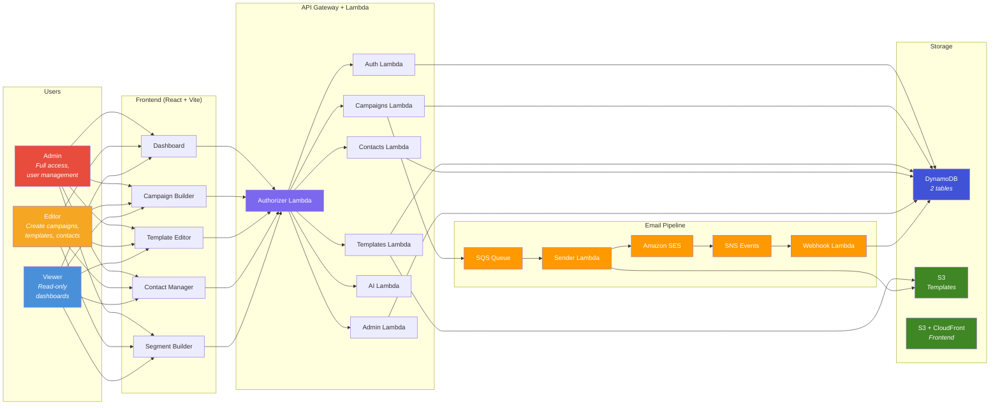

**Everything is serverless.** There are no EC2 instances, no containers, no standing servers. Every compute action runs as a Lambda function invoked by API Gateway (for API requests), SQS (for email sending), or SNS (for delivery event processing). The frontend is a static React SPA served from S3 via CloudFront.

---

## How It Works — The Simple Version

### Campaign Creation Flow

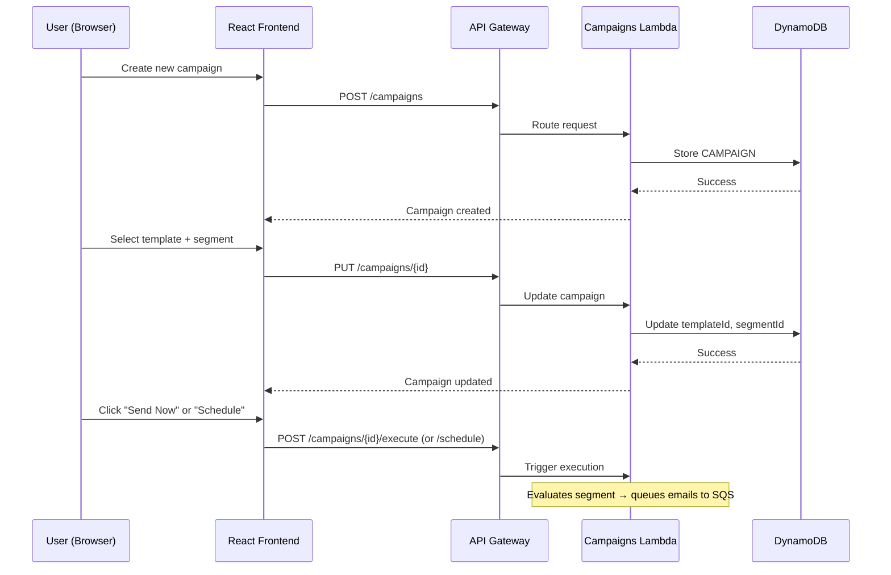

A campaign starts as a **draft** — just a name, subject line, template, and target segment. The user builds it iteratively: pick a template, choose a segment, preview the audience, then execute or schedule. No email leaves the system until the user explicitly triggers it.

### Email Delivery Flow

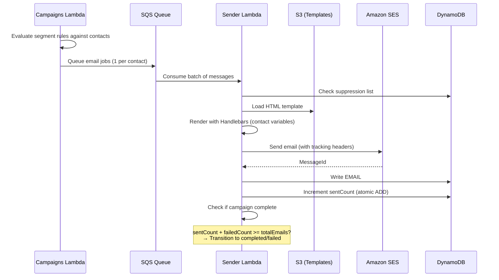

Each contact in the segment becomes a separate SQS message. The Sender Lambda processes these in batches, rendering personalized HTML for each recipient. Sends are idempotent — the same email job processed twice will not send twice.

### Event Tracking Flow

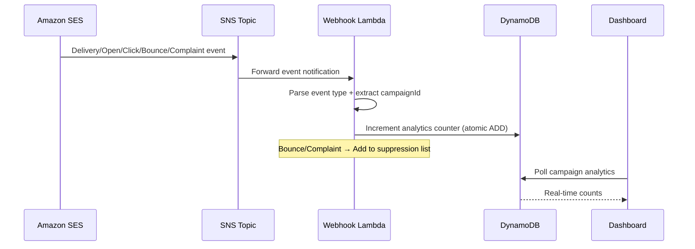

SES publishes delivery events to an SNS topic. The Webhook Lambda parses each event and atomically increments the relevant counter on the campaign record. Bounces and complaints automatically add the recipient to the suppression list, preventing future sends.

---

## The Tech Stack

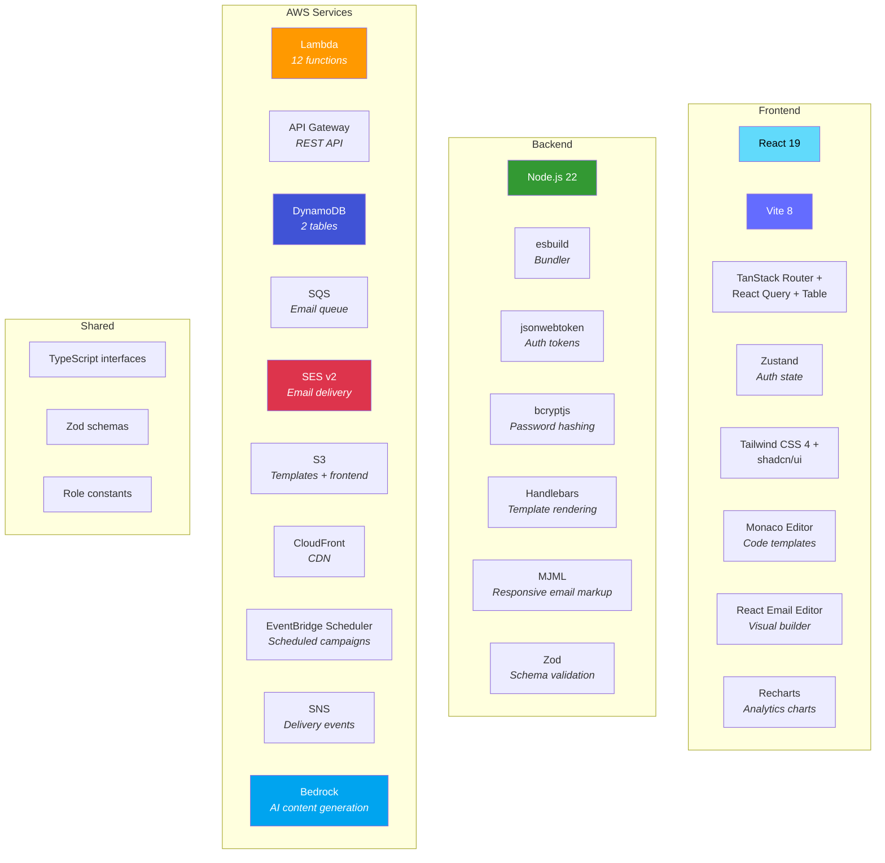

### Monorepo Structure

```
edm-aws/
├── packages/
│   ├── frontend/          React 19 + Vite SPA
│   │   ├── src/
│   │   │   ├── routes/    File-based routing (TanStack Router)
│   │   │   ├── components/ UI components (shadcn/ui)
│   │   │   ├── hooks/     React Query data hooks
│   │   │   ├── stores/    Zustand state (auth, theme)
│   │   │   └── lib/       API client, utilities
│   │   └── vite.config.ts
│   │
│   ├── backend/           Lambda functions
│   │   ├── src/
│   │   │   ├── functions/  10 API + 1 sender + 1 webhook
│   │   │   ├── lib/       Shared utilities (db, jwt, middleware)
│   │   │   └── types/     TypeScript interfaces
│   │   └── scripts/       Build configuration (esbuild)
│   │
│   └── shared/            Cross-package types + validation
│       ├── types/
│       ├── validation/
│       └── constants/
│
├── scripts/               AWS deployment scripts (18+ bash)
│   ├── deploy.sh          Master deployment orchestrator
│   ├── setup-*.sh         Per-service provisioning
│   ├── seed-*.sh          Initial data seeding
│   └── teardown.sh        Full resource cleanup
│
└── docs/                  Documentation
```

---

## Architecture Deep Dive

### Frontend Architecture

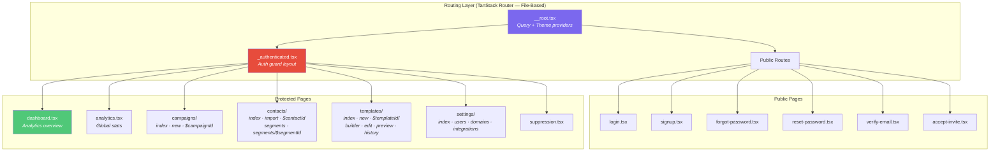

**State management is intentionally layered:**

| Layer | Tool | What It Manages |
|-------|------|----------------|
| **Server state** | React Query (5min staleTime, 1 retry) | All API data — campaigns, contacts, templates, analytics |
| **Auth state** | Zustand (localStorage persistence) | User profile, access token, `isAuthenticated` flag |
| **Theme state** | next-themes | Light/dark mode preference |
| **Component state** | React hooks | Forms, modals, local UI state |

**The API client** is a single generic `apiClient<T>()` function that handles JSON serialization, Bearer token injection, and automatic 401 → refresh → retry with a mutex to prevent duplicate refresh calls across concurrent requests.

### Backend Architecture — Lambda Functions

The backend is 12 Lambda functions. 10 serve API endpoints via API Gateway. 1 processes email sends from SQS. 1 processes delivery events from SNS.

```
┌─────────────────────────────────────────────────────────────────────────┐
│  API GATEWAY (REST)                                                      │
│  ┌──────────────┐                                                        │
│  │  Authorizer   │ ← Validates JWT on every request                      │
│  │  Lambda       │   Returns: userId, email, role as context             │
│  └──────┬───────┘                                                        │
│         │                                                                │
│  ┌──────▼───────────────────────────────────────────────────────────┐    │
│  │                        API Routes                                │    │
│  │                                                                  │    │
│  │  /auth/*          → Auth Lambda          (login, register, etc.) │    │
│  │  /admin/*         → Admin Lambda         (user management)       │    │
│  │  /contacts/*      → Contacts Lambda      (CRUD + import/export)  │    │
│  │  /campaigns/*     → Campaigns Lambda     (CRUD + execute)        │    │
│  │  /templates/*     → Templates Lambda     (CRUD + render)         │    │
│  │  /domain/*        → Domain Lambda        (SES domain status)     │    │
│  │  /integrations/*  → Integrations Lambda  (HubSpot, Zoho)        │    │
│  │  /ai/*            → AI Lambda            (generate, improve)     │    │
│  │                                                                  │    │
│  └──────────────────────────────────────────────────────────────────┘    │
└─────────────────────────────────────────────────────────────────────────┘

┌─────────────────────────────────────────────────────────────────────────┐
│  EVENT-DRIVEN FUNCTIONS                                                  │
│                                                                          │
│  SQS (email-queue)  → Sender Lambda    (render + send via SES)          │
│  SNS (ses-events)   → Webhook Lambda   (track delivery/open/click)      │
│                                                                          │
└─────────────────────────────────────────────────────────────────────────┘
```

### Full API Route Map

| Function | Method | Route | Auth | Description |
|----------|--------|-------|------|-------------|
| **auth** | POST | `/auth/login` | None | Username/password login |
| | POST | `/auth/register` | None | New user registration |
| | POST | `/auth/refresh` | Cookie | Refresh access token |
| | POST | `/auth/logout` | Cookie | Clear session |
| | POST | `/auth/verify-email` | None | Verify email token |
| | POST | `/auth/forgot-password` | None | Request password reset |
| | POST | `/auth/reset-password` | None | Reset with token |
| | POST | `/auth/accept-invite` | None | Accept admin invite |
| **admin** | GET | `/admin/users` | Admin | List all users |
| | POST | `/admin/users` | Admin | Create user |
| | POST | `/admin/users/invite` | Admin | Send invite email |
| | PUT | `/admin/users/{userId}` | Admin | Update user |
| | POST | `/admin/users/{userId}/disable` | Admin | Disable account |
| **contacts** | GET | `/contacts` | Any | List with pagination |
| | POST | `/contacts` | Editor+ | Create contact |
| | GET | `/contacts/{contactId}` | Any | Get contact details |
| | PUT | `/contacts/{contactId}` | Editor+ | Update contact |
| | DELETE | `/contacts/{contactId}` | Editor+ | Delete contact |
| | POST | `/contacts/import` | Editor+ | Bulk CSV import |
| | GET | `/contacts/export` | Any | CSV export |
| | GET | `/contacts/segments` | Any | List segments |
| | POST | `/contacts/segments` | Editor+ | Create segment |
| | GET/PUT/DELETE | `/contacts/segments/{segmentId}` | Editor+ | Segment CRUD |
| **campaigns** | GET | `/campaigns` | Any | List campaigns |
| | POST | `/campaigns` | Editor+ | Create campaign |
| | GET/PUT/DELETE | `/campaigns/{campaignId}` | Editor+ | Campaign CRUD |
| | GET | `/campaigns/{campaignId}/analytics` | Any | Per-campaign stats |
| | GET | `/campaigns/analytics` | Any | Global analytics |
| | GET | `/campaigns/{campaignId}/audience` | Any | Preview segment members |
| | POST | `/campaigns/{campaignId}/schedule` | Editor+ | Schedule send |
| | POST | `/campaigns/{campaignId}/cancel` | Editor+ | Cancel scheduled send |
| | POST | `/campaigns/{campaignId}/execute` | Editor+ | Send immediately |
| | POST/GET | `/campaigns/unsubscribe` | None | One-click unsubscribe |
| | GET/POST/DELETE | `/campaigns/suppressions` | Editor+ | Suppression list |
| **templates** | GET | `/templates` | Any | List templates |
| | POST | `/templates` | Editor+ | Create template |
| | GET/PUT/DELETE | `/templates/{templateId}` | Editor+ | Template CRUD |
| | POST | `/templates/{templateId}/render` | Any | Render with sample data |
| | GET | `/templates/{templateId}/versions` | Any | Version history |
| | POST | `/templates/{templateId}/revert` | Editor+ | Revert to version |
| | POST | `/templates/{templateId}/duplicate` | Editor+ | Clone template |
| **domain** | GET | `/domain/status` | Admin | SES domain verification status |
| | GET | `/domain/reputation` | Admin | Sender reputation metrics |
| | POST | `/domain/verify` | Admin | Trigger domain verification |
| **integrations** | GET | `/integrations` | Admin | List integrations |
| | GET/POST/DELETE | `/integrations/hubspot` | Admin | HubSpot connection |
| | GET/POST/DELETE | `/integrations/zoho` | Admin | Zoho connection |
| | POST | `/integrations/hubspot/sync` | Admin | Sync HubSpot contacts |
| | POST | `/integrations/zoho/sync` | Admin | Sync Zoho contacts |
| **ai** | POST | `/ai/generate` | Editor+ | Generate email content |
| | POST | `/ai/improve` | Editor+ | Suggest improvements |
| | POST | `/ai/agent` | Editor+ | Multi-turn AI chat |

### Request Lifecycle

Every API request follows the same path:

```
┌───────────────────────────────────────────────────────────────────────┐
│  1. BROWSER → API GATEWAY                                             │
│     Headers: Authorization: Bearer {accessToken}                      │
│     Body: JSON payload                                                │
│                                                                       │
│  2. API GATEWAY → AUTHORIZER LAMBDA                                   │
│     Extracts JWT from header                                          │
│     Verifies signature + expiration (HS256)                           │
│     Returns IAM policy + context: { userId, email, role }             │
│                                                                       │
│  3. API GATEWAY → TARGET LAMBDA                                       │
│     event.requestContext.authorizer = { userId, email, role }         │
│     event.pathParameters = { campaignId, contactId, etc. }            │
│     event.body = JSON string                                          │
│                                                                       │
│  4. LAMBDA HANDLER                                                    │
│     ├── Check OPTIONS → Return CORS preflight                        │
│     ├── Parse path + HTTP method                                     │
│     ├── Check role authorization (if write operation)                 │
│     ├── Route to business logic function                             │
│     └── Return { statusCode, headers (CORS), body: JSON }            │
│                                                                       │
│  5. RESPONSE → BROWSER                                                │
│     Success: { success: true, data: {...} }                           │
│     Error:   { success: false, error: "message" }                     │
└───────────────────────────────────────────────────────────────────────┘
```

---

## Authentication & Authorization

### Token Architecture

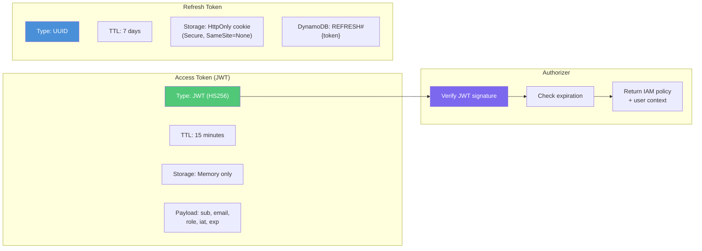

### Role-Based Access Control

```
┌─────────────────────────────────────────────────────────────────┐
│  ROLE HIERARCHY                                                  │
│                                                                  │
│  admin ──────────────────────────────────────────────────────── │
│  │  Full platform access                                        │
│  │  User management (create, invite, disable)                   │
│  │  Domain configuration (SES verification)                     │
│  │  CRM integrations (HubSpot, Zoho)                           │
│  │  All editor + viewer permissions                             │
│  │                                                              │
│  editor ─────────────────────────────────────────────────────── │
│  │  Create/edit campaigns, templates, contacts                  │
│  │  Execute and schedule campaigns                              │
│  │  Import/export contacts                                      │
│  │  Manage segments and suppression lists                       │
│  │  Use AI features                                             │
│  │  All viewer permissions                                      │
│  │                                                              │
│  viewer ─────────────────────────────────────────────────────── │
│     Read-only access to all data                                │
│     View dashboards and analytics                               │
│     Preview templates                                           │
│     Export contacts                                              │
└─────────────────────────────────────────────────────────────────┘
```

### Auth Flow — Step by Step

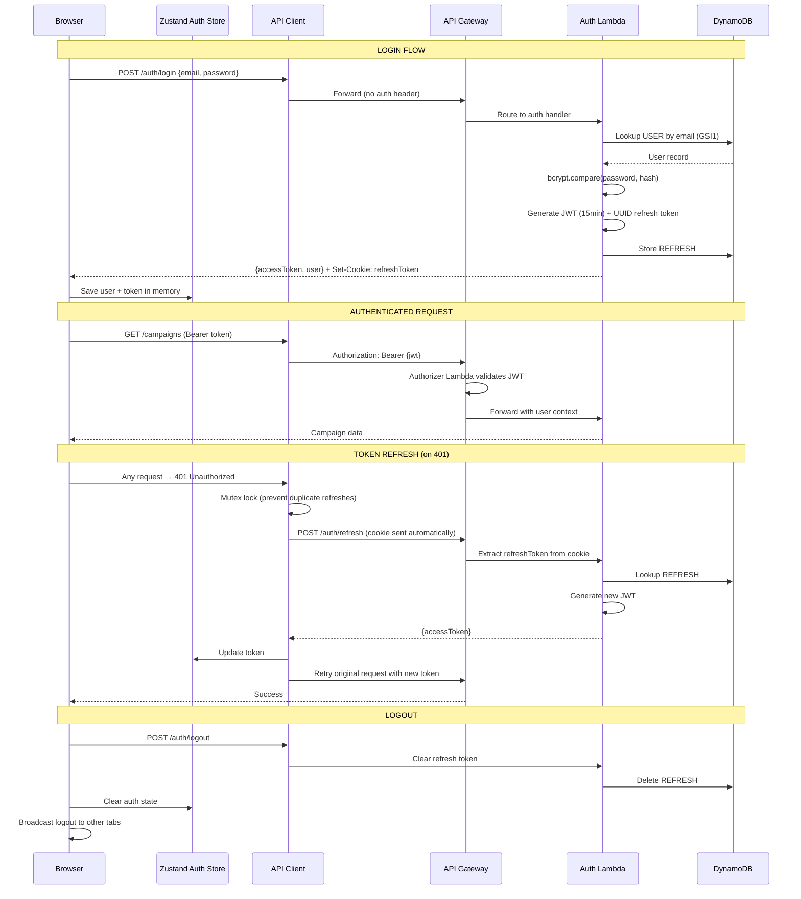

---

## Database Schema (DynamoDB)

The platform uses two DynamoDB tables with single-table design patterns. All records use composite keys (PK + SK) for efficient access.

### Users Table

```
┌─────────────────────────────────────────────────────────────────────────┐
│  TABLE: {TENANT_PREFIX}-users                                            │
│  Billing: On-Demand (pay-per-request)                                    │
│  GSI1: email (for login lookup)                                          │
├─────────────────────────────────────────────────────────────────────────┤
│                                                                          │
│  RECORD TYPE           PK                        SK                      │
│  ─────────────────────────────────────────────────────────────────────── │
│  User Profile          USER#{userId}             PROFILE                 │
│  Refresh Token Lookup  REFRESH#{tokenValue}      META                   │
│  User Session          USER#{userId}             SESSION#{sessionId}     │
│  Email Verify Token    VERIFY#{token}            META                   │
│  Password Reset Token  RESET#{token}             META                   │
│                                                                          │
│  USER ATTRIBUTES                                                         │
│  ─────────────────────────────────────────────────────────────────────── │
│  userId         String     UUID                                          │
│  email          String     Unique (GSI1)                                 │
│  passwordHash   String     bcrypt (10 rounds)                            │
│  name           String     Display name                                  │
│  role           String     admin | editor | viewer                       │
│  status         String     active | disabled | pending                   │
│  emailVerified  Boolean    Email verification status                     │
│  lastLoginAt    String     ISO timestamp                                 │
│  createdAt      String     ISO timestamp                                 │
│  updatedAt      String     ISO timestamp                                 │
│                                                                          │
│  TOKEN ATTRIBUTES                                                        │
│  ─────────────────────────────────────────────────────────────────────── │
│  refreshToken   String     UUID value                                    │
│  expiresAt      Number     TTL (epoch seconds) — auto-deleted by DDB     │
│                                                                          │
└─────────────────────────────────────────────────────────────────────────┘
```

### Data Table

```
┌─────────────────────────────────────────────────────────────────────────┐
│  TABLE: {TENANT_PREFIX}-data                                             │
│  Billing: On-Demand (pay-per-request)                                    │
│  GSI1: GSI1PK + GSI1SK (for alternative access patterns)                │
├─────────────────────────────────────────────────────────────────────────┤
│                                                                          │
│  RECORD TYPE           PK                        SK                      │
│  ─────────────────────────────────────────────────────────────────────── │
│  Contact               CONTACT#{contactId}       PROFILE                 │
│  Segment               SEGMENT#{segmentId}       META                   │
│  Template              TEMPLATE#{templateId}     META                   │
│  Template Version      TEMPLATE#{templateId}     VERSION#{versionNum}   │
│  Campaign              CAMPAIGN#{campaignId}     META                   │
│  Email Send Record     CAMPAIGN#{campaignId}     EMAIL#{contactId}      │
│  Campaign Audit Log    CAMPAIGN#{campaignId}     AUDIT#{ts}#{uuid}      │
│  Suppression Entry     SUPPRESSION#{email}       META                   │
│                                                                          │
│  CONTACT ATTRIBUTES                                                      │
│  ─────────────────────────────────────────────────────────────────────── │
│  contactId       String     UUID                                         │
│  email           String     Recipient email                              │
│  firstName       String     First name                                   │
│  lastName        String     Last name                                    │
│  tags            List       String tags for segmentation                 │
│  customFields    Map        Arbitrary key-value metadata                 │
│  status          String     active | unsubscribed | bounced              │
│  syncSource      String     local | hubspot | zoho                       │
│  externalIds     Map        { hubspotId, zohoId }                        │
│                                                                          │
│  CAMPAIGN ATTRIBUTES                                                     │
│  ─────────────────────────────────────────────────────────────────────── │
│  campaignId      String     UUID                                         │
│  name            String     Campaign name                                │
│  subject         String     Email subject line                           │
│  templateId      String     Linked template                              │
│  segmentId       String     Target segment                               │
│  status          String     draft|scheduled|executing|completed|failed   │
│  totalEmails     Number     Total recipients                             │
│  sentCount       Number     Successfully sent                            │
│  failedCount     Number     Failed to send                               │
│  deliveredCount  Number     Confirmed delivered                          │
│  openedCount     Number     Unique opens                                 │
│  clickedCount    Number     Unique clicks                                │
│  bouncedCount    Number     Hard/soft bounces                            │
│  complainedCount Number     Spam complaints                              │
│                                                                          │
│  TEMPLATE ATTRIBUTES                                                     │
│  ─────────────────────────────────────────────────────────────────────── │
│  templateId      String     UUID                                         │
│  name            String     Template name                                │
│  type            String     code | visual                                │
│  currentVersion  Number     Latest version number                        │
│  s3Key           String     Rendered HTML in S3                          │
│  designS3Key     String     Visual builder JSON in S3                    │
│  mjmlS3Key       String     MJML source in S3                            │
│  variables       List       Handlebars variable names                    │
│  isStarter       Boolean    Pre-built starter template flag              │
│                                                                          │
│  SEGMENT ATTRIBUTES                                                      │
│  ─────────────────────────────────────────────────────────────────────── │
│  segmentId       String     UUID                                         │
│  name            String     Segment name                                 │
│  description     String     Optional description                         │
│  rules           List       Array of {field, operator, value} rules      │
│  logic           String     AND | OR (combine rules)                     │
│  memberCount     Number     Cached member count                          │
│                                                                          │
└─────────────────────────────────────────────────────────────────────────┘
```

### Access Patterns

| Pattern | Table | Key Condition | Use Case |
|---------|-------|---------------|----------|
| Get user by ID | users | PK=`USER#{id}`, SK=`PROFILE` | Profile lookup |
| Get user by email | users | GSI1 on `email` | Login |
| Validate refresh token | users | PK=`REFRESH#{token}`, SK=`META` | Token refresh |
| List all contacts | data | PK begins_with `CONTACT#` | Contact list |
| Get campaign analytics | data | PK=`CAMPAIGN#{id}`, SK=`META` | Dashboard |
| List email send records | data | PK=`CAMPAIGN#{id}`, SK begins_with `EMAIL#` | Delivery tracking |
| Check suppression | data | PK=`SUPPRESSION#{email}`, SK=`META` | Pre-send check |
| Get template versions | data | PK=`TEMPLATE#{id}`, SK begins_with `VERSION#` | Version history |

---

## The Email Engine

### Campaign State Machine

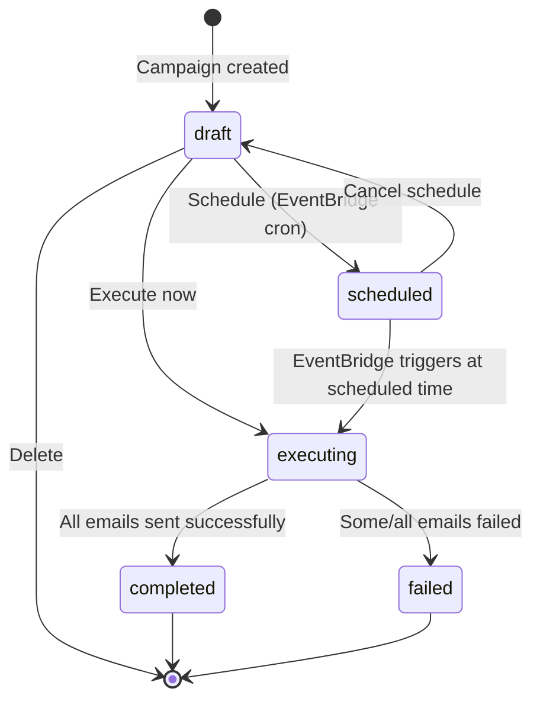

```
┌──────────────────────────────────────────────────────────────────────┐
│  STATE TRANSITIONS — WHAT TRIGGERS EACH                              │
├──────────────────────────────────────────────────────────────────────┤
│                                                                      │
│  draft → scheduled                                                   │
│    Trigger: POST /campaigns/{id}/schedule                            │
│    Action:  Create EventBridge one-time schedule                     │
│    Target:  Campaigns Lambda with { campaignId, action: "execute" }  │
│                                                                      │
│  draft → executing                                                   │
│    Trigger: POST /campaigns/{id}/execute                             │
│    Action:  Evaluate segment, queue emails to SQS                    │
│                                                                      │
│  scheduled → draft                                                   │
│    Trigger: POST /campaigns/{id}/cancel                              │
│    Action:  Delete EventBridge schedule, reset status                │
│                                                                      │
│  scheduled → executing                                               │
│    Trigger: EventBridge fires at scheduled time                      │
│    Action:  Invokes Campaigns Lambda → evaluate + queue              │
│                                                                      │
│  executing → completed                                               │
│    Trigger: Sender Lambda detects sentCount + failedCount >= total   │
│    Action:  Conditional update to "completed"                        │
│                                                                      │
│  executing → failed                                                  │
│    Trigger: Same check, but failedCount > 0                          │
│    Action:  Conditional update to "failed"                           │
│                                                                      │
└──────────────────────────────────────────────────────────────────────┘
```

### Sending Pipeline

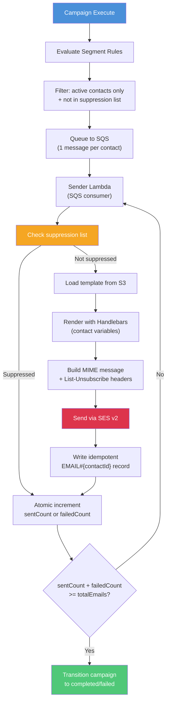

### SQS Email Job Structure

Each contact in the segment becomes one SQS message:

```json
{
  "campaignId": "uuid",
  "contactId": "uuid",
  "email": "recipient@example.com",
  "firstName": "Jane",
  "lastName": "Doe",
  "subject": "Your exclusive offer inside",
  "templateS3Key": "templates/tpl-123/v3.html",
  "customFields": {
    "company": "Acme Corp",
    "plan": "enterprise"
  }
}
```

### Template Rendering

```
┌─────────────────────────────────────────────────────────────────┐
│  RENDERING PIPELINE                                              │
│                                                                  │
│  1. Load HTML from S3 (templateS3Key)                           │
│     └── Pre-compiled from MJML or visual builder JSON           │
│                                                                  │
│  2. Handlebars compilation                                       │
│     └── Template variables: {{firstName}}, {{lastName}},         │
│         {{email}}, {{company}}, any customField key              │
│                                                                  │
│  3. Variable injection                                           │
│     └── Each contact's data fills their template copy            │
│                                                                  │
│  4. Unsubscribe link injection                                   │
│     └── {{unsubscribeUrl}} = /campaigns/unsubscribe              │
│         ?cid={campaignId}&email={email}&token={HMAC}             │
│                                                                  │
│  5. MIME message construction                                    │
│     └── Headers:                                                 │
│         List-Unsubscribe: <{url}>                               │
│         List-Unsubscribe-Post: List-Unsubscribe=One-Click       │
│         X-Campaign-Id: {campaignId}                              │
│         X-Contact-Id: {contactId}                                │
│                                                                  │
└─────────────────────────────────────────────────────────────────┘
```

### Event Tracking & Analytics

SES publishes delivery events via a Configuration Set → SNS → Webhook Lambda pipeline.

| Event | Source | Action | Counter Updated |
|-------|--------|--------|----------------|
| **Send** | SES queues email | Log send record | — |
| **Delivery** | MTA confirms receipt | Increment | `deliveredCount` |
| **Open** | Tracking pixel loaded | Increment | `openedCount` |
| **Click** | Tracked link clicked | Increment | `clickedCount` |
| **Bounce** | Hard or soft bounce | Increment + suppress (hard only) | `bouncedCount` |
| **Complaint** | Recipient marks as spam | Increment + suppress | `complainedCount` |

All counter updates use DynamoDB's atomic `ADD` operation — no read-modify-write races.

### Suppression & Compliance

```
┌─────────────────────────────────────────────────────────────────┐
│  SUPPRESSION LIST                                                │
│                                                                  │
│  Records: SUPPRESSION#{email}#META in data table                 │
│                                                                  │
│  Auto-added on:                                                  │
│  ├── Hard bounce (permanent delivery failure)                    │
│  ├── Spam complaint (recipient reported as spam)                 │
│  └── One-click unsubscribe (RFC 8058 compliant)                 │
│                                                                  │
│  Checked:                                                        │
│  ├── Before every individual email send (Sender Lambda)          │
│  └── Suppressed contacts are skipped, never re-contacted         │
│                                                                  │
│  One-Click Unsubscribe:                                          │
│  ├── URL: GET /campaigns/unsubscribe?cid=X&email=Y&token=Z      │
│  ├── Token: HMAC-SHA256(email + campaignId, UNSUBSCRIBE_SECRET)  │
│  ├── No authentication required (per RFC 8058)                   │
│  └── Adds to suppression list immediately                        │
│                                                                  │
│  Manual management:                                              │
│  ├── GET  /campaigns/suppressions — List all                     │
│  ├── POST /campaigns/suppressions — Add manually                 │
│  └── DELETE /campaigns/suppressions — Remove entry               │
│                                                                  │
└─────────────────────────────────────────────────────────────────┘
```

---

## Contact Management

### Contact Lifecycle

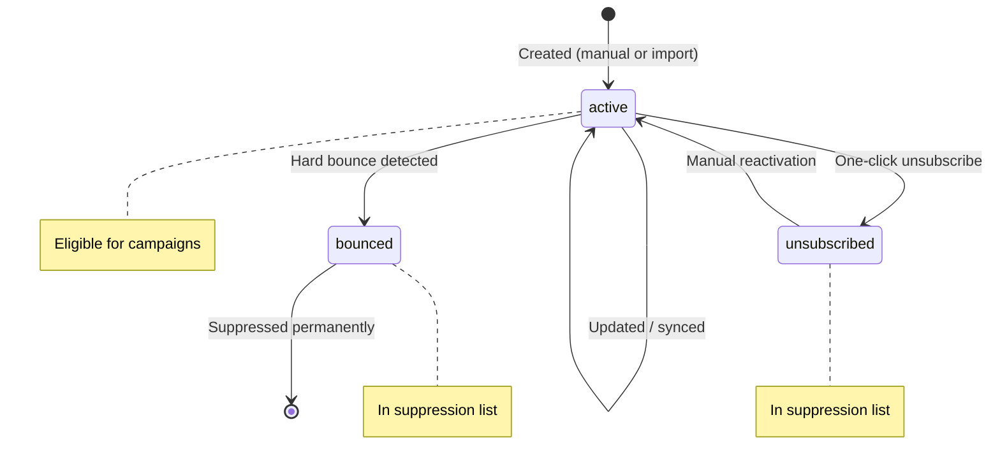

### Segmentation Engine

Segments are dynamic filters defined by rules. Each rule has a **field**, **operator**, and **value**. Rules combine with **AND** or **OR** logic.

```
┌─────────────────────────────────────────────────────────────────┐
│  SEGMENT RULE STRUCTURE                                          │
│                                                                  │
│  {                                                               │
│    "rules": [                                                    │
│      { "field": "status",    "operator": "equals",  "value": "active" },
│      { "field": "tags",      "operator": "contains","value": "premium" },
│      { "field": "firstName", "operator": "exists",  "value": null }
│    ],                                                            │
│    "logic": "AND"                                                │
│  }                                                               │
│                                                                  │
│  SUPPORTED OPERATORS                                             │
│  ─────────────────────────────────────────────────────────────── │
│  equals         Exact match (case-sensitive)                     │
│  not_equals     Inverse of equals                                │
│  contains       Substring or array element match                 │
│  not_contains   Inverse of contains                              │
│  starts_with    String prefix match                              │
│  exists         Field is present and non-null                    │
│  not_exists     Field is absent or null                          │
│  greater_than   Numeric comparison                               │
│  less_than      Numeric comparison                               │
│                                                                  │
│  EVALUATION                                                      │
│  ─────────────────────────────────────────────────────────────── │
│  Segments are evaluated at send time — not pre-computed.         │
│  All contacts are scanned and filtered by rules.                 │
│  memberCount is cached after evaluation for display purposes.    │
│                                                                  │
└─────────────────────────────────────────────────────────────────┘
```

### CSV Import Pipeline

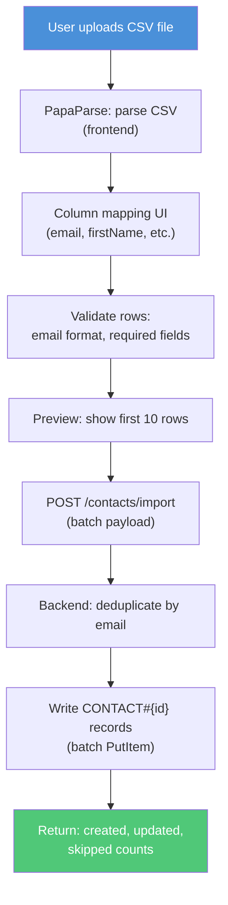

---

## Template System

### Template Types

| Type | Editor | Storage | Best For |
|------|--------|---------|----------|
| **Visual** | React Email Editor (drag & drop) | Design JSON in S3 (`designS3Key`) + compiled HTML (`s3Key`) | Non-technical users, quick campaigns |
| **Code** | Monaco Editor (HTML/MJML) | MJML source in S3 (`mjmlS3Key`) + compiled HTML (`s3Key`) | Developers, complex layouts |

Both types compile to final HTML stored in S3. The Sender Lambda always loads the compiled HTML — it doesn't know or care which editor created it.

### Version Control

```
┌─────────────────────────────────────────────────────────────────┐
│  TEMPLATE VERSIONING                                             │
│                                                                  │
│  Every save creates a new version:                               │
│  ├── TEMPLATE#{id}#VERSION#1  (original)                         │
│  ├── TEMPLATE#{id}#VERSION#2  (first edit)                       │
│  ├── TEMPLATE#{id}#VERSION#3  (current)                          │
│  └── TEMPLATE#{id}#META.currentVersion = 3                       │
│                                                                  │
│  S3 keys include version:                                        │
│  ├── templates/{templateId}/v1.html                              │
│  ├── templates/{templateId}/v2.html                              │
│  └── templates/{templateId}/v3.html                              │
│                                                                  │
│  Operations:                                                     │
│  ├── GET  /templates/{id}/versions → List all versions           │
│  ├── POST /templates/{id}/revert   → Set currentVersion = N      │
│  └── POST /templates/{id}/duplicate → Clone as new template      │
│                                                                  │
│  Reverting does NOT delete newer versions — it repoints the      │
│  currentVersion counter, preserving full history.                │
│                                                                  │
└─────────────────────────────────────────────────────────────────┘
```

### Variable System

Templates use Handlebars syntax for personalization:

| Variable | Source | Example |
|----------|--------|---------|
| `{{firstName}}` | Contact record | "Jane" |
| `{{lastName}}` | Contact record | "Doe" |
| `{{email}}` | Contact record | "jane@example.com" |
| `{{unsubscribeUrl}}` | Auto-generated | HMAC-signed unsubscribe link |
| `{{customFields.company}}` | Contact custom fields | "Acme Corp" |
| `{{customFields.*}}` | Contact custom fields | Any user-defined field |

---

## CRM Integrations

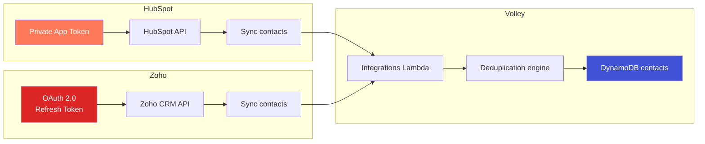

| Integration | Auth Method | Sync Direction | Dedup Key | Stored In |
|-------------|-------------|----------------|-----------|-----------|
| **HubSpot** | Private App token | HubSpot → Volley | `externalIds.hubspotId` | DynamoDB (encrypted token) |
| **Zoho** | OAuth 2.0 refresh token | Zoho → Volley | `externalIds.zohoId` | DynamoDB (OAuth credentials) |

**Sync behavior:**
- Imports contacts with email deduplication
- Maps external IDs for future syncs
- Sets `syncSource` to `hubspot` or `zoho`
- Preserves local customizations (tags, custom fields)
- Token refresh handled automatically (Zoho OAuth)

---

## AI Features (AWS Bedrock)

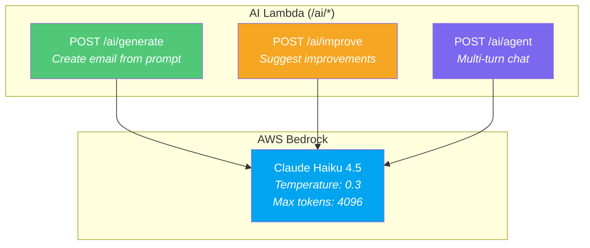

### Three AI Capabilities

| Feature | Input | Output | Use Case |
|---------|-------|--------|----------|
| **Generate** | Prompt + tone (professional, casual, urgent, friendly) | Subject line + preview text + body HTML | Create email copy from scratch |
| **Improve** | Current subject + body + optional goal | Array of suggestions: `{type, original, improved, reason}` + effectiveness score | Polish existing content |
| **Agent** | Conversation history + current message | Final text + list of tools used | Interactive AI assistant with tool access |

**Agent mode** supports multi-turn conversation with tool execution (content analysis, email generation, suggestion generation). It runs an agentic loop of up to 5 iterations: model → tools → results → model, preventing infinite loops.

**Configuration:**
- Model: `us.anthropic.claude-haiku-4-5-20251001-v1:0` (configurable via `AI_MODEL_ID`)
- Region: `us-east-1` (separate from main infrastructure region)
- Temperature: 0.3 (deterministic, consistent output)
- IAM: `bedrock:InvokeModel` permission on `arn:aws:bedrock:*::foundation-model/*`

---

## AWS Infrastructure

### Service Map

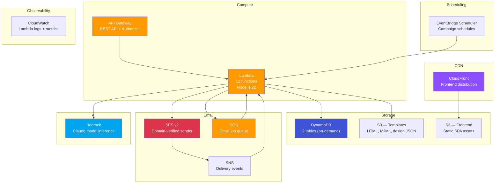

### Deployment Pipeline

The master `deploy.sh` script orchestrates full infrastructure provisioning in dependency order:

```
┌─────────────────────────────────────────────────────────────────────────┐
│  DEPLOYMENT ORDER (scripts/deploy.sh)                                    │
├─────────────────────────────────────────────────────────────────────────┤
│                                                                          │
│   Step  Script                    What It Creates                        │
│  ────────────────────────────────────────────────────────────────────── │
│    1    validate-env.sh           Check .env for required variables       │
│    2    build.ts                  esbuild all Lambda functions            │
│    3    setup-dynamodb.sh         Create users + data tables             │
│    4    setup-s3-buckets.sh       Create templates + frontend buckets    │
│    5    setup-ses.sh              Domain identity + verification         │
│    6    setup-sqs.sh              Email queue                            │
│    7    setup-lambdas.sh          Deploy all 12 Lambda functions         │
│    8    setup-sender-lambda.sh    Configure sender with SQS trigger      │
│    9    setup-api-gateway.sh      REST API + routes + authorizer         │
│   10    setup-eventbridge.sh      Campaign scheduler group               │
│   11    setup-ses-tracking.sh     Config set + SNS + webhook trigger     │
│   12    setup-cloudfront.sh       Frontend CDN distribution              │
│   13    seed-data.sh              Admin user + starter templates         │
│                                                                          │
│  TEARDOWN: scripts/teardown.sh removes ALL resources in reverse order   │
│                                                                          │
└─────────────────────────────────────────────────────────────────────────┘
```

### Naming Conventions

All AWS resources use a tenant prefix for multi-tenant isolation:

| Resource | Naming Pattern | Example |
|----------|---------------|---------|
| DynamoDB tables | `{TENANT_PREFIX}-users`, `-data` | `edm-users`, `edm-data` |
| S3 buckets | `{TENANT_PREFIX}-templates-{ACCOUNT_ID}` | `edm-templates-123456789` |
| Lambda functions | `{TENANT_PREFIX}-{function}` | `edm-auth`, `edm-campaigns` |
| API Gateway | `{TENANT_PREFIX}-api` | `edm-api` |
| SQS queue | `{TENANT_PREFIX}-email-queue` | `edm-email-queue` |
| SNS topic | `{TENANT_PREFIX}-ses-events` | `edm-ses-events` |
| EventBridge group | `{TENANT_PREFIX}-campaigns` | `edm-campaigns` |
| IAM roles | `{TENANT_PREFIX}-api-role`, `-scheduler-role` | `edm-api-role` |

---

## Security Architecture

```
┌─────────────────────────────────────────────────────────────────┐
│  SECURITY LAYERS                                                 │
├─────────────────────────────────────────────────────────────────┤
│                                                                  │
│  TRANSPORT                                                       │
│  ├── HTTPS throughout (CloudFront + API Gateway)                │
│  └── TLS termination at edge (CloudFront)                       │
│                                                                  │
│  AUTHENTICATION                                                  │
│  ├── JWT: 15-min TTL, HS256, verified on every request          │
│  ├── Refresh token: 7-day TTL, HttpOnly cookie, rotation        │
│  ├── Password: bcryptjs hashing (10 rounds)                     │
│  └── Email verification required for new accounts               │
│                                                                  │
│  AUTHORIZATION                                                   │
│  ├── Role-based: admin > editor > viewer                        │
│  ├── Every write operation checks role in handler               │
│  └── Authorizer Lambda returns role as request context          │
│                                                                  │
│  API SECURITY                                                    │
│  ├── CORS: Locked to FRONTEND_URL origin (not wildcard)         │
│  ├── OPTIONS preflight: Handled in every Lambda handler         │
│  └── Input validation: Zod schemas on request bodies            │
│                                                                  │
│  EMAIL SECURITY                                                  │
│  ├── SES domain verification: SPF + DKIM + DMARC                │
│  ├── Suppression list: Bounces + complaints auto-suppressed     │
│  ├── Unsubscribe HMAC: SHA256(email + campaignId, secret)       │
│  └── RFC 8058: List-Unsubscribe + List-Unsubscribe-Post         │
│                                                                  │
│  DATA PROTECTION                                                 │
│  ├── DynamoDB: Encryption at rest (AWS managed)                 │
│  ├── S3: Encryption at rest (SSE-S3)                            │
│  ├── Token TTL: Auto-deleted by DynamoDB TTL                    │
│  └── No PII in logs (CloudWatch)                                │
│                                                                  │
│  INFRASTRUCTURE                                                  │
│  ├── IAM: Least-privilege roles per function                    │
│  ├── Lambda: Execution role scoped to specific resources        │
│  └── No standing servers — zero attack surface at rest          │
│                                                                  │
└─────────────────────────────────────────────────────────────────┘
```

---

## Data Flow Examples

### Campaign Execution — End to End

```
STAGE 1: PREPARATION (User → Frontend → API)
┌────────────────────────────────────────────────────────────────┐
│  User creates campaign: name, subject line                      │
│  User selects template: picks from template gallery             │
│  User selects segment: "Active Premium Subscribers"             │
│  User previews audience: sees matching contacts + count         │
│  User clicks "Send Now"                                         │
│  → POST /campaigns/{id}/execute                                 │
└──────────────────────────────┬─────────────────────────────────┘
                               │
                               ▼

STAGE 2: QUEUING (Campaigns Lambda)
┌────────────────────────────────────────────────────────────────┐
│  Evaluate segment rules against all contacts in DynamoDB        │
│  Filter: status=active AND not in suppression list              │
│  Result: 2,500 matching contacts                                │
│  Set campaign: totalEmails=2500, status=executing               │
│  Queue 2,500 SQS messages (1 per contact)                      │
│  Each message: { campaignId, contactId, email, templateS3Key }  │
└──────────────────────────────┬─────────────────────────────────┘
                               │
                               ▼

STAGE 3: SENDING (Sender Lambda — SQS consumer)
┌────────────────────────────────────────────────────────────────┐
│  For each SQS message:                                          │
│  1. Check SUPPRESSION#{email} — skip if exists                  │
│  2. Load HTML from S3: templates/tpl-123/v3.html                │
│  3. Compile with Handlebars: inject firstName, lastName, etc.   │
│  4. Build MIME: add List-Unsubscribe, campaign tracking headers │
│  5. SES SendEmailCommand → get MessageId                        │
│  6. Write CAMPAIGN#{id}#EMAIL#{contactId} (idempotent PutItem)  │
│  7. Atomic ADD sentCount (or failedCount on error)              │
│  8. Check completion: 2500 == sentCount + failedCount?          │
│     → Yes: update status to completed/failed                    │
└──────────────────────────────┬─────────────────────────────────┘
                               │
                               ▼

STAGE 4: TRACKING (SES → SNS → Webhook Lambda)
┌────────────────────────────────────────────────────────────────┐
│  SES Configuration Set fires events:                            │
│  → Delivery: atomic ADD deliveredCount                          │
│  → Open: atomic ADD openedCount                                 │
│  → Click: atomic ADD clickedCount                               │
│  → Bounce: atomic ADD bouncedCount + SUPPRESSION#{email}        │
│  → Complaint: atomic ADD complainedCount + SUPPRESSION#{email}  │
│                                                                  │
│  Frontend polls /campaigns/{id} for real-time dashboard updates │
└────────────────────────────────────────────────────────────────┘
```

### Contact Import — End to End

```
┌────────────────────────────────────────────────────────────────┐
│  1. User uploads contacts.csv (frontend)                        │
│  2. PapaParse parses CSV → array of rows                        │
│  3. Column mapping UI: user maps CSV headers to fields          │
│     "Email Address" → email, "First" → firstName, etc.          │
│  4. Validation: check email format, required fields             │
│  5. Preview: show first 10 rows for confirmation                │
│  6. POST /contacts/import → batch payload to Contacts Lambda    │
│  7. Backend deduplicates by email                               │
│     → Existing: update fields (merge)                           │
│     → New: create CONTACT#{uuid}#PROFILE                        │
│  8. Return: { created: 1847, updated: 612, skipped: 41 }       │
└────────────────────────────────────────────────────────────────┘
```

### One-Click Unsubscribe

```
┌────────────────────────────────────────────────────────────────┐
│  1. Recipient clicks unsubscribe link in email                  │
│     GET /campaigns/unsubscribe?cid=abc&email=x@y.com&token=... │
│                                                                  │
│  2. Campaigns Lambda (no auth required):                        │
│     a. Verify HMAC: SHA256(email + campaignId, secret) == token │
│     b. Create SUPPRESSION#{email}#META in DynamoDB              │
│     c. Update contact status to "unsubscribed"                  │
│     d. Return confirmation page                                 │
│                                                                  │
│  3. Future sends:                                                │
│     Sender Lambda checks suppression list → skips this email    │
│     This contact will never receive another campaign             │
│                                                                  │
│  Per RFC 8058: No login, no confirmation step, immediate effect │
└────────────────────────────────────────────────────────────────┘
```

---

## Environment Variables

### Frontend (Vite)

| Variable | Description | Example |
|----------|-------------|---------|
| `VITE_API_URL` | API Gateway endpoint | `https://abc123.execute-api.ap-southeast-2.amazonaws.com/prod` |
| `VITE_APP_NAME` | Branding name | `Volley` |
| `VITE_LOGO_URL` | Logo image URL | `https://cdn.example.com/logo.png` |
| `VITE_PRIMARY_COLOR` | Theme accent color | `#2563EB` |

### Backend (Lambda)

| Variable | Description | Example |
|----------|-------------|---------|
| `USERS_TABLE_NAME` | Users DynamoDB table | `edm-users` |
| `DATA_TABLE_NAME` | Data DynamoDB table | `edm-data` |
| `TEMPLATES_BUCKET_NAME` | S3 bucket for templates | `edm-templates-123456789` |
| `JWT_SECRET` | JWT signing secret (32+ bytes) | `(random string)` |
| `UNSUBSCRIBE_SECRET` | HMAC secret for unsubscribe tokens | `(random string)` |
| `SENDER_DOMAIN` | Verified SES domain | `mail.example.com` |
| `APP_NAME` | Application name for emails | `Volley` |
| `FRONTEND_URL` | CloudFront URL (CORS origin) | `https://d1234.cloudfront.net` |
| `EMAIL_QUEUE_URL` | SQS queue URL | `https://sqs.ap-southeast-2.amazonaws.com/123/edm-email-queue` |
| `AWS_REGION` | Primary AWS region | `ap-southeast-2` |
| `BEDROCK_REGION` | Bedrock model region | `us-east-1` |
| `AI_MODEL_ID` | Bedrock model ID | `us.anthropic.claude-haiku-4-5-20251001-v1:0` |
| `SCHEDULER_GROUP_NAME` | EventBridge group | `edm-campaigns` |
| `SENDER_LAMBDA_ARN` | Sender Lambda ARN | `arn:aws:lambda:...` |
| `SCHEDULER_ROLE_ARN` | EventBridge execution role | `arn:aws:iam::...:role/...` |
| `HUBSPOT_ACCESS_TOKEN` | HubSpot private app token | `(optional)` |
| `ZOHO_CLIENT_ID` | Zoho OAuth client ID | `(optional)` |
| `ZOHO_CLIENT_SECRET` | Zoho OAuth secret | `(optional)` |
| `ZOHO_REFRESH_TOKEN` | Zoho OAuth refresh token | `(optional)` |

---

## Quick Stats

| Metric | Value |
|--------|-------|
| **Architecture** | Serverless monorepo (React + Lambda + DynamoDB) |
| **Packages** | 3 (frontend, backend, shared) |
| **Lambda functions** | 12 (10 API + 1 sender + 1 webhook) |
| **API routes** | 45+ endpoints across 8 function groups |
| **DynamoDB tables** | 2 (users, data) — on-demand billing |
| **S3 buckets** | 2 (templates, frontend) |
| **AWS services used** | 12 (Lambda, API GW, DynamoDB, SQS, SES, S3, CloudFront, EventBridge, SNS, CloudWatch, IAM, Bedrock) |
| **Frontend framework** | React 19 + Vite 8 + TanStack Router |
| **UI library** | shadcn/ui + Tailwind CSS 4 |
| **Template editors** | 2 (Visual drag-and-drop, Monaco code editor) |
| **Auth method** | JWT (15min) + Refresh token (7-day HttpOnly cookie) |
| **User roles** | 3 (admin, editor, viewer) |
| **Email rendering** | Handlebars + MJML → HTML |
| **AI model** | Claude Haiku 4.5 via AWS Bedrock |
| **AI features** | 3 (generate, improve, agent chat) |
| **CRM integrations** | 2 (HubSpot, Zoho) |
| **Campaign states** | 5 (draft, scheduled, executing, completed, failed) |
| **Contact statuses** | 3 (active, unsubscribed, bounced) |
| **Tracked events** | 6 (send, delivery, open, click, bounce, complaint) |
| **Deployment scripts** | 18+ bash scripts |
| **Primary region** | ap-southeast-2 (Sydney) |
| **Bedrock region** | us-east-1 (N. Virginia) |
| **Standing servers** | 0 — fully serverless |

---

*For deployment instructions, see [Setup Guide](./setup-guide.md).*
*For endpoint details, see [API Reference](./api-reference.md).*
*For user-facing documentation, see [User Manual](./user-manual.md).*
*Last updated: 2026-04-02*
