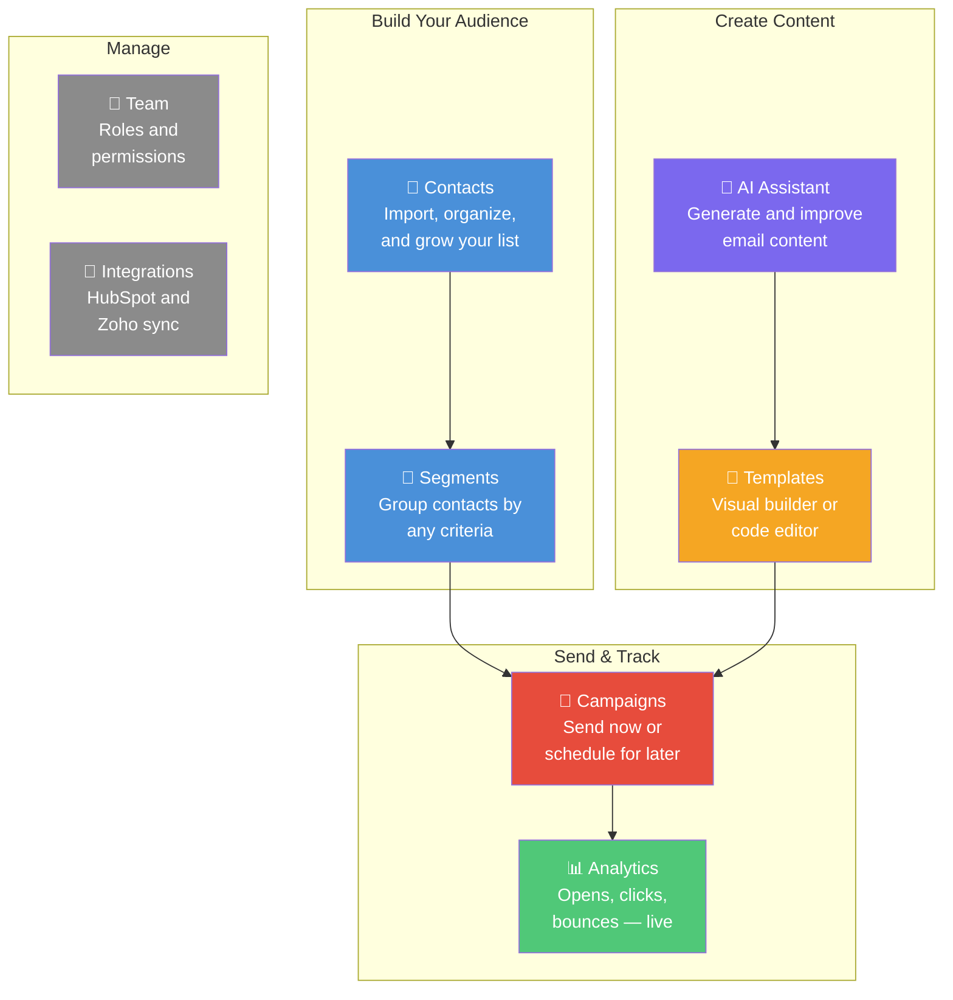
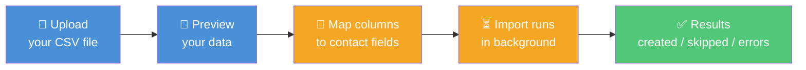
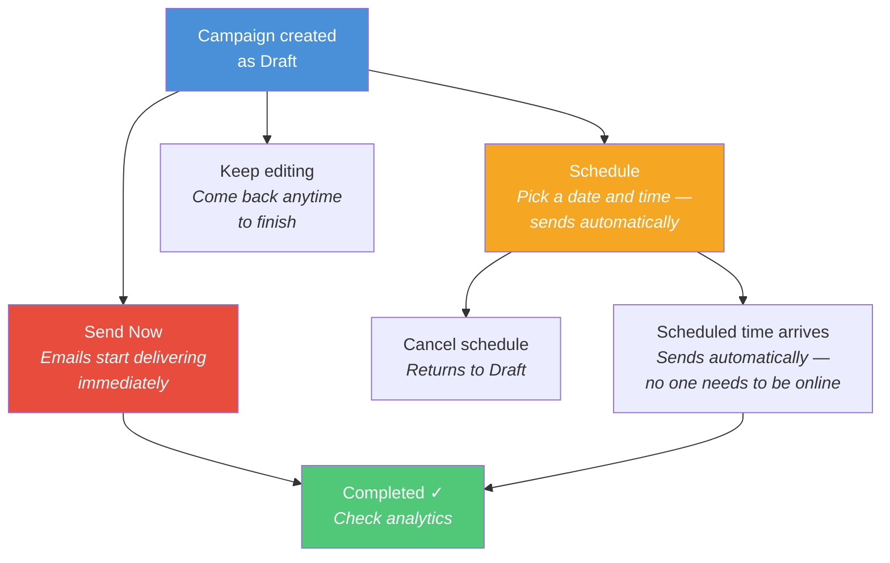
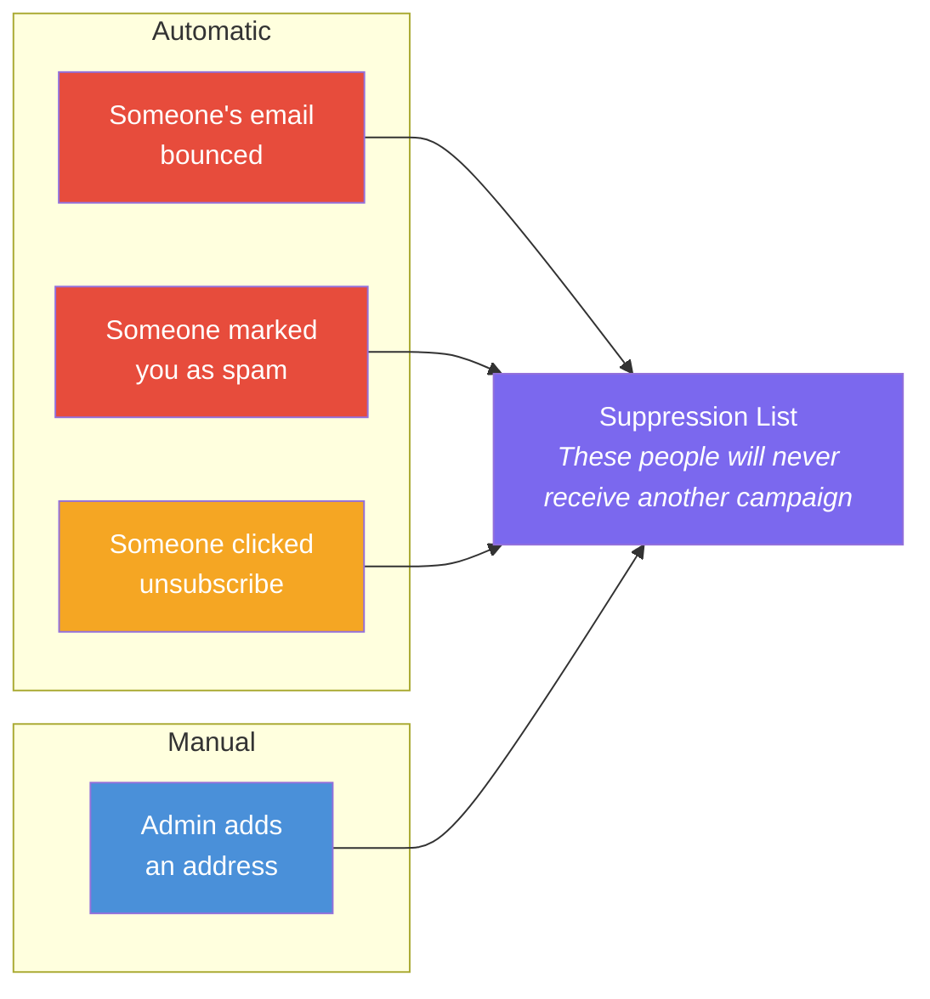
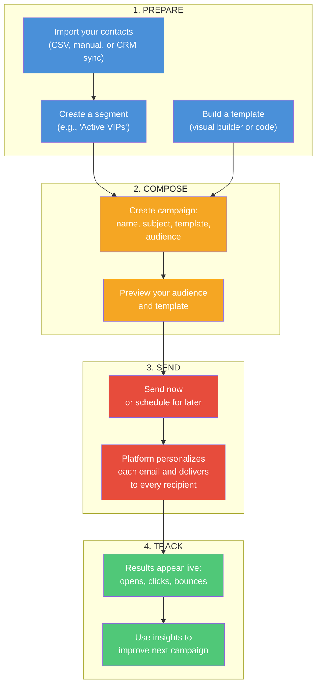
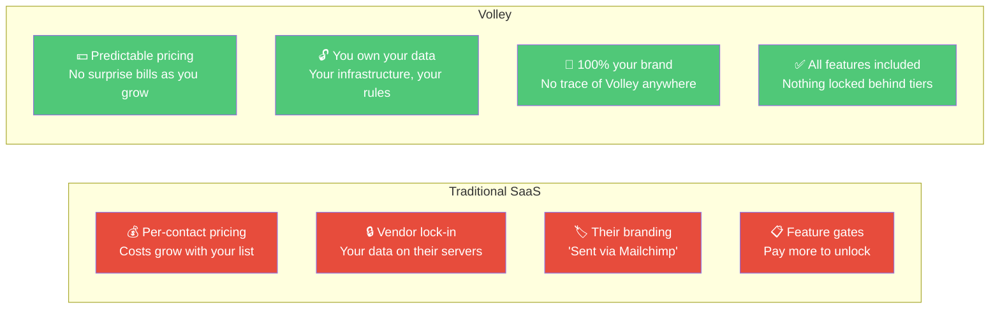
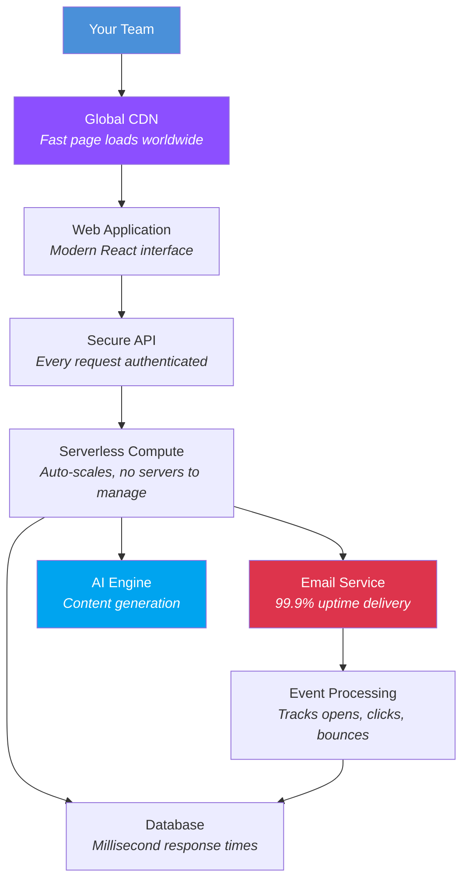

# Volley — Product Overview

> Your own email marketing platform — branded as yours, with unlimited contacts and complete data ownership. Import contacts, design beautiful emails, send campaigns, and track every open and click.

---

## Table of Contents

- [What Is Volley?](#what-is-edm)
- [What Your Team Gets](#what-your-team-gets)
- [Feature Walkthrough](#feature-walkthrough)
  - [Dashboard — Your Command Center](#dashboard--your-command-center)
  - [Contacts — Your Audience Database](#contacts--your-audience-database)
  - [Segments — Target the Right People](#segments--target-the-right-people)
  - [Templates — Design Emails Your Way](#templates--design-emails-your-way)
  - [Campaigns — Send With Confidence](#campaigns--send-with-confidence)
  - [Analytics — Know What's Working](#analytics--know-whats-working)
  - [AI Assistant — Write Better, Faster](#ai-assistant--write-better-faster)
  - [Suppression — Automatic List Hygiene](#suppression--automatic-list-hygiene)
  - [Team Management — Collaborate Securely](#team-management--collaborate-securely)
  - [Domain Settings — Professional Sending](#domain-settings--professional-sending)
  - [CRM Integrations — Connect Your Tools](#crm-integrations--connect-your-tools)
  - [White-Label Branding — Make It Yours](#white-label-branding--make-it-yours)
- [How a Campaign Works — End to End](#how-a-campaign-works--end-to-end)
- [Why Volley?](#why-volley)
- [Who Is Volley For?](#who-is-volley-for)
- [Security & Compliance](#security--compliance)
- [Under the Hood](#under-the-hood)
- [Full Feature Checklist](#full-feature-checklist)

---

## What Is Volley?

Volley is a complete email marketing platform that you own and control. Your team uses it to manage contacts, design emails, send campaigns, and track results — just like Mailchimp or SendGrid, but running entirely on your own infrastructure with your own branding.

No "Powered by" logos. No vendor lock-in. No contact limits. Full data ownership.

You deploy it once, brand it with your company name and colors, and your team has a professional email marketing tool that looks and feels like your own product.

```
┌─────────────────────────────────────────────────────────────────────────┐
│                                                                          │
│                        YOUR COMPANY NAME                                 │
│                        your logo here                                    │
│                                                                          │
│   ┌───────────────────────────────────────────────────────────────────┐  │
│   │                                                                   │  │
│   │   Dashboard  │  Campaigns  │  Contacts  │  Templates  │  Analytics│  │
│   │                                                                   │  │
│   │   Import contacts, build emails, send campaigns, track results    │  │
│   │   — all from one clean interface branded as your own.             │  │
│   │                                                                   │  │
│   └───────────────────────────────────────────────────────────────────┘  │
│                                                                          │
│   Your team never sees "Volley" anywhere. It's your platform.              │
│                                                                          │
└─────────────────────────────────────────────────────────────────────────┘
```

---

## What Your Team Gets



---

## Feature Walkthrough

### Dashboard — Your Command Center

The first thing your team sees after logging in. Four cards show the numbers that matter most — at a glance, no digging.

```
┌─────────────────────────────────────────────────────────────────────────┐
│  📊 Dashboard                                                            │
│  Overview of your email marketing platform.                              │
│                                                                          │
│  ┌──────────────┐  ┌──────────────┐  ┌──────────────┐  ┌──────────────┐│
│  │ Total        │  │ Campaigns    │  │ Avg Open     │  │ Recent       ││
│  │ Contacts     │  │ Sent         │  │ Rate         │  │ Activity     ││
│  │              │  │              │  │              │  │              ││
│  │    2,847     │  │      23      │  │   34.2%      │  │  Newsletter  ││
│  │              │  │              │  │              │  │  sent 2h ago ││
│  └──────────────┘  └──────────────┘  └──────────────┘  └──────────────┘│
│                                                                          │
│  Your team can check the pulse of their email program in seconds.       │
│                                                                          │
└─────────────────────────────────────────────────────────────────────────┘
```

**What it shows:**
- **Total Contacts** — how many people are in your database
- **Campaigns Sent** — how many campaigns you've completed
- **Avg Open Rate** — how engaged your audience is overall
- **Recent Activity** — what happened last

---

### Contacts — Your Audience Database

Every person who might receive your emails lives here. Add them one at a time, paste a batch, or import thousands from a CSV.

```
┌─────────────────────────────────────────────────────────────────────────┐
│  👥 Contacts                                                             │
│  Manage your contact list for email campaigns.                           │
│                                                                          │
│  [ Segments ]  [ Export CSV ]  [ Import CSV ]  [ Bulk Add ]  [+ Add ]   │
│                                                                          │
│  Search: ┌──────────────────────┐   Status: [ All statuses ▾ ]          │
│          │ Search contacts...   │                                        │
│          └──────────────────────┘                                        │
│                                                                          │
│  ┌───────────────────────────────────────────────────────────────────┐  │
│  │  Email                  First     Last      Tags          Status  │  │
│  │  ─────────────────────────────────────────────────────────────── │  │
│  │  jane@example.com       Jane      Doe       vip, news     Active │  │
│  │  marcus@acme.com        Marcus    Chen      enterprise    Active │  │
│  │  lisa@startup.io        Lisa      Park      trial         Active │  │
│  │  tom@bigcorp.com        Tom       Wilson    vip           Unsub  │  │
│  │  sarah@agency.co        Sarah     Miller    news          Active │  │
│  └───────────────────────────────────────────────────────────────────┘  │
│                                                                          │
│                          [ ← Previous ]  [ Next → ]                     │
│                                                                          │
└─────────────────────────────────────────────────────────────────────────┘
```

**Key capabilities:**

| Action | How It Works |
|--------|-------------|
| **Add one contact** | Click "Add" → fill in email, name, tags, and any custom fields |
| **Bulk add** | Click "Bulk Add" → paste multiple contacts at once |
| **CSV import** | Click "Import CSV" → upload a file → map columns → done |
| **CSV export** | Click "Export CSV" → downloads your full list instantly |
| **Search** | Type a name or email to find anyone fast |
| **Filter by status** | Show only Active, Unsubscribed, or Bounced contacts |
| **Custom fields** | Store any extra data per contact (company, plan, region — anything) |
| **Tags** | Label contacts flexibly for segmentation (e.g., "vip", "newsletter", "trial") |

**CSV Import — step by step:**



Upload your CSV, preview the data, tell the platform which column is the email / first name / etc., and click import. Duplicates are automatically skipped. You see a clear summary when it's done.

**Contact statuses:**

| Status | What It Means |
|--------|--------------|
| **Active** | This person will receive your campaigns |
| **Unsubscribed** | They clicked the unsubscribe link — automatically protected from future sends |
| **Bounced** | Their email address doesn't exist — automatically removed from future sends |

---

### Segments — Target the Right People

Segments let you send to the right audience instead of blasting your entire list. Define rules like "active contacts tagged VIP" and the platform finds matching contacts automatically — even as your list grows.

```
┌─────────────────────────────────────────────────────────────────────────┐
│  🎯 Segments                                                             │
│  Group contacts by criteria for targeted campaigns.                      │
│                                                                          │
│                                                       [ + Create Segment]│
│                                                                          │
│  ┌───────────────────────────────────────────────────────────────────┐  │
│  │  Name                    Rules        Members    Created          │  │
│  │  ─────────────────────────────────────────────────────────────── │  │
│  │  VIP Customers           3 rules      89         Mar 15          │  │
│  │  Newsletter Subscribers  2 rules      1,204      Mar 10          │  │
│  │  Trial Users             1 rule       342        Mar 8           │  │
│  │  Enterprise Clients      2 rules      56         Mar 1           │  │
│  └───────────────────────────────────────────────────────────────────┘  │
│                                                                          │
└─────────────────────────────────────────────────────────────────────────┘
```

**How the segment builder works:**

```
┌─────────────────────────────────────────────────────────────────┐
│  Create Segment                                                  │
│                                                                  │
│  Name: ┌────────────────────────────────┐                        │
│        │ VIP Customers                  │                        │
│        └────────────────────────────────┘                        │
│                                                                  │
│  Match: ( ALL of these rules ▾ )                                 │
│                                                                  │
│  ┌──────────────────────────────────────────────────────┐       │
│  │  [ status ▾ ]     [ equals ▾ ]      [ active    ]  ✕│       │
│  │                        AND                           │       │
│  │  [ tags   ▾ ]     [ contains ▾ ]    [ vip       ]  ✕│       │
│  │                        AND                           │       │
│  │  [ tags   ▾ ]     [ contains ▾ ]    [ newsletter]  ✕│       │
│  └──────────────────────────────────────────────────────┘       │
│                                                                  │
│  [ + Add another rule ]                                          │
│                                                                  │
│  ┌─────────────────────────┐                                    │
│  │  👥 89 contacts match    │                                    │
│  └─────────────────────────┘                                    │
│                                                                  │
│                    [ Cancel ]  [ Create Segment ]                │
└─────────────────────────────────────────────────────────────────┘
```

**Segments are live, not frozen.** When you add new contacts that match the rules, they're automatically included next time you send to that segment. No manual updating needed.

**Example segments you might create:**

| Segment Name | Rules | Use Case |
|-------------|-------|----------|
| All Active Subscribers | status = active | General newsletters |
| VIP Customers | status = active AND tags contains "vip" | Exclusive offers |
| Enterprise Accounts | customFields.plan = "enterprise" | Product updates |
| New This Month | created after 2026-03-01 | Welcome series |
| Inactive Users | tags not contains "recently_engaged" | Re-engagement |

---

### Templates — Design Emails Your Way

Templates are reusable email designs. Build them once, use them across many campaigns. Every template is responsive — it looks great on desktop, tablet, and mobile.

**Two ways to build:**

```
┌───────────────────────────────────┐     ┌───────────────────────────────────┐
│                                   │     │                                   │
│      ┌─────────────────────┐     │     │     1  <mjml>                     │
│      │      HEADER         │     │     │     2    <mj-body>                │
│      └─────────────────────┘     │     │     3      <mj-section>          │
│                                   │     │     4        <mj-column>        │
│   ┌──────────┐  ┌──────────┐     │     │     5          <mj-text>        │
│   │  IMAGE   │  │  IMAGE   │     │     │     6            Hello           │
│   └──────────┘  └──────────┘     │     │     7            {{firstName}}   │
│                                   │     │     8          </mj-text>       │
│   ┌──────────────────────────┐   │     │     9        </mj-column>       │
│   │   Your text goes here    │   │     │    10      </mj-section>        │
│   └──────────────────────────┘   │     │    11    </mj-body>              │
│                                   │     │    12  </mjml>                   │
│   ┌──────────────────────────┐   │     │                                   │
│   │    [ Call to Action → ]  │   │     │                                   │
│   └──────────────────────────┘   │     │                                   │
│                                   │     │                                   │
│   🎨 VISUAL BUILDER              │     │   💻 CODE EDITOR                  │
│   Drag and drop blocks —         │     │   Write MJML markup for           │
│   no coding required.            │     │   full control over layout.       │
│   Perfect for marketers.         │     │   Perfect for developers.         │
│                                   │     │                                   │
└───────────────────────────────────┘     └───────────────────────────────────┘
```

| Feature | What It Does |
|---------|-------------|
| **Visual builder** | Drag text, images, buttons, and columns into your email — like designing a document |
| **Code editor** | Write MJML (a simple email markup language) with syntax highlighting |
| **Personalization** | Insert `{{firstName}}`, `{{lastName}}`, or any custom field — each recipient sees their own data |
| **Preview** | See how the email looks with sample data before sending |
| **Version history** | Every save is a version. Revert to any previous version with one click. Nothing is ever lost. |
| **Starter templates** | Pre-built designs to get started fast — customize them or build from scratch |
| **Duplicate** | Copy any template to create a variation without changing the original |

**Personalization example:**

```
What you write:                    What Jane sees:          What Marcus sees:
─────────────────                  ──────────────           ────────────────
Hello {{firstName}},        →      Hello Jane,              Hello Marcus,
Thanks for choosing                Thanks for choosing      Thanks for choosing
{{customFields.plan}}.             Premium.                 Enterprise.
```

---

### Campaigns — Send With Confidence

A campaign is one email send to one audience. Pick a template, pick a segment, write a subject line, and send — now or later.

```
┌─────────────────────────────────────────────────────────────────────────┐
│  📧 Campaigns                                                            │
│  Create and manage email campaigns.                                      │
│                                                                          │
│                                                      [ + New Campaign ] │
│                                                                          │
│  ┌───────────────────────────────────────────────────────────────────┐  │
│  │  Name              Status       Segment          Sent     Created │  │
│  │  ───────────────────────────────────────────────────────────────  │  │
│  │  April Newsletter   Draft       All Subscribers   —       Apr 1  │  │
│  │  Spring Sale        Scheduled   VIP Customers     —       Mar 28 │  │
│  │  March Newsletter   Completed   All Subscribers   2.8K    Mar 15 │  │
│  │  Welcome Series     Completed   New This Month    342     Mar 10 │  │
│  │  Product Update     Failed      Enterprise        41/56   Mar 5  │  │
│  └───────────────────────────────────────────────────────────────────┘  │
│                                                                          │
└─────────────────────────────────────────────────────────────────────────┘
```

**Creating a new campaign:**

```
┌─────────────────────────────────────────────────────────────────┐
│  New Campaign                                         [✨ AI ]   │
│  Configure your campaign and select an audience.                 │
│                                                                  │
│  Campaign Name *                                                 │
│  ┌─────────────────────────────────────────────┐                │
│  │ April Newsletter                            │                │
│  └─────────────────────────────────────────────┘                │
│                                                                  │
│  Email Subject *                                       [✨]      │
│  ┌─────────────────────────────────────────────┐                │
│  │ Your April update is here, {{firstName}}    │                │
│  └─────────────────────────────────────────────┘                │
│  Tip: Click ✨ to generate a subject line with AI               │
│                                                                  │
│  Template *                                                      │
│  ┌─────────────────────────────────────────────┐                │
│  │ Monthly Newsletter (v3)                  ▾  │                │
│  └─────────────────────────────────────────────┘                │
│                                                                  │
│  Audience *                                                      │
│  ┌─────────────────────────────────────────────┐                │
│  │ All Active Subscribers (2,847 members)   ▾  │                │
│  └─────────────────────────────────────────────┘                │
│                                                                  │
│  Audience Preview:                                               │
│  jane@example.com, marcus@acme.com, lisa@startup.io...          │
│                                                                  │
│                 [ Cancel ]  [ Create Campaign ]                  │
└─────────────────────────────────────────────────────────────────┘
```

**After creating, you choose when to send:**



**Campaign statuses at a glance:**

| Status | What It Means |
|--------|--------------|
| **Draft** | Saved but not sent — you can still edit everything |
| **Scheduled** | Waiting for the scheduled date and time to arrive |
| **Executing** | Emails are being sent right now |
| **Completed** | All emails processed — check your analytics |
| **Failed** | Something went wrong — click in to see details |

---

### Analytics — Know What's Working

Every campaign tracks delivery, opens, clicks, bounces, and complaints in real time. Results start appearing as soon as recipients interact with your email.

**Per-campaign view:**

```
┌─────────────────────────────────────────────────────────────────────────┐
│  March Newsletter — Completed                                            │
│  Sent to 2,847 contacts                                                 │
│                                                                          │
│  ┌───────────┐  ┌───────────┐  ┌───────────┐  ┌───────────┐  ┌───────┐│
│  │ Delivered │  │  Opened   │  │  Clicked  │  │  Bounced  │  │Compl. ││
│  │   2,831   │  │    968    │  │    247    │  │    16     │  │   2   ││
│  │   99.4%   │  │   34.2%   │  │   8.7%    │  │   0.6%    │  │ 0.07% ││
│  └───────────┘  └───────────┘  └───────────┘  └───────────┘  └───────┘│
│                                                                          │
│  ████████████████████████████████████████████ Delivered  2,831          │
│  ████████████████                             Opened      968          │
│  ████                                         Clicked     247          │
│  ▪                                            Bounced      16          │
│                                                                          │
└─────────────────────────────────────────────────────────────────────────┘
```

**Global analytics dashboard:**

Aggregated metrics across all your campaigns, with time-range filters:

```
┌─────────────────────────────────────────────────────────────────────────┐
│  📈 Analytics                                                            │
│  Track email delivery and engagement across all campaigns.               │
│                                                                          │
│  Period: [ Last 7 days ▾ ]  [ Last 30 days ]  [ Last 90 days ]  [ All ]│
│                                                                          │
│  ┌───────────┐  ┌───────────┐  ┌───────────┐  ┌───────────┐  ┌───────┐│
│  │ Total     │  │ Total     │  │ Total     │  │ Total     │  │ Total ││
│  │ Sent      │  │ Delivered │  │ Opened    │  │ Clicked   │  │Bounced││
│  │  12,450   │  │  12,283   │  │   4,106   │  │   1,038   │  │  167  ││
│  │           │  │   98.7%   │  │   33.4%   │  │   8.4%    │  │  1.3% ││
│  └───────────┘  └───────────┘  └───────────┘  └───────────┘  └───────┘│
│                                                                          │
│  Campaign Comparison                                                     │
│  ┌───────────────────────────────────────────────────────────────────┐  │
│  │  March Newsletter    ████████████████████  ████████  ███          │  │
│  │  Spring Sale         ████████████████      █████████████          │  │
│  │  Welcome Series      ████████████████████████  ████████████       │  │
│  │  Product Update      ████████████          ███                    │  │
│  │                                                                   │  │
│  │  Legend: ■ Delivered  ■ Opened  ■ Clicked                        │  │
│  └───────────────────────────────────────────────────────────────────┘  │
│                                                                          │
└─────────────────────────────────────────────────────────────────────────┘
```

**What each metric tells you:**

| Metric | What It Means | Healthy Range |
|--------|--------------|---------------|
| **Delivery Rate** | How many emails actually reached the inbox | > 95% |
| **Open Rate** | How many people opened your email | > 20% |
| **Click Rate** | How many people clicked a link | > 2% |
| **Bounce Rate** | How many emails failed to deliver | < 2% |
| **Complaint Rate** | How many people marked it as spam | < 0.1% |

---

### AI Assistant — Write Better, Faster

Built-in AI helps your team create email content without being a copywriter. Three tools, all accessible from within the campaign and template editors.

**Generate — Create content from a description:**

```
┌─────────────────────────────────────────────────────────────┐
│  ✨ AI Email Generator                                       │
│                                                              │
│  What should this email be about?                            │
│  ┌───────────────────────────────────────────────────────┐   │
│  │ Announce our spring sale — 20% off all plans,         │   │
│  │ running for one week starting Monday.                 │   │
│  └───────────────────────────────────────────────────────┘   │
│                                                              │
│  Tone:  [ Professional ▾ ]                                   │
│         Professional · Casual · Urgent · Friendly            │
│                                                              │
│                                        [ ✨ Generate ]       │
│                                                              │
│  ─── Result ─────────────────────────────────────────────    │
│                                                              │
│  Subject:  Spring Into Savings — 20% Off All Plans           │
│  Preview:  Your exclusive discount starts Monday             │
│  Body:     [Full email copy ready to use]                    │
│                                                              │
│                        [ Regenerate ]  [ Apply ]             │
└─────────────────────────────────────────────────────────────┘
```

**Improve — Get suggestions for existing content:**

```
┌──────────────────────────────────────────┐
│  📝 AI Content Improver                   │
│                                           │
│  Goal: ┌────────────────────────────┐     │
│        │ increase click rate        │     │
│        └────────────────────────────┘     │
│                              [ Analyze ]  │
│                                           │
│  Overall Score:  7.2 / 10                 │
│                                           │
│  Suggestion 1 — Subject Line              │
│  ┌───────────────────────────────────┐    │
│  │  Before: "March Newsletter"       │    │
│  │  After:  "3 Things You Need to    │    │
│  │           Know This March"        │    │
│  │  Why: Numbers in subject lines    │    │
│  │       increase open rates by 15%  │    │
│  │                      [ Apply ]    │    │
│  └───────────────────────────────────┘    │
│                                           │
│  Suggestion 2 — Call to Action            │
│  ┌───────────────────────────────────┐    │
│  │  Before: "Learn More"             │    │
│  │  After:  "Get Your Free Report"   │    │
│  │  Why: Specific CTAs outperform    │    │
│  │       generic ones by 2-3x       │    │
│  │                      [ Apply ]    │    │
│  └───────────────────────────────────┘    │
│                                           │
└──────────────────────────────────────────┘
```

**Chat — Ask anything about your campaigns:**

```
┌──────────────────────────────────────────┐
│  🤖 AI Assistant                          │
│                                           │
│  ┌───────────────────────────────────┐    │
│  │ 🤖 I can help you with campaigns, │    │
│  │ content, segments, and strategy.  │    │
│  │ What would you like to do?        │    │
│  └───────────────────────────────────┘    │
│                                           │
│         ┌───────────────────────────┐     │
│         │ Write me 3 subject line   │     │
│         │ options for a product     │     │
│         │ launch email.         👤  │     │
│         └───────────────────────────┘     │
│                                           │
│  ┌───────────────────────────────────┐    │
│  │ 🤖 Here are 3 options:            │    │
│  │                                   │    │
│  │ 1. "It's Here — Introducing       │    │
│  │     [Product Name]"               │    │
│  │ 2. "You Asked, We Built It"       │    │
│  │ 3. "First Look: [Product] Is      │    │
│  │     Now Live"                     │    │
│  │                                   │    │
│  │ Option 1 works best for brand     │    │
│  │ announcements. Option 2 creates   │    │
│  │ curiosity. Option 3 appeals to    │    │
│  │ early adopters.                   │    │
│  └───────────────────────────────────┘    │
│                                           │
│  ┌──────────────────────────┐ [ Send ]   │
│  │ Ask anything...          │             │
│  └──────────────────────────┘             │
└──────────────────────────────────────────┘
```

---

### Suppression — Automatic List Hygiene

The suppression list keeps your sending reputation healthy by automatically preventing emails to addresses that shouldn't receive them.



**Your team doesn't need to manage this.** The platform handles it automatically. Every campaign checks the suppression list before sending — suppressed contacts are silently skipped.

You can also manually add or remove addresses through the Suppression page (for things like phone opt-out requests or re-subscriptions).

---

### Team Management — Collaborate Securely

Invite your team and control who can do what.

```
┌─────────────────────────────────────────────────────────────────┐
│  ⚙️ User Management                                              │
│  Manage platform users and their roles.                          │
│                                                                  │
│  [ Invite User ]  [ + Create User ]                             │
│                                                                  │
│  Search: ┌────────────────┐  Role: [All▾]  Status: [All▾]       │
│          │                │                                      │
│          └────────────────┘                                      │
│                                                                  │
│  ┌───────────────────────────────────────────────────────────┐  │
│  │  Name           Email                 Role     Status     │  │
│  │  ─────────────────────────────────────────────────────── │  │
│  │  Jane Smith     jane@company.com      Admin    Active     │  │
│  │  Marcus Chen    marcus@company.com    Editor   Active     │  │
│  │  Lisa Park      lisa@company.com      Viewer   Active     │  │
│  │  Tom Wilson     tom@company.com       Editor   Disabled   │  │
│  └───────────────────────────────────────────────────────────┘  │
│                                                                  │
└─────────────────────────────────────────────────────────────────┘
```

**Three roles — give each person exactly the access they need:**

| | Admin | Editor | Viewer |
|---|:---:|:---:|:---:|
| View contacts, campaigns, templates, analytics | ✅ | ✅ | ✅ |
| Export contacts | ✅ | ✅ | ✅ |
| Create and edit campaigns, templates, contacts | ✅ | ✅ | — |
| Send and schedule campaigns | ✅ | ✅ | — |
| Use AI features | ✅ | ✅ | — |
| Manage team members | ✅ | — | — |
| Configure domains and integrations | ✅ | — | — |

**Invite by email** — new team members receive a link, set their password, and they're in. **Disable instantly** — one click removes access and terminates all active sessions.

---

### Domain Settings — Professional Sending

Emails are sent from your own domain (e.g., `campaigns@yourdomain.com`), not from a generic address. The Domains settings page shows your verification status and sending health.

```
┌─────────────────────────────────────────────────────────────────┐
│  🌐 Domain Settings                                              │
│                                                                  │
│  Domain: yourdomain.com                                          │
│  Verification: ✅ Verified                                       │
│  DKIM: ✅ Configured                                             │
│                                                                  │
│  Account Health                                                  │
│  ┌──────────────┐  ┌──────────────┐  ┌──────────────┐          │
│  │ Enforcement  │  │ Production   │  │ Sending      │          │
│  │   Normal     │  │   Yes ✅     │  │   Enabled ✅ │          │
│  └──────────────┘  └──────────────┘  └──────────────┘          │
│                                                                  │
│  Send Quota (24 hours)                                           │
│  ████████████░░░░░░░░░  2,100 / 50,000                          │
│                                                                  │
└─────────────────────────────────────────────────────────────────┘
```

The platform handles email authentication (SPF, DKIM, DMARC) — your team just needs to add the DNS records shown on the page to your domain settings. This ensures your emails land in inboxes, not spam folders.

---

### CRM Integrations — Connect Your Tools

Pull contacts from HubSpot or Zoho CRM with one click. No manual CSV exports needed.

```
┌─────────────────────────────────────────────────────────────────┐
│  🔗 CRM Integrations                                             │
│                                                                  │
│  ┌──────────────────────────────┐  ┌──────────────────────────┐ │
│  │  HubSpot        ✅ Connected  │  │  Zoho CRM    ✅ Connected │ │
│  │                              │  │                          │ │
│  │  Last synced: 2 hours ago    │  │  Last synced: 1 day ago  │ │
│  │                              │  │  Region: US              │ │
│  │  [ Sync Now ]  [ Disconnect ]│  │  [ Sync Now ] [Disconn.] │ │
│  └──────────────────────────────┘  └──────────────────────────┘ │
│                                                                  │
└─────────────────────────────────────────────────────────────────┘
```

| | HubSpot | Zoho CRM |
|---|---|---|
| **How to connect** | Paste your Private App token | Enter refresh token + pick region |
| **What syncs** | Contacts from HubSpot → your platform | Contacts from Zoho → your platform |
| **Duplicates** | Automatically merged by email | Automatically merged by email |
| **Your existing contacts** | Preserved — sync adds, doesn't replace | Preserved — sync adds, doesn't replace |

Click **Sync Now** anytime to pull the latest contacts from your CRM.

---

### White-Label Branding — Make It Yours

The entire platform is branded as your own. Your team sees your company name, your logo, and your colors — no trace of "Volley" anywhere.

```
┌──────────────────────────┐     ┌──────────────────────────┐
│  🏢 ACME CORP            │     │  🌊 BLUE OCEAN AGENCY    │
│  [acme logo]             │     │  [blue ocean logo]       │
│                          │     │                          │
│  ▸ Dashboard             │     │  ▸ Dashboard             │
│  ▸ Campaigns             │     │  ▸ Campaigns             │
│  ▸ Contacts              │     │  ▸ Contacts              │
│                          │     │                          │
│  Primary color: 🟠       │     │  Primary color: 🔵       │
│  Buttons, links, accents │     │  Buttons, links, accents │
│  all use #FF6B35         │     │  all use #2563EB         │
│                          │     │                          │
│  Emails from:            │     │  Emails from:            │
│  hi@acmecorp.com         │     │  news@blueocean.agency   │
│                          │     │                          │
└──────────────────────────┘     └──────────────────────────┘

Same platform, completely different brands.
```

**What you can customize:**

| Element | Where It Appears |
|---------|-----------------|
| **Company name** | Sidebar header, browser tab, transactional emails |
| **Logo** | Sidebar header (replaces text name) |
| **Brand color** | Buttons, links, active states, accents throughout the UI |
| **Sending domain** | The "from" address on all campaign emails |
| **Transactional branding** | Password reset, invite, and verification emails match your brand too |

No "Powered by" footer. No third-party branding. Your team — and your clients — see only your brand.

---

## How a Campaign Works — End to End

From idea to delivered email, here's the complete flow:



**What the platform handles automatically after you hit send:**

```
┌─────────────────────────────────────────────────────────────────┐
│                                                                  │
│  You click "Send Now"                                            │
│       │                                                          │
│       ▼                                                          │
│  Platform finds all contacts matching your segment               │
│       │                                                          │
│       ▼                                                          │
│  Checks each contact against the suppression list                │
│  (bounced, unsubscribed, or complained = skipped)                │
│       │                                                          │
│       ▼                                                          │
│  Renders a personalized email for each recipient                 │
│  ({{firstName}} → "Jane", {{company}} → "Acme Inc")             │
│       │                                                          │
│       ▼                                                          │
│  Delivers each email with tracking enabled                       │
│       │                                                          │
│       ▼                                                          │
│  As recipients open and click, your analytics update live        │
│       │                                                          │
│       ▼                                                          │
│  If someone bounces or complains, they're automatically          │
│  suppressed from all future campaigns                            │
│                                                                  │
│  ✓  You don't need to monitor any of this — it's all automatic  │
│                                                                  │
└─────────────────────────────────────────────────────────────────┘
```

---

## Why Volley?



| | Traditional SaaS | Volley |
|---|---|---|
| **Contact limits** | Capped by plan tier — pay more as you grow | Unlimited |
| **Features** | Advanced features locked behind higher tiers | Everything included from day one |
| **White-labeling** | Enterprise plans only (if available at all) | Built-in, standard |
| **Data ownership** | Vendor stores your data on their servers | Your data stays on your infrastructure |
| **Vendor lock-in** | High — migrating away is painful | None — you control everything |
| **Branding** | "Sent via [vendor]" footers | Zero third-party branding |
| **Scalability** | Plan upgrades required | Scales automatically with usage |

*Contact us for pricing details and deployment options.*

---

## Who Is Volley For?

```
┌─────────────────────────────────────────────────────────────────┐
│                                                                  │
│  🏢  AGENCIES                                                    │
│  Deploy a branded instance for each client. Offer email          │
│  marketing as a white-label managed service.                     │
│                                                                  │
│  🚀  STARTUPS                                                    │
│  Full-featured email marketing from day one. Scale from          │
│  100 contacts to 100,000 without hitting plan limits.            │
│                                                                  │
│  🏛️  ENTERPRISES WITH DATA REQUIREMENTS                          │
│  Everything runs on your own infrastructure, in your chosen      │
│  region. No data leaves your environment. Full audit trail.      │
│                                                                  │
│  📈  GROWING TEAMS                                               │
│  Unlimited contacts, all features included, no surprise          │
│  bills as your audience grows.                                   │
│                                                                  │
│  🛠️  TECHNICAL TEAMS                                             │
│  Extensible codebase, serverless architecture, easy to           │
│  customize with your own features and integrations.                │
│                                                                  │
└─────────────────────────────────────────────────────────────────┘
```

---

## Security & Compliance

Everything your team and your recipients expect from a professional email platform:

| Area | What's Built In |
|------|----------------|
| **Data ownership** | All data stays in your cloud account — no third parties |
| **Encryption** | All data encrypted in transit (HTTPS) and at rest |
| **Authentication** | Secure login with short-lived tokens and encrypted passwords |
| **Team access control** | Three roles (Admin, Editor, Viewer) enforced on every action |
| **Email authentication** | SPF + DKIM + DMARC — your emails are verified as coming from you |
| **One-click unsubscribe** | Every email includes a tamper-proof unsubscribe link (RFC 8058) |
| **Automatic suppression** | Bounces, complaints, and unsubscribes are instantly protected |
| **No re-emailing** | Suppressed contacts can never accidentally receive another campaign |
| **Domain reputation monitoring** | Live dashboard showing your sending health and limits |

---

## Under the Hood

For technical stakeholders who want to know what powers the platform:



| Characteristic | Detail |
|----------------|--------|
| **Servers to manage** | Zero — fully serverless, auto-scaling |
| **Uptime** | Built on AWS infrastructure (99.9%+ SLA) |
| **Scaling** | Handles 100 or 1,000,000 emails — no configuration needed |
| **Deployment** | Single command deploys the entire platform |
| **Regions** | Deploy in any AWS region worldwide |
| **AI** | Powered by Claude AI for content generation |

*For the full technical architecture, see [Platform Overview](./VOLLEY-PLATFORM-OVERVIEW.md).*

---

## Full Feature Checklist

| Category | Feature | |
|----------|---------|---|
| **Contacts** | Unlimited contacts | ✅ |
| | CSV import with column mapping wizard | ✅ |
| | CSV export | ✅ |
| | Custom fields (store any data) | ✅ |
| | Tags for organizing | ✅ |
| | Search and filter | ✅ |
| | Automatic deduplication | ✅ |
| | CRM sync (HubSpot, Zoho) | ✅ |
| **Segments** | Dynamic rule-based segments | ✅ |
| | AND / OR logic | ✅ |
| | 9 filter operators | ✅ |
| | Live member count | ✅ |
| **Templates** | Visual drag-and-drop builder | ✅ |
| | Code editor (MJML) | ✅ |
| | Personalization variables | ✅ |
| | Version history with rollback | ✅ |
| | Starter templates | ✅ |
| | Live preview | ✅ |
| | Template duplication | ✅ |
| **Campaigns** | Send now | ✅ |
| | Schedule for later | ✅ |
| | Cancel scheduled sends | ✅ |
| | Per-recipient personalization | ✅ |
| | Audience preview | ✅ |
| | Live send progress | ✅ |
| **Analytics** | Delivery tracking | ✅ |
| | Open tracking | ✅ |
| | Click tracking | ✅ |
| | Bounce tracking | ✅ |
| | Complaint tracking | ✅ |
| | Per-campaign detail view | ✅ |
| | Global dashboard with charts | ✅ |
| | Time-range filters | ✅ |
| **AI** | Email content generation | ✅ |
| | Content improvement suggestions | ✅ |
| | Interactive chat assistant | ✅ |
| | Tone selection (4 tones) | ✅ |
| **Compliance** | One-click unsubscribe | ✅ |
| | Automatic bounce suppression | ✅ |
| | Automatic complaint suppression | ✅ |
| | Email authentication (SPF/DKIM/DMARC) | ✅ |
| **Team** | Role-based access (3 roles) | ✅ |
| | Email invitations | ✅ |
| | Instant account disable | ✅ |
| **White-Label** | Custom company name | ✅ |
| | Custom logo | ✅ |
| | Custom brand color | ✅ |
| | Custom sending domain | ✅ |
| | Zero third-party branding | ✅ |
| **Platform** | Fully serverless (no maintenance) | ✅ |
| | Auto-scaling | ✅ |
| | Single-command deployment | ✅ |
| | Multi-region support | ✅ |

---

*Ready to see it in action? Contact us for a demo.*
*For setup instructions, see the [Setup Guide](./setup-guide.md).*
*Last updated: 2026-04-02*
